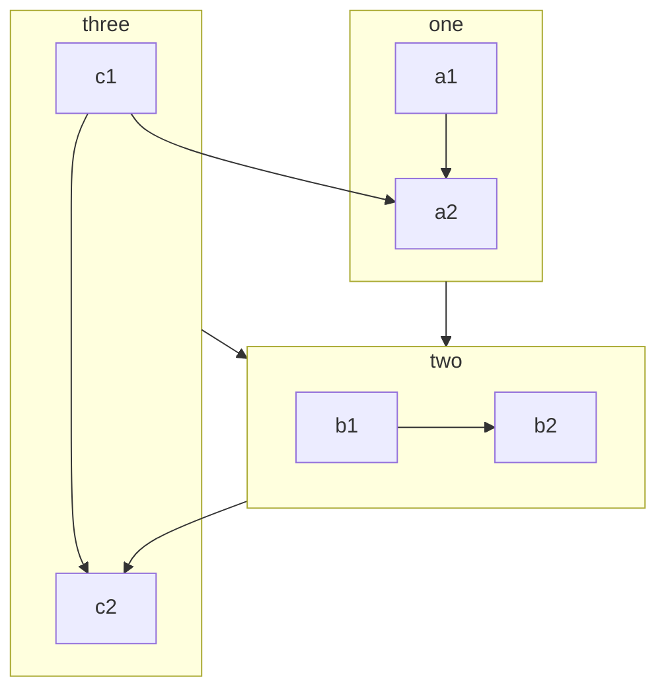

# 烧风的 Markdown 进阶教程

> <p style="text-align: right">——没想到，Markdown 远比想象的要精彩。</p>

::: warning
如果你还没看过 Markdown 基础教程，请先阅读 [使用 Markdown 排版文章](how-to-use-markdown.md)
:::

## Emoji 表情

::: info 
试试在 Markdown 中输入 Emoji 表情 :laughing: :laughing: :laughing:  ！！！

你可以直接键入 Unicode 表情，也可以根据 [这份对照表](https://gist.github.com/rxaviers/7360908) 输入
:::

:laughing: :laughing: :laughing:
🎈🎈🎈 恭喜你进入 Markdown 进阶教程！！！

```markdown
:laughing: :laughing: :laughing:
🎈🎈🎈 恭喜你进入 Markdown 进阶教程！！！
```

## 嵌入 HTML

::: info
通常，Markdown 需要先被转换为 HTML ，然后再解析成 [DOM 文档对象模型](https://developer.mozilla.org/zh-CN/docs/Web/API/Document_Object_Model) ，最终被布局排版并渲染为文档。更多信息，请了解 [HTML 超文本标记语言](https://developer.mozilla.org/zh-CN/docs/Web/HTML)
:::

::: tip
通过各种 HTML 标签和 `style` 样式，你可以更加灵活的控制页面布局和样式

下面举出一些常用例子，欢迎你补充或自己默默探索其它利用 HTML 的有趣用法
:::

### 键盘输入元素

<kbd>Ctrl</kbd> + <kbd>Shift</kbd> + <kbd>ESC</kbd>

```markdown
<kbd>Ctrl</kbd> + <kbd>Shift</kbd> + <kbd>ESC</kbd>
```

### 强制居中

<center>这是强制居中的一段文本</center>

<p style="text-align: center">这是居中的一段文本</p>

```markdown
<center>这是强制居中的一段文本</center>

<p style="text-align: center">这是居中的一段文本</p>
```

### 强制换行

::: warning
为保持文档的规范性，Markdown 避免出现空行，因此多余的空行会被取消掉，最多仅保留连续两个换行，但是你可以使用 HTML 来强制要求多次连续换行
:::

这是第一行


只换了两行

这是第一行<br><br><br><br>换了很多行

::: details 查看 Markdown 代码
```markdown
这是第一行


只换了两行

这是第一行<br><br><br><br>换了很多行
```

### 图像标签

<br>
<center></center>
<br>

```markdown
<center></center>
```

## 转义语法

### 转义符号

在以下字符前面添加反斜杠字符 `\` ，可以显示原本用于格式化 Markdown 文档的字符。

```markdown
\       反斜线          `       反引号
*       星号            _       下划线
{}      花括号          []      方括号
()      小括号          #       井字号
+       加号            -       减号
.       英文句点        !       感叹号
|       管道符号        ~       波浪号
```

### 转义 `` ` ``

想要输入 `` ` `` 你需要这样

```markdown
`` ` ``
```

### 转义 \`\`\`

想要输入 \`\`\` 你需要这样

```markdown
\`\`\`
```

### 字符实体

::: info
因为 Markdown 可以嵌入 HTML ， 因此字符实体也可以用，请参考 [Entity - 术语表 | MDN](https://developer.mozilla.org/zh-CN/docs/Glossary/Entity)
:::

## 标题索引

::: tip
每个标题是可以被自动索引的，注意到标题前面隐藏的 `#` 超链接了吗？

你还可以通过这个语法为每个标题设置自定义的编号，通过链接索引可以直接到达这个标题位置
:::

```markdown
### 这是你的标题 {#custom-id}
```

### 索引到标题

```markdown
[这个链接索引到标题](#custom-id)  
[也可通过完整链接索引](https://xxxx.xxxx/xxxx/xxxx.html#custom-id)
```

## $\LaTeX$ 公式

::: info
Markdown 内使用 $\LaTeX$ 通常是编辑器或者网页应用了 [Mathjax](https://www.mathjax.org/) 或者 [KaTeX](https://katex.org/)，使用 Mathjax 的 $\LaTeX$ 具体用法可以参考 [这篇帮助文档](https://latexlive.com/help)
:::

### 数学公式

::: tip 傅里叶变换
:::

$$
f(x) = \int_{-\infty}^\infty  \hat f(x)\xi\,e^{2 \pi i \xi x}  \,\mathrm{d}\xi 
$$

```markdown
$$
f(x) = \int_{-\infty}^\infty  \hat f(x)\xi\,e^{2 \pi i \xi x}  \,\mathrm{d}\xi 
$$
```

### 物理公式

::: tip 高斯定理
:::

$$
\mathop \Phi \nolimits_e = \oint { \mathord{ \buildrel{ \lower3pt \hbox{$ \scriptscriptstyle \rightharpoonup$}} \over E} \cdot {d \mathord{ \buildrel{ \lower3pt \hbox{$ \scriptscriptstyle \rightharpoonup$}} \over S}}  = {1 \over {{\varepsilon _0}}}\sum {q} } 
$$

```markdown
$$
\mathop \Phi \nolimits_e = \oint { \mathord{ \buildrel{ \lower3pt \hbox{$ \scriptscriptstyle \rightharpoonup$}} \over E} \cdot {d \mathord{ \buildrel{ \lower3pt \hbox{$ \scriptscriptstyle \rightharpoonup$}} \over S}}  = {1 \over {{\varepsilon _0}}}\sum {q} } 
$$
```

### 化学方程式

::: tip 硫酸钡沉淀
:::

$$
\ce{SO4^2- + Ba^2+ -> BaSO4 v} 
$$

```markdown
$$
\ce{SO4^2- + Ba^2+ -> BaSO4 v} 
$$
```

## 上下标

- 19^th^
- H~2~O

```markdown
- 19^th^
- H~2~O
```

## 对齐

::: center
要居中的段落
:::

::: right
要居右的段落
:::

## 标记

哈喽！很高兴认识你，我的 ==昵称== 叫烧风!

## 容器

::: info
信息容器。
:::

::: note
注释容器。
:::

::: tip
提示容器
:::

::: warning
警告容器
:::

::: danger
危险容器
:::

::: details
详情容器
:::

::: info 自定义标题

一个有 `代码` 和 [链接](#演示) 的信息容器。

```js
const a = 1;
```

:::

::: note 自定义标题

一个有 `代码` 和 [链接](#演示) 的注释容器。

```js
const a = 1;
```

:::

::: tip 自定义标题

一个有 `代码` 和 [链接](#演示) 的提示容器。

```js
const a = 1;
```

:::

::: warning 自定义标题

一个有 `代码` 和 [链接](#演示) 的警告容器。

```js
const a = 1;
```

:::

::: danger 自定义标题

一个有 `代码` 和 [链接](#演示) 的危险容器。

```js
const a = 1;
```

:::

::: details 自定义标题

一个有 `代码` 和 [链接](#演示) 的详情容器。

```js
const a = 1;
```

:::

::: info 自定义信息
:::

::: note 自定义注释
:::

::: tip 自定义提示
:::

::: warning 自定义警告
:::

::: danger 自定义危险
:::

:::: details
```md
::: info
信息容器。
:::

::: note
注释容器。
:::

::: tip
提示容器
:::

::: warning
警告容器
:::

::: danger
危险容器
:::

::: details
详情容器
:::

::: info 自定义标题

一个有 `代码` 和 [链接](#演示) 的信息容器。

```js
const a = 1;
```

:::

::: note 自定义标题

一个有 `代码` 和 [链接](#演示) 的注释容器。

```js
const a = 1;
```

:::

::: tip 自定义标题

一个有 `代码` 和 [链接](#演示) 的提示容器。

```js
const a = 1;
```

:::

::: warning 自定义标题

一个有 `代码` 和 [链接](#演示) 的警告容器。

```js
const a = 1;
```

:::

::: danger 自定义标题

一个有 `代码` 和 [链接](#演示) 的危险容器。

```js
const a = 1;
```

:::

::: details 自定义标题

一个有 `代码` 和 [链接](#演示) 的详情容器。

```js
const a = 1;
```

:::

::: info 自定义信息
:::

::: note 自定义注释
:::

::: tip 自定义提示
:::

::: warning 自定义警告
:::

::: danger 自定义危险
:::
```
::::

## 框图


### 流程图



::: details 查看 Markdown 代码

````md

````

:::

### 循序图

```sequence
Alice ->> Bob: Hello Bob, how are you?
Bob-->>John: How about you John?
Bob--x Alice: I am good thanks!
Bob-x John: I am good thanks!
Note right of John: Bob thinks a long<br/>long time, so long<br/>that the text does<br/>not fit on a row.

Bob-->Alice: Checking with John...
Alice->John: Yes... John, how are you?
```

::: details 查看 Markdown 代码

````md
```sequence
Alice ->> Bob: Hello Bob, how are you?
Bob-->>John: How about you John?
Bob--x Alice: I am good thanks!
Bob-x John: I am good thanks!
Note right of John: Bob thinks a long<br/>long time, so long<br/>that the text does<br/>not fit on a row.

Bob-->Alice: Checking with John...
Alice->John: Yes... John, how are you?
```
````

:::

### 类图

```class
class Square~Shape~{
    int id
    List~int~ position
    setPoints(List~int~ points)
    getPoints() List~int~
}

Square : -List~string~ messages
Square : +setMessages(List~string~ messages)
Square : +getMessages() List~string~
```

::: details 查看 Markdown 代码

````md
```class
class Square~Shape~{
    int id
    List~int~ position
    setPoints(List~int~ points)
    getPoints() List~int~
}

Square : -List~string~ messages
Square : +setMessages(List~string~ messages)
Square : +getMessages() List~string~
```
````

:::

### 状态图

```state
[*] --> Active

state Active {
    [*] --> NumLockOff
    NumLockOff --> NumLockOn : EvNumLockPressed
    NumLockOn --> NumLockOff : EvNumLockPressed
    --
    [*] --> CapsLockOff
    CapsLockOff --> CapsLockOn : EvCapsLockPressed
    CapsLockOn --> CapsLockOff : EvCapsLockPressed
    --
    [*] --> ScrollLockOff
    ScrollLockOff --> ScrollLockOn : EvScrollLockPressed
    ScrollLockOn --> ScrollLockOff : EvScrollLockPressed
}
```

::: details 查看 Markdown 代码

````md
```state
[*] --> Active

state Active {
    [*] --> NumLockOff
    NumLockOff --> NumLockOn : EvNumLockPressed
    NumLockOn --> NumLockOff : EvNumLockPressed
    --
    [*] --> CapsLockOff
    CapsLockOff --> CapsLockOn : EvCapsLockPressed
    CapsLockOn --> CapsLockOff : EvCapsLockPressed
    --
    [*] --> ScrollLockOff
    ScrollLockOff --> ScrollLockOn : EvScrollLockPressed
    ScrollLockOn --> ScrollLockOff : EvScrollLockPressed
}
```
````

:::

### 关系图

```er
CAR ||--o{ NAMED-DRIVER : allows
CAR {
    string registrationNumber
    string make
    string model
}
PERSON ||--o{ NAMED-DRIVER : is
PERSON {
    string firstName
    string lastName
    int age
}
```

::: details 查看 Markdown 代码

````md
```er
CAR ||--o{ NAMED-DRIVER : allows
CAR {
    string registrationNumber
    string make
    string model
}
PERSON ||--o{ NAMED-DRIVER : is
PERSON {
    string firstName
    string lastName
    int age
}
```
````

:::

### 用户日记图

```journey
title My working day
section Go to work
  Make tea: 5: Me
  Go upstairs: 3: Me
  Do work: 1: Me, Cat
section Go home
  Go downstairs: 5: Me
  Sit down: 5: Me
```

::: details 查看 Markdown 代码

````md
```journey
title My working day
section Go to work
  Make tea: 5: Me
  Go upstairs: 3: Me
  Do work: 1: Me, Cat
section Go home
  Go downstairs: 5: Me
  Sit down: 5: Me
```
````

:::

### 甘特图

```gantt
dateFormat  YYYY-MM-DD
title       Adding GANTT diagram functionality to mermaid
excludes    weekends
%% (`excludes` accepts specific dates in YYYY-MM-DD format, days of the week ("sunday") or "weekends", but not the word "weekdays".)

section A section
Completed task            :done,    des1, 2014-01-06,2014-01-08
Active task               :active,  des2, 2014-01-09, 3d
Future task               :         des3, after des2, 5d
Future task2              :         des4, after des3, 5d

section Critical tasks
Completed task in the critical line :crit, done, 2014-01-06,24h
Implement parser and jison          :crit, done, after des1, 2d
Create tests for parser             :crit, active, 3d
Future task in critical line        :crit, 5d
Create tests for renderer           :2d
Add to mermaid                      :1d

section Documentation
Describe gantt syntax               :active, a1, after des1, 3d
Add gantt diagram to demo page      :after a1  , 20h
Add another diagram to demo page    :doc1, after a1  , 48h

section Last section
Describe gantt syntax               :after doc1, 3d
Add gantt diagram to demo page      :20h
Add another diagram to demo page    :48h
```

::: details 查看 Markdown 代码

````md
```gantt
dateFormat  YYYY-MM-DD
title       Adding GANTT diagram functionality to mermaid
excludes    weekends
%% (`excludes` accepts specific dates in YYYY-MM-DD format, days of the week ("sunday") or "weekends", but not the word "weekdays".)

section A section
Completed task            :done,    des1, 2014-01-06,2014-01-08
Active task               :active,  des2, 2014-01-09, 3d
Future task               :         des3, after des2, 5d
Future task2              :         des4, after des3, 5d

section Critical tasks
Completed task in the critical line :crit, done, 2014-01-06,24h
Implement parser and jison          :crit, done, after des1, 2d
Create tests for parser             :crit, active, 3d
Future task in critical line        :crit, 5d
Create tests for renderer           :2d
Add to mermaid                      :1d

section Documentation
Describe gantt syntax               :active, a1, after des1, 3d
Add gantt diagram to demo page      :after a1  , 20h
Add another diagram to demo page    :doc1, after a1  , 48h

section Last section
Describe gantt syntax               :after doc1, 3d
Add gantt diagram to demo page      :20h
Add another diagram to demo page    :48h
```
````

:::

### 饼图

```pie
title What Voldemort doesn’t have?
  "FRIENDS" : 2
  "FAMILY" : 3
  "NOSE" : 45
```

::: details 查看 Markdown 代码

````md
```pie
title What Voldemort doesn’t have?
  "FRIENDS" : 2
  "FAMILY" : 3
  "NOSE" : 45
```
````

:::

### Git 图表

```git-graph
commit
branch hotfix
checkout hotfix
commit
branch develop
checkout develop
commit id:"ash" tag:"abc"
branch featureB
checkout featureB
commit type:HIGHLIGHT
checkout main
checkout hotfix
commit type:NORMAL
checkout develop
commit type:REVERSE
checkout featureB
commit
checkout main
merge hotfix
checkout featureB
commit
checkout develop
branch featureA
commit
checkout develop
merge hotfix
checkout featureA
commit
checkout featureB
commit
checkout develop
merge featureA
branch release
checkout release
commit
checkout main
commit
checkout release
merge main
checkout develop
merge release
```

::: details 查看 Markdown 代码

````md
```git-graph
commit
branch hotfix
checkout hotfix
commit
branch develop
checkout develop
commit id:"ash" tag:"abc"
branch featureB
checkout featureB
commit type:HIGHLIGHT
checkout main
checkout hotfix
commit type:NORMAL
checkout develop
commit type:REVERSE
checkout featureB
commit
checkout main
merge hotfix
checkout featureB
commit
checkout develop
branch featureA
commit
checkout develop
merge hotfix
checkout featureA
commit
checkout featureB
commit
checkout develop
merge featureA
branch release
checkout release
commit
checkout main
commit
checkout release
merge main
checkout develop
merge release
```
````

:::

### C4C 图表

```c4c
title System Context diagram for Internet Banking System

Person(customerA, "Banking Customer A", "A customer of the bank, with personal bank accounts.")
Person(customerB, "Banking Customer B")
Person_Ext(customerC, "Banking Customer C")
System(SystemAA, "Internet Banking System", "Allows customers to view information about their bank accounts, and make payments.")

Person(customerD, "Banking Customer D", "A customer of the bank, <br/> with personal bank accounts.")

Enterprise_Boundary(b1, "BankBoundary") {

  SystemDb_Ext(SystemE, "Mainframe Banking System", "Stores all of the core banking information about customers, accounts, transactions, etc.")

  System_Boundary(b2, "BankBoundary2") {
    System(SystemA, "Banking System A")
    System(SystemB, "Banking System B", "A system of the bank, with personal bank accounts.")
  }

  System_Ext(SystemC, "E-mail system", "The internal Microsoft Exchange e-mail system.")
  SystemDb(SystemD, "Banking System D Database", "A system of the bank, with personal bank accounts.")

  Boundary(b3, "BankBoundary3", "boundary") {
    SystemQueue(SystemF, "Banking System F Queue", "A system of the bank, with personal bank accounts.")
    SystemQueue_Ext(SystemG, "Banking System G Queue", "A system of the bank, with personal bank accounts.")
  }
}

BiRel(customerA, SystemAA, "Uses")
BiRel(SystemAA, SystemE, "Uses")
Rel(SystemAA, SystemC, "Sends e-mails", "SMTP")
Rel(SystemC, customerA, "Sends e-mails to")
```

::: details 查看 Markdown 代码

````md
```c4c
title System Context diagram for Internet Banking System

Person(customerA, "Banking Customer A", "A customer of the bank, with personal bank accounts.")
Person(customerB, "Banking Customer B")
Person_Ext(customerC, "Banking Customer C")
System(SystemAA, "Internet Banking System", "Allows customers to view information about their bank accounts, and make payments.")

Person(customerD, "Banking Customer D", "A customer of the bank, <br/> with personal bank accounts.")

Enterprise_Boundary(b1, "BankBoundary") {

  SystemDb_Ext(SystemE, "Mainframe Banking System", "Stores all of the core banking information about customers, accounts, transactions, etc.")

  System_Boundary(b2, "BankBoundary2") {
    System(SystemA, "Banking System A")
    System(SystemB, "Banking System B", "A system of the bank, with personal bank accounts.")
  }

  System_Ext(SystemC, "E-mail system", "The internal Microsoft Exchange e-mail system.")
  SystemDb(SystemD, "Banking System D Database", "A system of the bank, with personal bank accounts.")

  Boundary(b3, "BankBoundary3", "boundary") {
    SystemQueue(SystemF, "Banking System F Queue", "A system of the bank, with personal bank accounts.")
    SystemQueue_Ext(SystemG, "Banking System G Queue", "A system of the bank, with personal bank accounts.")
  }
}

BiRel(customerA, SystemAA, "Uses")
BiRel(SystemAA, SystemE, "Uses")
Rel(SystemAA, SystemC, "Sends e-mails", "SMTP")
Rel(SystemC, customerA, "Sends e-mails to")
```
````

:::

### 一个复杂的案例


::: details 查看 Markdown 代码

````md

````

:::


## 选项卡

### 无绑定

::: tabs

@tab apple

Apple

@tab banana

Banana

@tab orange

Orange

:::

:::: details
```md
::: tabs

@tab apple

Apple

@tab banana

Banana

@tab orange

Orange

:::
```
::::

### 绑定关联

::: tabs#fruit

@tab apple#apple

Apple

@tab banana#banana

Banana

:::


::: tabs#fruit

@tab apple

Apple

@tab banana

Banana

@tab orange

Orange

:::


:::: details
```md
::: tabs#fruit

@tab apple#apple

Apple

@tab banana#banana

Banana

:::


::: tabs#fruit

@tab apple

Apple

@tab banana

Banana

@tab orange

Orange

:::
```
::::

## 图表

### 折线图

::: echarts 一个折线图案例

```json
{
  "xAxis": {
    "type": "category",
    "data": ["Mon", "Tue", "Wed", "Thu", "Fri", "Sat", "Sun"]
  },
  "yAxis": {
    "type": "value"
  },
  "series": [
    {
      "data": [150, 230, 224, 218, 135, 147, 260],
      "type": "line"
    }
  ]
}
```

:::

### 柱状图

::: echarts 一个柱状图案例

```json
{
  "xAxis": {
    "type": "category",
    "data": ["Mon", "Tue", "Wed", "Thu", "Fri", "Sat", "Sun"]
  },
  "yAxis": {
    "type": "value"
  },
  "series": [
    {
      "data": [120, 200, 150, 80, 70, 110, 130],
      "type": "bar",
      "showBackground": true,
      "backgroundStyle": {
        "color": "rgba(180, 180, 180, 0.2)"
      }
    }
  ]
}
```

:::

### 饼图

::: echarts 一个基础南丁格尔玫瑰图案例

```json
{
  "legend": {
    "top": "bottom"
  },
  "toolbox": {
    "show": true,
    "feature": {
      "mark": {
        "show": true
      },
      "dataView": {
        "show": true,
        "readOnly": false
      },
      "restore": {
        "show": true
      },
      "saveAsImage": {
        "show": true
      }
    }
  },
  "series": [
    {
      "name": "Nightingale Chart",
      "type": "pie",
      "radius": [20, 100],
      "center": ["50%", "50%"],
      "roseType": "area",
      "itemStyle": {
        "borderRadius": 8
      },
      "data": [
        {
          "value": 40,
          "name": "rose 1"
        },
        {
          "value": 38,
          "name": "rose 2"
        },
        {
          "value": 32,
          "name": "rose 3"
        },
        {
          "value": 30,
          "name": "rose 4"
        },
        {
          "value": 28,
          "name": "rose 5"
        },
        {
          "value": 26,
          "name": "rose 6"
        },
        {
          "value": 22,
          "name": "rose 7"
        },
        {
          "value": 18,
          "name": "rose 8"
        }
      ]
    }
  ]
}
```

:::

### 散点图

::: echarts 一个散点图案例

```json
{
  "xAxis": {},
  "yAxis": {},
  "series": [
    {
      "symbolSize": 20,
      "data": [
        [10.0, 8.04],
        [8.07, 6.95],
        [13.0, 7.58],
        [9.05, 8.81],
        [11.0, 8.33],
        [14.0, 7.66],
        [13.4, 6.81],
        [10.0, 6.33],
        [14.0, 8.96],
        [12.5, 6.82],
        [9.15, 7.2],
        [11.5, 7.2],
        [3.03, 4.23],
        [12.2, 7.83],
        [2.02, 4.47],
        [1.05, 3.33],
        [4.05, 4.96],
        [6.03, 7.24],
        [12.0, 6.26],
        [12.0, 8.84],
        [7.08, 5.82],
        [5.02, 5.68]
      ],
      "type": "scatter"
    }
  ]
}
```

:::


## 尾声

::: warning
本站所有内容均使用 MIT 协议，并署名 [`shaofun`](//shao.fun)，请遵守 [此协议](/LICENSE.md) ，转载请标明出处。
:::