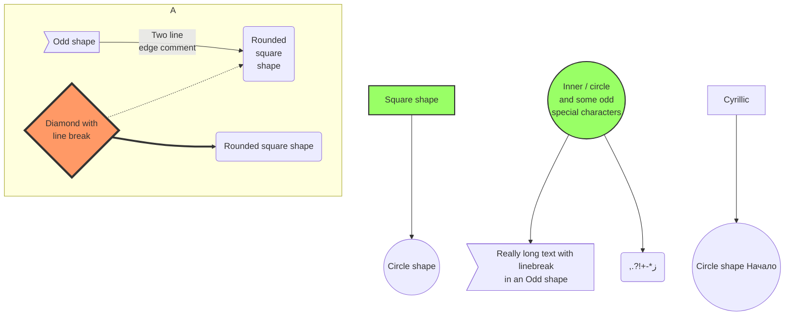

# 烧风的 Markdown 进阶教程

> <p style="text-align: right">——没想到，Markdown 远比想象的要精彩。</p>

::: warning
如果你还没看过 Markdown 基础教程，请先阅读 [烧风的 Markdown 基础教程](basic-tutorial-for-markdown.md)
:::

::: info
- 本篇 Markdown 进阶教程，同样也是完全使用 Markdown 编写的，然后渲染为你看到的这个网页，你可以在 [GitHub 仓库](https://github.com/HK-SHAO/HK-SHAO.github.io/blob/main/src/blog/p/advanced-use-of-markdown.md) 查看它的 Markdown 源码

- 本篇文章很大程度上参考了 [vuepress-theme-hope](https://vuepress-theme-hope.github.io/v2/zh/) 的文档，它的 [vuepress-plugin-md-enhance](https://vuepress-theme-hope.github.io/v2/md-enhance/zh/) 是本站正在使用的 Markdown 渲染器
:::

## 目录

::: warning

生成目录的语法是 `[TOC]` 而有些平台则是 `[[TOC]]` ，因为这并不是标准 Markdown 语法。同样的，后面的很多高级用法都不是标准 Markdown 语法，使用它们要注意平台是否支持和兼容

:::

::: details 查看目录

[[TOC]]

:::

::: details 查看 Markdown 代码
```markdown
[[TOC]]
```
:::


## Emoji 表情

::: info 
试试在 Markdown 中输入 Emoji 表情 :laughing: :laughing: :laughing:  ！！！

你可以直接键入 Unicode 表情，也可以根据 [这份对照表](https://gist.github.com/rxaviers/7360908) 输入
:::

:laughing: :laughing: :laughing:
🎈🎈🎈 恭喜你进入 Markdown 进阶教程！！！

```markdown
:laughing: :laughing: :laughing:
🎈🎈🎈 恭喜你进入 Markdown 进阶教程！！！
```

## 嵌入 HTML

::: info
通常，Markdown 需要先被转换为 HTML ，然后再解析成 [DOM 文档对象模型](https://developer.mozilla.org/zh-CN/docs/Web/API/Document_Object_Model) ，最终被布局排版并渲染为文档。更多信息，请了解 [HTML 超文本标记语言](https://developer.mozilla.org/zh-CN/docs/Web/HTML)
:::

::: tip
通过各种 HTML 标签和 `style` 样式，你可以更加灵活的控制页面布局和样式

下面举出一些常用例子，欢迎你补充或自己默默探索其它利用 HTML 的有趣用法
:::

### 键盘输入元素

<kbd>Ctrl</kbd> + <kbd>Shift</kbd> + <kbd>ESC</kbd>

```markdown
<kbd>Ctrl</kbd> + <kbd>Shift</kbd> + <kbd>ESC</kbd>
```

### 强制居中

::: warning
你可以使用 `<center>` 来强制居中，但它是已经被废弃使用的 HTML 标签，非常不推荐你使用它。请使用样式 `style="text-align: center"` 来代替，或者使用 [对齐标记](#对齐) 来居中
:::


<center>这是强制居中的一段文本</center>

<p style="text-align: center">这是居中的一段文本</p>

```markdown
<center>这是强制居中的一段文本</center>

<p style="text-align: center">这是居中的一段文本</p>
```

### 强制换行

::: warning
为保持文档的规范性，Markdown 避免出现空行，因此多余的空行会被取消掉，最多仅保留连续两个换行，但是你可以使用 HTML 来强制要求多次连续换行
:::

这是第一行


只换了两行

这是第一行<br><br><br><br>换了很多行

::: details 查看 Markdown 代码
```markdown
这是第一行


只换了两行

这是第一行<br><br><br><br>换了很多行
```

:::

### 嵌入 Web 程序

::: info
要完整的嵌入 HTML 和其它前端代码，请查看 [前端演示](#前端演示)
:::

## 转义语法

### 转义符号

在以下字符前面添加反斜杠字符 `\` ，可以显示原本用于格式化 Markdown 文档的字符

```markdown
\   反斜线          `   反引号
*   星号            _   下划线
{}  花括号          []  方括号
()  小括号          #   井字号
+   加号            -   减号
.   英文句点        !   感叹号
|   管道符号        ~   波浪号
```

### 转义 `` ` ``

想要输入 `` ` `` 你需要这样

```markdown
`` ` ``
```

### 转义 \`\`\`

想要输入 \`\`\` 你需要这样

```markdown
\`\`\`
```

### 字符实体

::: info
因为 Markdown 可以嵌入 HTML ， 因此字符实体也可以用，请参考 [Entity - 术语表 | MDN](https://developer.mozilla.org/zh-CN/docs/Glossary/Entity)
:::

## 标题索引

::: tip
每个标题是可以被自动索引的，注意到标题前面隐藏的 `#` 超链接了吗？

你还可以通过这个语法为每个标题设置自定义的编号，通过链接索引可以直接到达这个标题位置
:::

```markdown
### 这是你的标题 {#custom-id}
```

### 索引到标题

```markdown
[这个链接索引到标题](#custom-id)  
[也可通过完整链接索引](https://xxxx.xxxx/xxxx/xxxx.html#custom-id)
```

## $\LaTeX$ 公式

::: info
基于 [Mathjax](https://www.mathjax.org/) 或者 [KaTeX](https://katex.org/) 可以在 Markdown 中使用 $\LaTeX$ 语法来创建公式，本文的公式是使用 Mathjax 渲染的，其具体用法可以参考 [这篇帮助文档](https://latexlive.com/help)
:::

### 数学公式

::: tip 傅里叶变换
:::

$$
f(x) = \int_{-\infty}^\infty  \hat f(x)\xi\,e^{2 \pi i \xi x}  \,\mathrm{d}\xi 
$$

```markdown
$$
f(x) = \int_{-\infty}^\infty  \hat f(x)\xi\,e^{2 \pi i \xi x}  \,\mathrm{d}\xi 
$$
```

### 物理公式

::: tip 高斯定理
:::

$$
\mathop \Phi \nolimits_e = \oint { \mathord{ \buildrel{ \lower3pt \hbox{$ \scriptscriptstyle \rightharpoonup$}} \over E} \cdot {d \mathord{ \buildrel{ \lower3pt \hbox{$ \scriptscriptstyle \rightharpoonup$}} \over S}}  = {1 \over {{\varepsilon _0}}}\sum {q} } 
$$

```markdown
$$
\mathop \Phi \nolimits_e = \oint { \mathord{ \buildrel{ \lower3pt \hbox{$ \scriptscriptstyle \rightharpoonup$}} \over E} \cdot {d \mathord{ \buildrel{ \lower3pt \hbox{$ \scriptscriptstyle \rightharpoonup$}} \over S}}  = {1 \over {{\varepsilon _0}}}\sum {q} } 
$$
```

### 化学方程式

::: tip 硫酸钡沉淀
:::

$$
\ce{SO4^2- + Ba^2+ -> BaSO4 v} 
$$

```markdown
$$
\ce{SO4^2- + Ba^2+ -> BaSO4 v} 
$$
```

## 代码

### 代码行高亮

::: tip
行数范围标记的例子

- 行数范围: `{5-8}`
- 多个单行: `{4,7,9}`
- 组合使用: `{4,7-13,16,23-27,40}`
:::

```ts{1,6-8}
import { defaultTheme, defineUserConfig } from 'vuepress'

export default defineUserConfig({
  title: '你好， VuePress',

  theme: defaultTheme({
    logo: 'https://vuejs.org/images/logo.png',
  }),
})
```

::: details 查看 Markdown 代码
````markdown
```ts{1,6-8}
import { defaultTheme, defineUserConfig } from 'vuepress'

export default defineUserConfig({
  title: '你好， VuePress',

  theme: defaultTheme({
    logo: 'https://vuejs.org/images/logo.png',
  }),
})
```
````
:::

### 禁用行号

```python:no-line-numbers
print('你好烧风')
```

````markdown
```python:no-line-numbers
print('你好烧风')
```
````

### 分组代码

安装 VuePress Theme Hope

::: code-tabs#shell

@tab pnpm

```bash
pnpm add -D vuepress-theme-hope@next
```

@tab yarn

```bash
yarn add -D vuepress-theme-hope@next
```

@tab:active npm

```bash
npm i -D vuepress-theme-hope@next
```

:::

安装 VuePress Plugin Markdown Enhance

::: code-tabs#shell

@tab pnpm

```bash
pnpm add -D vuepress-plugin-md-enhance@next
```

@tab yarn

```bash
yarn add -D vuepress-plugin-md-enhance@next
```

@tab:active npm

```bash
npm i -D vuepress-plugin-md-enhance@next
```

:::

:::::details 查看 Markdown 代码
`````markdown
安装 VuePress Theme Hope

::: code-tabs#shell

@tab pnpm

```bash
pnpm add -D vuepress-theme-hope@next
```

@tab yarn

```bash
yarn add -D vuepress-theme-hope@next
```

@tab:active npm

```bash
npm i -D vuepress-theme-hope@next
```

:::

安装 VuePress Plugin Markdown Enhance

::: code-tabs#shell

@tab pnpm

```bash
pnpm add -D vuepress-plugin-md-enhance@next
```

@tab yarn

```bash
yarn add -D vuepress-plugin-md-enhance@next
```

@tab:active npm

```bash
npm i -D vuepress-plugin-md-enhance@next
```

:::
`````
:::::


## 上下标

- 19^th^
- H~2~O

```markdown
- 19^th^
- H~2~O
```

## 对齐

::: left
要左对齐的段落
:::

::: center
要居中对齐的段落
:::

::: right
要右对齐的段落
:::

```markdown
::: left
要左对齐的段落
:::

::: center
要居中对齐的段落
:::

::: right
要右对齐的段落
:::
```

## 图片

### 图片尺寸

|    |    |    |
| :---------------------------------: | :------------------------------------: | :----------------------------------: |
| `` | `` | `` |


```markdown
|    |    |    |
| :------------------------: | :---------------------------: | :-------------------------: |
| `` | `` | `` |
```


### 图片标记

::: info
一种特殊情况，使用 `#` 用为图像设置以下 ID ，可以使得这张图片尽在特定模式下显示
```markdown
#gh-dark-mode-only
#gh-light-mode-only
#dark
#light
```
现在，你可以试试反复切换主题的暗黑模式，观察图像发生的变化
:::

::: center

:::

::: center

:::

```markdown
::: center

:::

::: center

:::
```

## 标记

哈喽！很高兴认识你，我的 ==昵称== 叫烧风!

```markdown
哈喽！很高兴认识你，我的 ==昵称== 叫烧风!
```

## 容器

::: info
信息容器
:::

::: note
注释容器
:::

::: tip
提示容器
:::

::: warning
警告容器
:::

::: danger
危险容器
:::

::: details
详情容器
:::

::: info 自定义标题

一个有 `代码` 和 [链接](#演示) 的信息容器

```js
const a = 1;
```

:::

::: note 自定义标题

一个有 `代码` 和 [链接](#演示) 的注释容器

```js
const a = 1;
```

:::

::: tip 自定义标题

一个有 `代码` 和 [链接](#演示) 的提示容器

```js
const a = 1;
```

:::

::: warning 自定义标题

一个有 `代码` 和 [链接](#演示) 的警告容器

```js
const a = 1;
```

:::

::: danger 自定义标题

一个有 `代码` 和 [链接](#演示) 的危险容器

```js
const a = 1;
```

:::

::: details 自定义标题

一个有 `代码` 和 [链接](#演示) 的详情容器

```js
const a = 1;
```

:::

::: info 自定义信息
:::

::: note 自定义注释
:::

::: tip 自定义提示
:::

::: warning 自定义警告
:::

::: danger 自定义危险
:::

:::: details 查看 Markdown 代码

`````markdown
::: info
信息容器
:::

::: note
注释容器
:::

::: tip
提示容器
:::

::: warning
警告容器
:::

::: danger
危险容器
:::

::: details
详情容器
:::

::: info 自定义标题

一个有 `代码` 和 [链接](#演示) 的信息容器

```js
const a = 1;
```

:::

::: note 自定义标题

一个有 `代码` 和 [链接](#演示) 的注释容器

```js
const a = 1;
```

:::

::: tip 自定义标题

一个有 `代码` 和 [链接](#演示) 的提示容器

```js
const a = 1;
```

:::

::: warning 自定义标题

一个有 `代码` 和 [链接](#演示) 的警告容器

```js
const a = 1;
```

:::

::: danger 自定义标题

一个有 `代码` 和 [链接](#演示) 的危险容器

```js
const a = 1;
```

:::

::: details 自定义标题

一个有 `代码` 和 [链接](#演示) 的详情容器

```js
const a = 1;
```

:::

::: info 自定义信息
:::

::: note 自定义注释
:::

::: tip 自定义提示
:::

::: warning 自定义警告
:::

::: danger 自定义危险
:::
`````
::::

## Mermaid 框图

::: info
下面是一个 Mermaid 框图的例子，具体请查看 [在 Markdown 中使用框图](./use-mermaid-in-markdwon.md)
:::



::: details 查看 Markdown 代码

````markdown

````

:::


## Echarts 图表

::: info
下面是一个在 Markdwon 中使用 Echarts 图表的例子，更多信息请查看 [使用 Echarts 图表](use-echarts-in-markdown.md)
:::

::: echarts 一个柱状图案例

```json
{
  "xAxis": {
    "type": "category",
    "data": ["Mon", "Tue", "Wed", "Thu", "Fri", "Sat", "Sun"]
  },
  "yAxis": {
    "type": "value"
  },
  "series": [
    {
      "data": [120, 200, 150, 80, 70, 110, 130],
      "type": "bar",
      "showBackground": true,
      "backgroundStyle": {
        "color": "rgba(180, 180, 180, 0.2)"
      }
    }
  ]
}
```
:::

:::: details 查看 Markdown 代码
````markdown
::: echarts 一个柱状图案例

```json
{
  "xAxis": {
    "type": "category",
    "data": ["Mon", "Tue", "Wed", "Thu", "Fri", "Sat", "Sun"]
  },
  "yAxis": {
    "type": "value"
  },
  "series": [
    {
      "data": [120, 200, 150, 80, 70, 110, 130],
      "type": "bar",
      "showBackground": true,
      "backgroundStyle": {
        "color": "rgba(180, 180, 180, 0.2)"
      }
    }
  ]
}
```
:::
````
::::

## 思维导图

::: info
使用 [Markmap](https://markmap.js.org/) 和 Markdown 语法来创建思维导图
:::

:::: normal-demo 演示
```html
<iframe src="/html/blog/markmap-demo.html"
width="100%"
height="100%"
frameborder="0"
scrolling="No"
leftmargin="0"
topmargin="0"
/>
```

::::

:::: details 查看 Markdown 代码
`````markdown
---
markmap:
  colorFreezeLevel: 2
---

# markmap

## Links

- <https://markmap.js.org/>
- [GitHub](https://github.com/gera2ld/markmap)

## Related Projects

- [coc-markmap](https://github.com/gera2ld/coc-markmap)
- [gatsby-remark-markmap](https://github.com/gera2ld/gatsby-remark-markmap)

## Features

- links
- **strong** ~~del~~ *italic* ==highlight==
- multiline
  text
- `inline code`
-
    ```js
    console.log('code block');
    ```
- KateX
  - $x = {-b \pm \sqrt{b^2-4ac} \over 2a}$
  - [More Katex Examples](#?d=gist:af76a4c245b302206b16aec503dbe07b:katex.md)
- Now we can wrap very very very very long text based on `maxWidth` option
`````
::::

## 选项卡

### 无绑定

::: tabs

@tab apple

Apple

@tab banana

Banana

@tab orange

Orange

:::

:::: details 查看 Markdown 代码
```markdown
::: tabs

@tab apple

Apple

@tab banana

Banana

@tab orange

Orange

:::
```
::::

### 绑定关联

::: tabs#fruit

@tab apple#apple

Apple

@tab banana#banana

Banana

:::


::: tabs#fruit

@tab apple

Apple

@tab banana

Banana

@tab orange

Orange

:::


:::: details 查看 Markdown 代码
```markdown
::: tabs#fruit

@tab apple#apple

Apple

@tab banana#banana

Banana

:::


::: tabs#fruit

@tab apple

Apple

@tab banana

Banana

@tab orange

Orange

:::
```
::::

## 幻灯片

::: info
基于 [reveal.js](https://revealjs.com/) ，使用 Markdown 语法来创建 Slides
:::

::: tip
除此之外，你还有其它选择来创建 Slides ，例如 [Marp](https://marp.app/) 和 [Slidev](https://sli.dev/) 等
:::

@slidestart auto

## 幻灯片 1

一个有文字和 [链接](https://mrhope.site) 的段落

---

## 幻灯片 2

- 项目 1
- 项目 2

---

## 幻灯片 3.1

```js
const a = 1;
```

--

## 幻灯片 3.2

$$
J(\theta_0,\theta_1) = \sum_{i=0}
$$

@slideend

::: details 查看 Markdown 代码
````markdown
@slidestart

## 幻灯片 1

一个有文字和 [链接](https://mrhope.site) 的段落

---

## 幻灯片 2

- 项目 1
- 项目 2

---

## 幻灯片 3.1

```js
const a = 1;
```

--

## 幻灯片 3.2

$$
J(\theta_0,\theta_1) = \sum_{i=0}
$$

@slideend
````
:::

## 前端演示

::: info
在页面内独立出一个渲染 Web 的容器，支持纯 `HTML/JS/CSS` ，还支持 `Vue` 和 `React  `
:::

::: tip
下面是一个例子，更多信息请查看 VuePress Theme Hope 的 [代码演示](https://vuepress-theme-hope.github.io/v2/zh/guide/markdown/demo.html)
:::

::: normal-demo Demo 演示

```html
<h1>你好，我是<span>烧风</span></h1>
<p><button id="button">一个按钮</button></p>
```

```js
document.querySelector("#button").addEventListener("click", () => {
  alert("Hello World!");
});
```

```css
span {
  color: green;
}
```

:::

::::: details 查看 Markdown 代码
`````markdown
::: normal-demo Demo 演示

```html
<h1>VuePress Theme <span>Hope</span></h1>
<p><button id="very">非常强大!</button></p>
```

```js
document.querySelector("#very").addEventListener("click", () => {
  alert("非常强大");
});
```

```css
span {
  color: green;
}
```

:::
`````
:::::

## 组件

::: info
在 Markdown 中嵌入 Vue 组件，可以实现为页面插入视频（Bilibili、YouTube、视频文件）、 PDF 文档和其它 Web 程序。
:::

::: tip
详细信息请查看 VuePress Theme Hope 的 [vuepress-plugin-components](https://vuepress-theme-hope.github.io/v2/components/zh/)
:::

### PDF

<br/>

<PDF url="/bin/pdf/pdf-demo.pdf" />

::::: details 查看 Markdown 代码
`````markdown
<PDF url="/bin/pdf/pdf-demo.pdf" />
`````
:::::


## 尾声

::: danger

Markdown 的进阶使用方法，大多数并不是标准语法，不一定受平台支持，兼容性可能存在问题。你需要根据你使用的工具或者环境来判断这个语法或者功能是否被支持

:::

@include(@src/shared/license.md{3-})