# 引导大语言模型生成计算机可解析内容

::: note 关于本文
- **本文作者**：王家晔 (JiayeWang)
- **作者单位**：华南师范大学软件学院 & Tencent PCG
- **初公开于**：https://chinaxiv.org/abs/202403.00340
:::

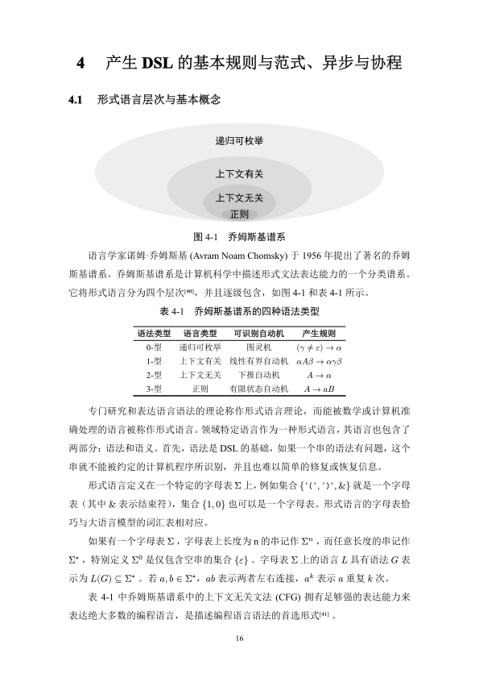
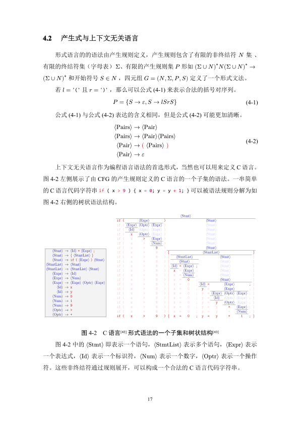
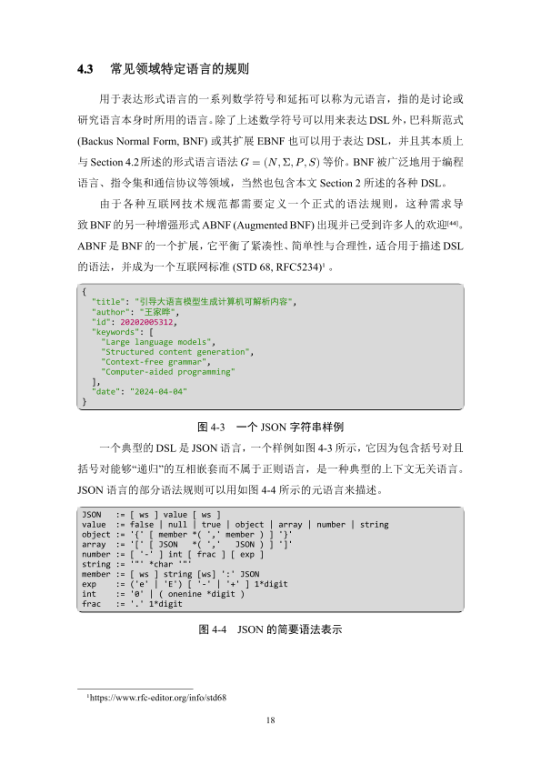
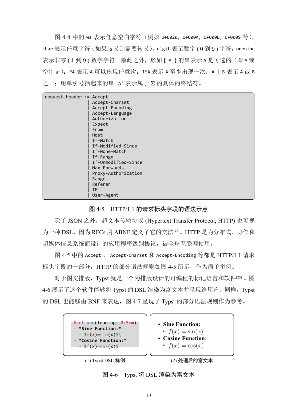

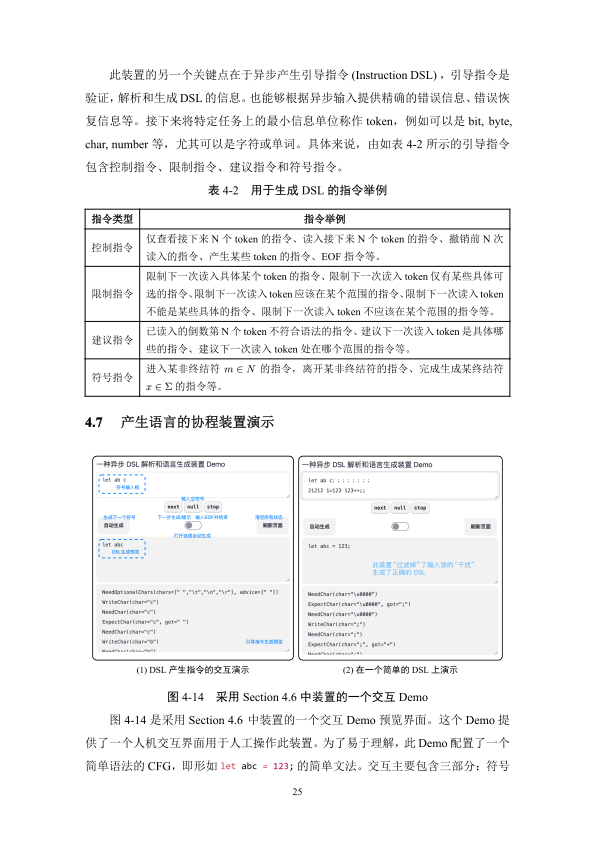

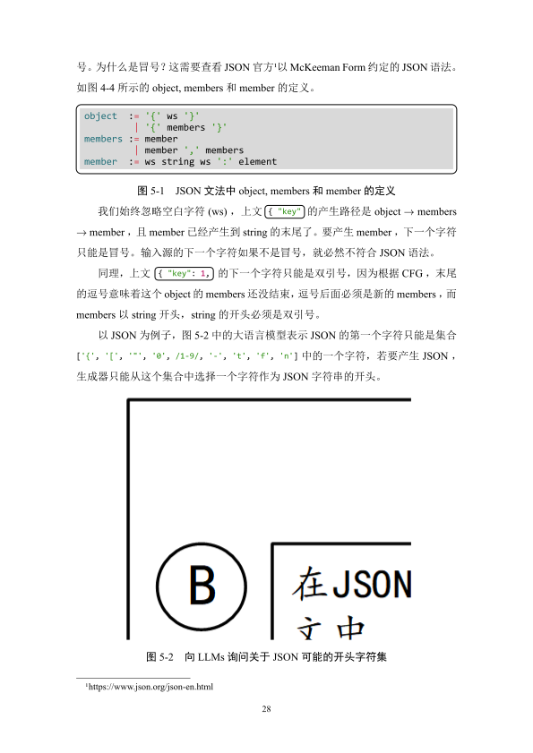

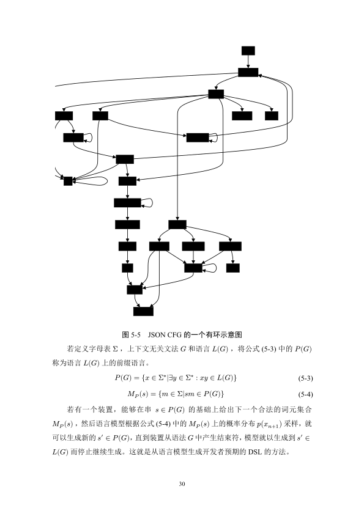

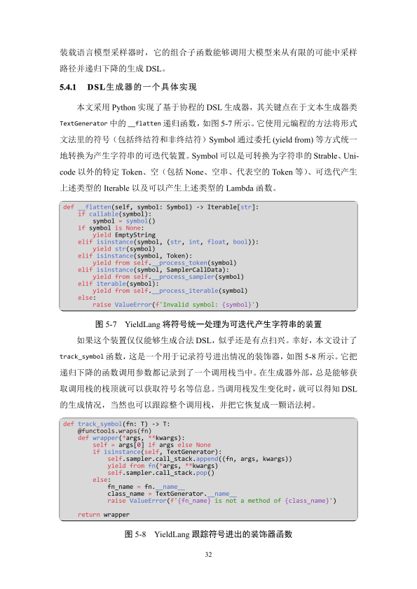
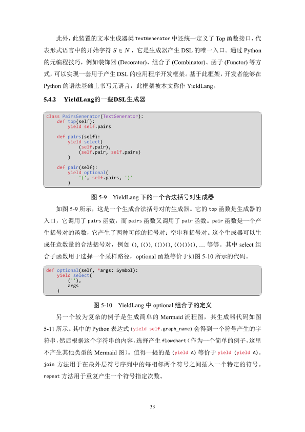

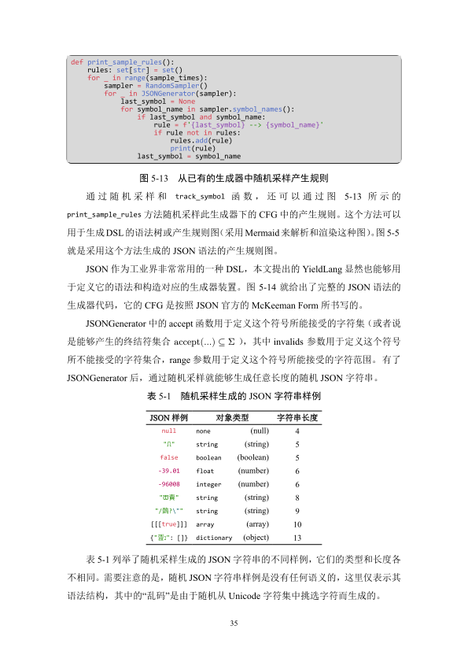

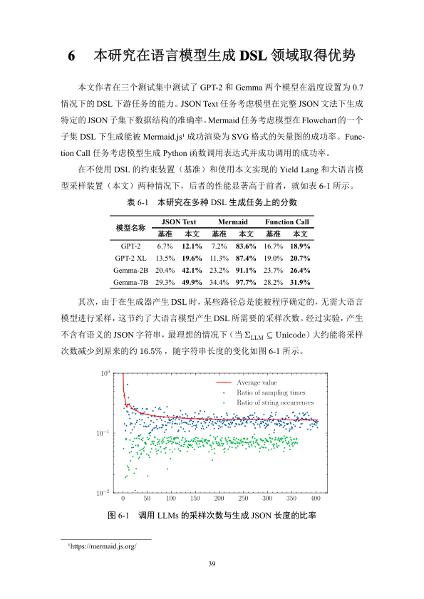

@include(@src/shared/license.md{3-})