# 数字图像处理基础大作业

:::: center


自发光、辉光、镜中镜

::::

::: details 查看目录

[[TOC]]

:::

<div style="page-break-after:always;"></div>

## 前言

亲爱的 XX 老师，这次大作业我会主要介绍我在这两周自行从零实现的一个 PT Renderer (路径追踪渲染器)，涉及的主要工作是计算机伪随机数生成、三维空间中的变换、蒙特卡洛、图像采样、图像预处理、双向散射分布函数、有向距离场函数和求交、计算成像、基于物理的渲染、基础光学原理、色调映射算法、图像后期降噪算法等。我没有按照老师的要求从作品选题中四选一，但我能保证本文介绍的 PT 是我个人从零开始实现的，本文是本人独创。

PT 中涉及到了一些简单的数字图像处理操作，此作品的 Taichi 语言 (一个并行计算框架) 版本[^taichiv]也获得了太极图形 ([Taichi Graphics](taichi.graphics), 国内一家图形学研究初创公司) 的 Hackathon 比赛第一名。相信我从《数字图像处理处理基础》这门课程中有所收获。

[^taichiv]: HK-SHAO. Taichi: 从零开始的光线追踪. https://shao.fun/blog/w/taichi-ray-tracing.html.  

## 选题

正如前面所说，本次大作业我采用自己的选题《一个基于路径追踪并基于物理的有向距离场函数渲染器》，项目采用的是 Taichi 和着色器语言 (SL) 描述，并实时通过像素着色器运行在图形处理器中。~~对于老师给的四个选题，其中选题一我会采用计算着色器对图像做预处理，使用卷积寻找瓶子边缘和瓶颈并分割，用灰度值面积比的阈值就可以大致判断出是否装满。对于第二题可以是用灰度化、二值化、降噪、腐蚀算法。第三题可以用灰度化、二值化、矫正扭曲、去噪、识别。第四题我可能会用卷积神经网络。~~

## 工具

着色器程序使用着色器语言编写的，并由 CPU 编译为机器码，发送到 GPU 中由 GPU 直接并行运行的程序。因此它的并行处理效率极其优秀。着色器程序分为很多种，例如顶点着色器、片段着色器、几何着色器、计算着色器等等。GPU 尤其擅长高密度的并行运算，并对向量、矩阵和线性代数常见运算有着特别指令优化。上面这些优点 Taichi 编程语言也有，Taichi 可以被嵌入到 Python 中。因此本项目采用 Taichi 和 SL 编写。

## 基础原理

光线追踪程序的基本原理是从光源发出光子，光子传播并与物体表面或次表面产生作用，然后继续传播，直到击中摄像机的传感器。然鹅由于对光源的采样，太少密度光子会击中传感器了，为了提高计算效率，假设光子沿着直线传播，并且按照光路可逆原理，光线从屏幕像素逆向寻找光源，大大提高了计算效率，因此这种方法被称作反向路径追踪。

路径追踪的好处是每个像素都能够无偏的获得整个虚拟世界中的信息，因此可以带来全局光照效果，而基于 PBR 的渲染又可以达到真实感渲染器需求。但路径追踪的缺点是相比光栅化和屏幕空间的渲染，计算量大幅度上升，因此难以做到实时渲染（每秒 24 帧以上并保证像素采样质量），大多应用在高级的离线渲染器。

本文采用的渲染算法为反向路径追踪，简图如下：

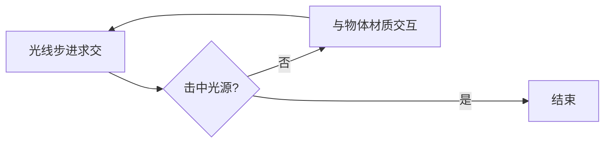

## 算法难点

一个路径追踪渲染器的难点和计算密集度主要集中在两点，分别是:
- 光线与物体求交
- 光线与物体材质交互

### 光线与物体求交

光线与物体求交指的是，光线（包含当前位置和方向）传播后:
- 与哪个物体相交？在哪里相交？
- 相交位置物体表面的法线是什么？
- 相交位置的材质信息是什么？

#### 形状建模

这涉及到我们如何表示对物体建模。物体包含了形状、变换（包含位置、旋转、大小），对物体形状的建模方式通常有三种：

- 网格（离散，不统一）
  - 网格 (Mesh) ，用离散的顶点组成的不统一三角面表示物体形状
- 体素（离散，统一）
  - 体素 (Voxel)，用离散但是大小统一的方块来组成物体形状
- 场（连续，统一）
  - 场 (Field) ，用连续的数学函数表示物体形状，通常有距离场、密度场等

本研究采用有向距离场 (SDF, Signed Distance Field) 表示物体，当距离为 $0$ 时代表点在物体表面，因此方程 $sdf(\vec{\mathbf{p}})=0$ 表示的是一个隐式曲面，且通过简单的数学操作可以对场进行交、并、差集来建模。

:::: center

|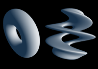|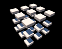|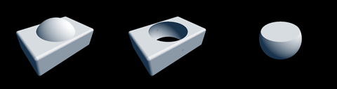|
|:--:|:--:|:--:|
|扭曲物体|重复物体|并集、差集、交集|

图片来自 https://iquilezles.org/articles/distfunctions/

::::

#### 步进求交

有了形状之后，对物体的求交就变成了数学问题。对于 SDF 形状，采用的办法是光线步进 (Ray March) 。即让光子一步一步前进，如果光子离物体表面足够近就认为相交。

:::: center

|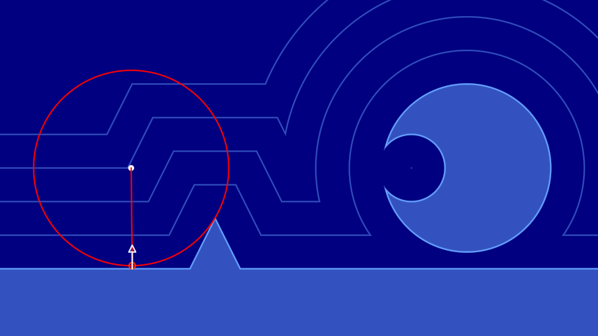|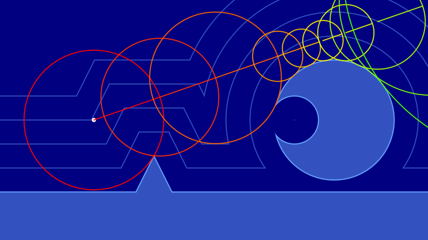|
|:-:|:-:|
|较好的情况下很快到达物体表面|没有交点的情况很快就发散|

图片截取自 https://www.shadertoy.com/view/lslXD8

::::

#### 核心代码

```glsl
// 使用光线步进 (Ray March) 检测第一个交点
record raycast(ray r) {
    record rec; float t = TMIN;
    for(uint i = 0U; i < MAX_RAYMARCH && t < TMAX && !rec.hit; i++) {
        rec.pos = at(r, t);
        rec.obj = nearest_object(rec.pos);
        rec.hit = rec.obj.dis < PRECISION;
        t      += rec.obj.dis;
    }
    return rec;
}
```

### 光线与物体材质交互

光线与物体材质交互指的是，当光线达到物体表面之后，哪些光会被吸收？哪些光会被反射、散射、折射？并且方向是什么？或者更简单的说就是，光子颜色和方向怎么变化？本研究采用的是基于物理的渲染 (PBR, Physicallly-Based Rendering) ，且采用“粗糙度/金属度”表示方法。

由于一条光线经过材质交互后可能产生的不止一条光线，我们把一次交互认为是材质在这一点上的球面采样。这样的话光线在多次在物体表面采样后可能会像“核裂变”一样产生巨量的光线，计算量过高，通常我们也不希望使用递归的方法。有一种办法避开“核裂变”，每一次只采样一条光线，把计算量分摊到更多帧，然后再累积起来。那就是使用蒙特卡洛采样，或者地差异化序列采样。本研究目前采用蒙特卡洛采样。

### 双向散射率分布函数

本研究的 PBR 基于双向散射率分布函数 (BSDF, Bidirectional Scattering Distribution Function) ，包含反射散射部分 (RSDF) 和透射散射部分 (TSDF) 。对于使用这种方法渲染，已经能够达到真实感渲染器需求。

对物体材质的建模包含当前位置的粗糙度、金属度、基础色、透射度、折射率等。有时还会加入法线映射、置换映射、环境光遮蔽映射，目的是以以低精度模型为物体表面带来不同的法线、高度和遮蔽信息。

#### 核心代码

```glsl
// 应用 PBR 材质
ray BSDF(ray r, record rec) {
    // 材质参数
    vec3  albedo       = rec.obj.mtl.albedo;
    float roughness    = rec.obj.mtl.roughness;
    float metallic     = rec.obj.mtl.metallic;
    float transmission = rec.obj.mtl.transmission;
    vec3  normal       = rec.obj.mtl.normal;
    float ior          = rec.obj.mtl.ior;
    
    normal = TBN(rec.normal) * normal; // 将切线空间法线转换到世界空间
    
    // 光线和物体表面参数
    vec3 I  =  r.direction;
    vec3 V  = -r.direction;
    vec3 P  =  rec.pos;
    vec3 N  =  normal;
    vec3 C  =  r.color;
    vec3 L;
    
    float outer = sign(dot(N, V)); // 光正在从外面穿入物体表面
    N = normal *= outer; // 如果处于 SDF 物体内部就反过来
    
    N = TBN(N) * hemispheric_sampling(roughness);
    float NoV   = dot(N, V);

    float eta = outer > 0.0 ? ENV_IOR / ior : ior / ENV_IOR; // 折射率之比
    float k   = 1.0 - eta * eta * (1.0 - NoV * NoV); // 小于 0 为全反射
    float F0  = (eta - 1.0) / (eta + 1.0); F0 *= 3.0*F0; // 让反射更明显一些
    float F   = fresnel_schlick(NoV, F0, roughness); // 菲涅尔

    vec2 rand2 = rand21();
    if (rand2.x < transmission) { // BTDF 透射或者反射
        if (rand2.y < F + metallic || k < 0.0) {
            L = I + 2.0 * NoV * N; // 菲涅尔反射或全反射
        } else {
            L = eta * I - (sqrt(k)- eta * NoV) * N; // 斯涅尔折射
        }
    } else { // BRDF 反射或者漫反射
        if (rand2.y < F + metallic) {
            L = I + 2.0 * NoV * N; // 镜面反射
        } else {
            L = TBN(N) * hemispheric_sampling(); // 漫反射
        }
        
        // 如果光穿入或穿出表面就直接吸收掉
        C *= float(dot(L, normal) > 0.0);
    }

    C *= albedo;

    // 更新光的方向和颜色
    r.color     = C;
    r.origin    = P;
    r.direction = L;
    
    return r;
}
```

## 摄像机表示

摄像机是对人眼的模仿，但现实的摄像机拥有更多可以调整的参数，例如除了有位置 (lookfrom) 、朝向 (lookat, vup) 之外，还有视野 (vfov)、传感器（画布）长宽比 (aspect)、光圈直径 (aperture)、合焦距离 (focus) 等等参数，这些参数会影响摄像机传感器捕获的光子。关于摄像机的更多信息，可以看我为 Taichi 写的这篇科普文章：[Taichi: 从零开始的光线追踪 | HK-SHAO](https://shao.fun/blog/w/taichi-ray-tracing.html#%E5%88%9B%E5%BB%BA%E6%91%84%E5%83%8F%E6%9C%BA%E7%B1%BB)

::: center
  
我为这个摄像机模型总结了一幅图，根据这幅图可以直观的写出代码
:::

## 图像处理

像素着色器程序就是对输入像素和信息进行处理然后输出像素信息 (一个 `vec4` 分别表示 RGBA 四个通道的强度，归一化到 $[0,1]$ 之间) 。

本研究的图像处理集中在基于图像的照明 (IBL, Image Based Lighting) 、色调映射 (Tone Mapping) 和图像降噪。

### 基于图像的照明

通常是在现实世界用相机采集整个环境的高动态范围 (HDR) 图像，然后投影到天空盒（六个正方形图像）或者从一个球等距投影到展开的圆柱体上（一个矩形图像）。这样，这张图像就可以充当环境光照信息，对虚拟世界里的物体打光。如下图，是等距投影的一张 HDR 图像（已被转换到 SDR/sRGB ）

:::: center

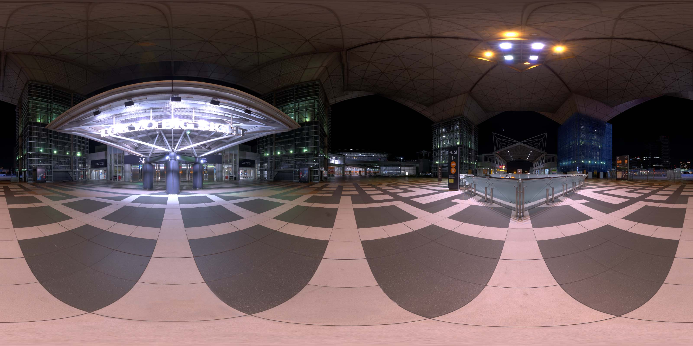  

东京国际展览中心的 IBL 图片[^sibl]

::::

[^sibl]: sIBL Archive. sIBL Archive. http://www.hdrlabs.com/sibl/archive.html.

对于反向路径追踪，基于图像的照明很简单。当光线没有与任何一个物体相交时，光线会在无穷远处与天空相交，而这个天空就是我们的 HDR 图像，这样就做到在 HDR 上采样 IBL 了。

#### 核心代码

由于某些情况下无法使用 HDR 图像，因此下面的方法是将一张 SDR 图像叠加一张泛光后的 SDR 图像来模拟 HDR 图像。

```glsl
// 采样立方体贴图
vec4 mix_cube_lod(samplerCube sharp, 
                  samplerCube blur, vec3 dir, float lod) {
    return mix(textureLod(sharp, dir, lod), 
               textureLod(blur, dir, lod), lod);
}

// 采样天空
vec3 sky(ray r, float brightness, float lod) { // 天空盒 IBL 照明
    vec4 ibl = mix_cube_lod(iChannel2, iChannel3, r.direction, lod); 
    return pow(ibl.rgb * ibl.a * brightness, vec3(gamma)); // gamma 矫正
}
```

### 超采样抗锯齿

锯齿的产生是因为我们的像素是离散的，但是只要像素密度足够高，我们就难以察觉出锯齿。因此超采样抗锯齿的思路是在一个像素中虚拟出更多像素，然后对这些像素进行平均。在光线追踪中，我们可以在一个像素中对 uv 进行抖动，来模拟对像素内大量虚拟像素的采样。

在蒙特卡洛过程使用超采样抗锯齿的办法很简单，只需要对 UV 进行抖动即可。

#### 核心代码

```glsl
// 用 UV 和时间初始化随机数发生器种子
seed = rand13(vec3(uv, TIME));

// 超采样
uv += rand21() * SCREEN_PIXEL_SIZE;

// 对每个光子经过的表面采样一次
ray r = get_ray(cam, uv, vec3(1));

// 处理颜色
vec3 color = raytrace(r).color;
```

### 色调映射

大多数显示器能够显示的色彩范围是 $[0,1]$ ，当 RGB 的某个分量大于 1 时，会被直接截断为 1 ，这带来的后果是大量高光信息丢失。自然世界中的光强取值是 $[0,+\infty]$ ，为了能够让更广的动态范围被显示设备显示，需要一条曲线映射原本的光强，在保证阴影和高光细节的同时，呈现更真实的色彩。

:::: center

|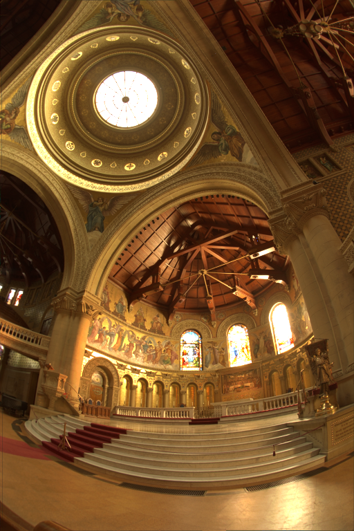|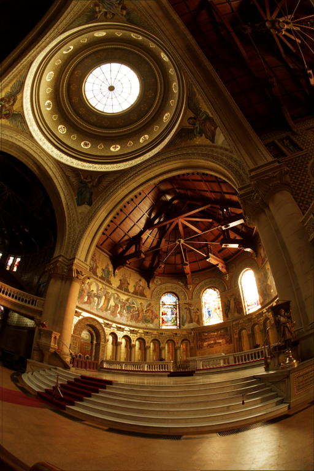|
|:-:|:-:|
|直接截断颜色|ACES 色调映射|

::::

Matt Taylor 的这篇文章[^tomp]很好的总结了各种色调映射算法，本研究使用了 ACES (Academy Color Encoding System) 色调映射算法。

[^tomp]: Matt Taylor. Tone Mapping. https://64.github.io/tonemapping/.

#### 核心代码

非本次研究独创，代码来自 Paniq's ACES fitted from https://github.com/TheRealMJP/BakingLab/blob/master/BakingLab/ACES.hlsl

```glsl
vec3 ACESFitted(vec3 color) {
	// ODT_SAT => XYZ => D60_2_D65 => sRGB
    color *= mat3(
        0.59719, 0.35458, 0.04823,
        0.07600, 0.90834, 0.01566,
        0.02840, 0.13383, 0.83777
    );
    // Apply RRT and ODT
    vec3 a = color * (color + 0.0245786) - 0.000090537;
    vec3 b = color * (0.983729 * color + 0.4329510) + 0.238081;
    color  = a / b;
	// Back to color space
    color *= mat3(
         1.60475, -0.53108, -0.07367,
        -0.10208,  1.10813, -0.00605,
        -0.00327, -0.07276,  1.07602
    );
    // Clamp to [0, 1]
    return clamp(color, 0.0, 1.0);
}
```

### 伽马矫正

在图像后处理阶段，色调映射前应该调整曝光值，色调映射后要对图像进行 gamma 映射。人眼感受到的光强并不是与物理世界的光强成线性增长，因此色调映射通常与 gamma 矫正一起使用。

#### 核心代码

```glsl
// 色调映射
color *= camera_exposure;
color  = ACESFitted(color);

// 伽马矫正
color = pow(color, vec3(1.0 / gamma));
```

### 降噪

由蒙特卡洛采样路径追踪产生的图像，通常包含大量噪点。研究需要一种方法，能在各个处理阶段尽量减少噪点。通常降噪可以从这三方面优化：

- 蒙特卡洛重要性采样：尽量采样更多贡献更大的光线路径
- 增加采样次数 (SPP, Samples per pixel) ：为每一像素采样更多次颜色信息并混合起来
- 后处理降噪：通用图像降噪后处理方法或者针对路径追踪程序的特定图像降噪后处理

#### 重要性采样

本研究没有使用特定的重要性采样算法，而是直接根据模型对光的方向进行改变。在本文截止之前，我还未实现对光源的重要性采样（本来今天正准备研究的，但是得等我写完这篇报告先）。

对光源的重要性采样集中在寻找场景中光源位置和光源类型，光源类型包括点光源、面光源、方向光源、体积光源等。基本思路是根据光源信息来决定采样的偏向。

#### 增加采样数

基础降噪的思路很简单，因为光线追踪是一个蒙特卡洛过程，所以我们可以在迭代中对多帧结果进行积累，当积累足够多步数后，总有一个临界点让我们无法观察到噪点。我们可以用变量 $\mathbf{C}_i$ 和 $\mathbf{C}_{i-1}$ 来表示当前帧和上一帧像素颜色，用 $\mathbf{S}_i$ 表示这帧采样到的颜色，用 $n$ 来表示当前的采样次数，那么我们可以用下面的公式来更新像素颜色

$$
\mathbf{C}_i = \mathrm{mix}\left(\mathbf{C}_{i-1}, \mathbf{S}_i, \frac{1}{n}\right)
$$

还有一种方法是直接将颜色累加起来，使用 alpha 通道，也就是像素 `vec4` 的 alpha 值来标记这个像素采样的次数，在下一个 buffer 中将颜色值除以 alpha 值获取平均后的颜色。

#### 人工智能降噪

针对路径追踪的 AI 降噪是一项很重要的研究，这项研究英伟达、英特尔等企业都在研究并在 SIGGRAPH 发了数篇论文，其中目前最新的一篇是英特尔的。

Intel 的论文 [Temporally Stable Real-Time Joint Neural Denoising and Supersampling](https://www.intel.com/content/www/us/en/developer/articles/technical/temporally-stable-denoising-and-supersampling.html) 提出了一种效果不错的光追降噪方法，这是一种混合了传统和 AI 的降噪方案 。

我与 Keyu Lu (宾夕法尼亚大学图形学在读学生) 同学正在共同研究这篇论文，Keyu Lu 写了篇简介在我的博客[^keyuv]，更多信息请前往这里查看：[光线追踪实时渲染降噪 (WIP) | HK-SHAO](https://shao.fun/blog/w/ray-tracing-denoise.html)

[^keyuv]: Keyu Lu. 光线追踪实时渲染降噪 (WIP). https://shao.fun/blog/w/ray-tracing-denoise.html.

### 泛光

由于我们的显示器通常都是 SDR 而不是 HDR，更高的亮度信息会被直接截断到 $1$ ，没办法显示亮度特别高的画面，因此有一种图像后处理技术，提取原本更高亮度的信息，然后采用一个高斯模糊或者其它泛光图形映射得到一张图像与原本的图像叠加起来。这样就获得了好看的泛光效果，让人视觉上感受这块区域亮度很高。

#### 后处理代码

非此次研究原创，代码 fork 自 [Gem Bloom FX (shadertoy.com)](https://www.shadertoy.com/view/MssczX)

```glsl
vec2 rot(vec2 p, float a) {
    a=radians(a);
    return cos(a)*p + sin(a)*vec2(p.y, -p.x);
}
vec2 saturate(vec2 p) { return clamp(p,0.,1.); }
void mainImage( out vec4 fragColor, in vec2 fragCoord ){
    const float n = 24.;
    const float a1 = -1.;
    const float a2 = -5.;
    vec2 uv = fragCoord/iResolution.xy;
    vec3 color = vec3(0);
    vec2 colorShift = vec2(2,1)/iResolution.xy;
    vec2 uv1 = uv+colorShift;
    vec2 uv2 = uv;
    vec2 uv3 = uv-colorShift;
    vec2 axis1 = rot(vec2(0,1.105/iResolution.y),-15.);
    vec2 axis2 = rot(vec2(0,0.953/iResolution.y),+65.);
    for(float delta = 0.; delta< n;delta++){
        float scale = .0625*.0625*(1.-.9875*delta/n);
        vec2 d1r = delta*rot(axis1,-a1);
        vec2 d1g = delta*axis1;
        vec2 d1b = delta*rot(axis1,+a1);
        vec4 texR1 = texture(iChannel0, saturate(uv1+d1r));
        vec4 texR2 = texture(iChannel0, saturate(uv1-d1r));
        vec4 texG1 = texture(iChannel0, saturate(uv2+d1g));
        vec4 texG2 = texture(iChannel0, saturate(uv2-d1g));
        vec4 texB1 = texture(iChannel0, saturate(uv3+d1b));
        vec4 texB2 = texture(iChannel0, saturate(uv3-d1b));
        vec3 aberr1 = vec3(dot(vec4(10,4,2,0),texR1+texR2),
                           dot(vec4(3,10,3,0),texG1+texG2),
                           dot(vec4(2,4,10,0),texB1+texB2));
        vec3 col1 = aberr1*max(aberr1.r,max(aberr1.g,aberr1.b));
        vec2 d2r = delta*rot(axis2,+a2);
        vec2 d2g = delta*axis2;
        vec2 d2b = delta*rot(axis2,-a2);
        vec4 texR3 = texture(iChannel0, saturate(uv1+d2r));
        vec4 texR4 = texture(iChannel0, saturate(uv1-d2r));
        vec4 texG3 = texture(iChannel0, saturate(uv2+d2g));
        vec4 texG4 = texture(iChannel0, saturate(uv2-d2g));
        vec4 texB3 = texture(iChannel0, saturate(uv3+d2b));
        vec4 texB4 = texture(iChannel0, saturate(uv3-d2b));
        vec3 aberr2 = vec3(dot(vec4(10,4,2,0),texR3+texR4),
                           dot(vec4(3,10,3,0),texG3+texG4),
                           dot(vec4(2,4,10,0),texB3+texB4));
        vec3 col2 = aberr2*max(aberr2.r,max(aberr2.g,aberr2.b));
        vec3 col = pow(scale*max(col1,col2)*3.7,vec3(5.2));
        color+=col;
    }
    fragColor = vec4(mix(texture(iChannel0,uv).rgb, color,
                         smoothstep(.01,.2,min(uv.x,uv.y))*
                         smoothstep(-.99,-.8,-max(uv.x,uv.y))),1);
    vec4 res = texture(iChannel1,uv);
    fragColor = max(vec4(0),sqrt(5.5*fragColor)*.0010625) + 
        			vec4(res.rgb/res.a,1.0);;
}
```

## 研究效果

研究还算是比较成功的，并且在 AMD 6800H 的核显可以流畅的渲染出以下图像。

### 自发光、辉光、镜中镜


<div style="page-break-after:always;"></div>

### 玻璃中的空气，空气中的玻璃

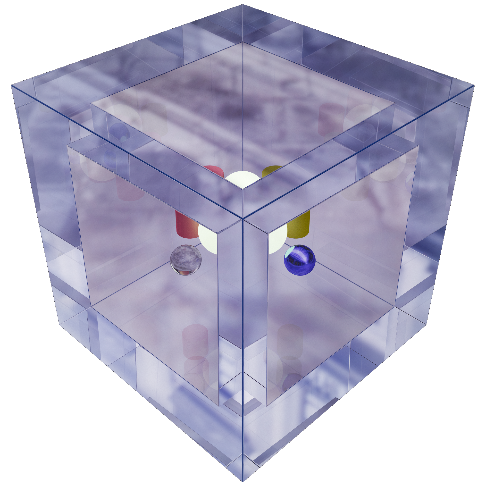

<div style="page-break-after:always;"></div>

### 光圈、景深、对焦测试

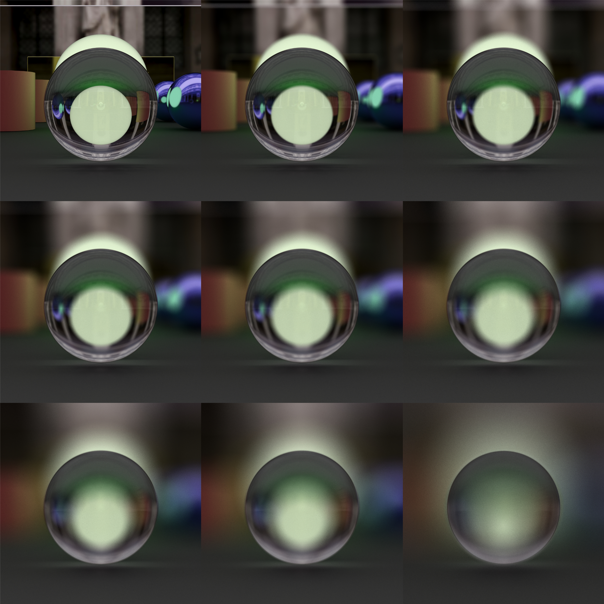

<div style="page-break-after:always;"></div>

### 人脸模型、茶壶模型、各种材质

|||
|-|-|

### 自发光绿球、镜子面对面


## 不足之处

在渲染上还有很多需要进一步优化和提升的点。

### ToDo

- [ ] Bloom&Glow: 进一步辉光和泛光后处理提高画面质量
- [ ] Checkerboard Rendering: 棋盘渲染提高渲染性能并增加分辨率
- [ ] Reprojection: 摄像机位置改变，用历史的画面加速采样并起到降噪效果
- [ ] Light Sources: 对光源的特殊采样
- [ ] Importance Sampling: 重要性采样
- [ ] Spectral Rendering: 光谱渲染，渲染焦散色散色差等
- [ ] Mesh Rendering: 网格渲染
- [ ] Voxel Rendering: 体素渲染
- [ ] Volume Rendering: 体积渲染
- [ ] Bouding Volume Hierarchy: 层次包围体求交加速
- [ ] Further noise reduction: 在低 SPP 下进一步降噪等

### 展望

- [ ] 一个更好的 GUI 对各种参数调整
- [ ] 其它资源（例如 HDR 图、模型文件等）的读取

## 致谢

感谢蔡逸彬和 Keyu Lu 同学帮助我跟进了其中一些研究内容。还非常感谢 Taichi 图形对我进行了支持，以及 GAMES104 、Shadertoy 里的大佬。还特别感谢 @ycz 大佬的文章对我有不少启发。

## 附录

关于本程序，您可以在网页上直接运行（需使用算力足够且系统和浏览器较新的计算机）
- https://www.shadertoy.com/view/ddSSWy
- [raytracing.shao.fun](https://raytracing.shao.fun)

本项目全部代码已经在 GitHub 开源，请参考

- [HK-SHAO/RayTracingPBR: Ray Tracing PBR for Taichi Hackathon 2022 (github.com)](https://github.com/HK-SHAO/RayTracingPBR)
- [RayTracing PBR with Free Camera in ShaderToy (github.com)](https://gist.github.com/HK-SHAO/e142e3889270d353e3acae5bf3e1a82a)
