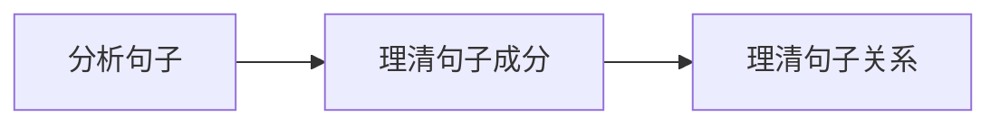
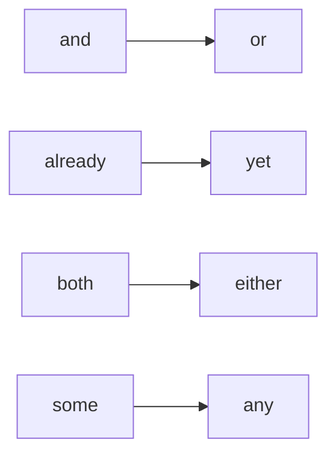
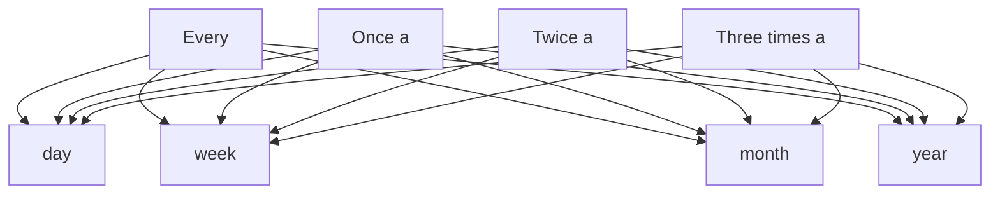

# Yjango 的英语语法总结

::: warning
本文排版暂未完成哦
:::

::: details 目录

[[TOC]]

:::

## 句子

**学习语法：**

### 句子成分

1. **主语**：句子所陈述的对象。
2. **谓语**：主语发出的动作。一般是有动作意义的动词。
3. **宾语**：分为动词宾语和介词宾语，属于动作的承受者。
4. **系动词**：表示状态或状态变化的动词，没有实际的动作意义。例如
   1. be 动词 (am, is, are) ；
   2. 感官系动词 (look, sound, smell, taste, feel) ；
   3. 保持类系动词 (keep, stay, remain) ；
   4. 状态变化类系动词 (become, get, turn, go) 等。

5. **表语**：紧跟系动词后面的成分。
6. **定语**：修饰名词或代词的成分。
7. **状语**： 修饰形容词、副词、动词或句子的成分。
8. **补语**：分为宾语补足语和主语补足语。是对宾语和主语的补充说明，与其有主动或被动的逻辑关系。

### 句型

**句子的基本结构**：主语部分 + 谓语部分（名词+动词）

#### 五种句型

| 模式            | 例句                           | 分析                                                      |
| --------------- | ------------------------------ | --------------------------------------------------------- |
| 主 系 表        | I am a student.                | (I) 主语 (am) 系动词 (a student) 表语                     |
| 主 谓           | I am studying.                 | (I) 主语 (am studying) 谓语                               |
| 主 谓 宾        | I study English.               | (I) 主语 (study) 谓语 (English) 宾语                      |
| 主 谓 间宾 直宾 | Our teacher taught us English. | (Our teacher) 主语 (taught) 谓语 (us) 间宾 (English) 直宾 |
| 主 谓 宾 宾补   | I learn English well.          | (I) 主语 (learn) 谓语 (English) 宾语 (well) 宾补          |

- 关键在于**谓语动词**，它构成了一个**句子的骨架**

##### 主语 + 系动词 + 主语补足语（表语）

 系动词 (Linking Verb)

- **作用**：无具体动作，仅起连接作用
- **后面所接成分**：说明主语特点性质特征
- **种类**：be 动词 (am, is, are)
  - look, sound, smell, taste, feel, seem, appear, become, turn
- **表语**：名词 or 形容词

##### 主语 + 谓语（+ 状语）

 不及物动词（Intransitive Verb）vi.

- **特点**：主语自身可以完成，不需要作用对象
- **习惯**：带状语（修饰动作的成分）

##### 主语 + 谓语 + 宾语

 及物动词 (Transitive Verb) vt.

- **作用**：说明主语动作的作用对象
- **宾语**：主语动作承受对象

##### 主语 + 谓语 + 间宾 + 直宾

 双宾动词 (Dative Verb)

- **特点**：后面成分有**人**（间接宾语<接受者>）又有**物**（直接宾语<承受者>）

##### 主语 + 谓语 + 宾语 + 宾语补足语

 宾补动词（Factitive Verb）

#### 区分双宾语和复合宾语

 在间接宾语后加上 be 动词，若能成句，则是补足语。

| 动词种类                                                 | 句型            |
| -------------------------------------------------------- | --------------- |
| Linking verb.                                             | 主 系 表        |
| Intransitive Verb.                                        | 主 谓           |
| Transitive Verb.                                          | 主 谓 宾        |
| Transitive Verb with direct object and indirect object.   | 主 谓 间宾 直宾 |
| Transitive Verb with direct object and object complement. | 主 谓 宾 宾补   |

## 动词

### 实义动词 (Notional Verb)

- **词义**：完整​
- **作用**：能独立充当谓语​
- **分类**：助动词和情态动词以外的动词

### 助动词 (Auxiliary Verb)

- **词义**：不完整
- **作用**：无法独立充当谓语
  - 必须和实义动词连用，构成各种时态、语态、语气、否定、疑问
- **分类**：
  - **Be**: am, is, are, was, were, been, being
  - **Do**: does, did
  - **Have**: has, had, having

#### Be 类

- **变化形式**：am, is, are, was, were, been, being
- **功能**：
  1. 帮助构成进行时态
       I am studying grammar.
       He is playing football.
  2. 帮助构成被动语态
       I was cheated.

#### Do 类

- **变化形式**：does, did
- **功能**：
  1. 帮助实义动词构成否定
     ​ ​ I do not like English.
  2. 帮助实义动词构成疑问
     ​ ​ Do you like English?

#### Have 类

- **变化形式**：Has, had, having
- **功能**：
  1. 帮助构成完成时态
     ​ ​ I have studied English for 3 years.

#### be, do, have 可作实义动词又可作助动词

| 分类     | 例句                               | 词义   | 词性及作用         |
| -------- | ---------------------------------- | ------ | ------------------ |
| **be**   | I am a student.                     | “是”   | 系动词，作谓语     |
|          | I am studying grammar.              | 无词义 | 助动词，构成进行时 |
| **have** | I have two brothers.                | “有”   | 实义动词，作谓语   |
|          | I have studied English for 3 years. | 无词义 | 助动词，构成完成时 |
| **do**   | I often do my homework at home.     | “做”   | 实义动词，作谓语   |
|          | I do not like English.              | 无词义 | 助动词，构成否定   |

### 情态动词 (Modal Verb)

- **词义**：有词义，表示**说话者**对某种行为或状态的**看法**或**态度**
  - 表示可能、建议、愿望、必要、允许、能力、怀疑
- **作用**：无法独立充当谓语，必须和实义动词一起构成复合谓语
- **常见**：can/could/may/might/must/shall/should/will/would/have to/ought to/used to/need/dare

## 句子的变化

### 陈述句否定

#### 谓语动词含有助动词或情态动词

- **变形**：助动词或情态动词后 + not
  - He is a teacher. He is not a teacher.
  - I can swim. I cannot swim.
  - He will come to the party. he will not come to the party

#### 谓语动词是实义动词

- **变形**：借助助动词 do not 来构成，第三人称用 does not + 动词原形，过去式 did not
  - I like English. I do not like English.
  - He likes English. He does not like English.
  - There are some dogs. There aren't any dogs.

#### 助动词否定的缩写

| 原型               | 否定     | 缩写    |
| ------------------ | -------- | ------- |
| I am               | Am not   | 无      |
| We/You/They are    | Are not  | Aren't  |
| She/He/It is       | Is not   | Isn't   |
| I/He/She/It was    | Was not  | Wasn't  |
| We/You/They were   | Were not | Weren't |
| I/You/We/They do   | Do not   | Don't   |
| He/She/It does     | Does not | Doesn't |
| Did                | Did not  | Didn't  |
| I/You/We/They have | Have not | Haven't |
| He/She/It has      | Has not  | Hasn't   |
| Had                | Had not  | Hadn't  |

#### 情态动词否定的缩写

| 原型   | 否定       | 缩写      |
| ------ | ---------- | --------- |
| Will   | Will not   | Won't     |
| Would  | Would not  | Wouldn't  |
| Shall  | Shall not  | Shan't    |
| Should | Should not | Shouldn't |
| Can    | Cannot     | Can't     |
| Could  | Could not  | Couldn't  |
| May    | May not    | 无        |
| Might  | Might not  | Mightn't  |
| Must   | Must not   | Mustn't   |

其他词变化：

祈使句：祈使句前 + don't
- Don't open the door.

​不定式：不定式前 + not
- She asks the boy not to play in the street.

### 一般疑问句

#### 谓语动词含有助动词或情态动词

- 变形：助动词 or 情态动词移至句首
  - He is a teacher. Is he a teacher? Yes, he is./No, he isn't.

#### 谓语动词是实义动词

- 变形：加 do does did 于句首，实义动词变原形
  - He likes English. Does he like English? Yes, he does/No, he doesn't.
  - I like English. Do you like English? Yes, I do/No, I don't.

### 特殊疑问句

#### 不接名词连用的疑问句

##### **对人提问**：who

- He can sing in English. Who can sing in English.
- I saw him at the party last night. Who did you see at the party last night?

##### **对事或物**：what
- I like English. What do you like?
- I am studying English grammar. What are you doing?
- I am studying English grammar. What are you studying?
- I'd like to go swimming tomorrow. What would you like to do tomorrow?

##### **对时间提问**：when
- I was born in 1980. When were you born?

##### **对地点提问**：where
- He lives in Beijing. Where does he live?

##### **对方式提问**：how
- He goes to school by bus. How does he go to school?

##### **对原因提问**：why
- I often study at the library because it's quiet. Why do you often study at the library?

#### 接名词连用的疑问词

- Which：
  - Could you lend me your pen?
  - Sure. I have two pens. This pen has black ink.
  - That pen has red ink.
  - Which pen/Which one/Which do you want?
  - That red one. Thanks.

Which 也可不接名词，这时 which 用作代词。

- Whose：必须接名词
  - This is his book. Whose book is this?
  - I borrowed Jack's car last night. Whose car did you borrow last night?

#### How 用法详解

- 单独使用：对动作方式的提问
  - How do you go to work?
  - I drive/By car/I take a taxi/I take a bus/By bus.
  - How did he break his leg?
  - He fell off the ladder.

- 和形容词 or 副词连用
  - How old are you?
  - How tall is he?
  - How big is your new house?
  - How far is it from your home to school?
  - How well does he speak English?
  - How quickly can you get here?

- 对频率提问：how often/how many times?
  - I write to my parents once a month. How often do you write to your parents?
  - I go shopping twice a week. How often do you go shopping?/How many times a week
​ do you go shopping?

其他频率短语

## 时态

### 一般时态和现在时态

#### 一般现在时

**The present simple tense** is used to express a general truth or fact, or an action that occurs regularly or habitually. Generally, the present simple tense verb conveys a sense of permanence.

- Truth or fact
  - The sun rises in the east and sets in the west.
  - The earth moves around the sun.
- An action that occurs regularly or habitually
  - I often spend two hours reading English in the morning.
  - Classes begin at nine in the morning

1. 事实
   - The world is round.
2. 经常性，习惯性动作或状态
   - He doesn't work hard.
   - 常连用频率副词（助动词后，实义动词前）
   - always frequently usually sometimes generally occasionally often
   - never seldom rarely
3. 以there或here开头句子中，表正在发生的短暂动作
   - Here comes your wife=your wife is coming.
   - There goes our bus; we'll have to wait for the next one.
4. 条件状语 (if unless) ，时间状语 (when as soon as before after) 从句中，表示将来动作
   - Please let me know when he comes back.
   - What are you going to do when you leave school?
   - I'll be glad if she comes over to visit me.

#### 一般过去时

**The past simple tense** is used to express a completed action which took place eat a specified time in the past.

- The specified time is either stated or implied.
- A completed action
  - I saw him in the library yesterday morning.
  - I began to learn English ten years ago.
- A past action that occurred regularly or habitually
  - I slept for eight hours last night.
  - She lived in our town for three years, but now she is living in Beijing.

1. 过去动作或状态
   - He was late for school this morning.
   - I bought this computer three years ago.
1. 过去一段时间一直持续或反复发生的动作
   - I lived in the country for ten years.
   - He used to do morning exercises.
   - He took a walk after supper when he was alive.

#### 一般将来时

**The future simple tense** is used to express an action that will occur at some time in the future.

- Will or Be Going To can be used to express sort of certainty.
   - According to the weather report, it will be windy tomorrow. 说话人认为将要发生
   - According to the weather report, it is going to be windy tomorrow. 根据明显迹象判断
- Be Going To is used to express a definite plan.
   - I have bought a computer and I'm going to learn the computer science.
- Will is used to express a willingness.
   - The telephone is ringing； I will answer it.

- will（说话时做出的决定）
- be going to（对话前做出的决定）

### 进行时态

- 时态构成
  - 助动词 + 进行分词 be + doing
- 意义
  - 该时刻（具体时间，另一个具体活动背景下），活动正在进行

#### 现在进行时

1. 说话此刻正在进行
   - What program are you watching?
   - He is not available now. He is talking on another phone.

2. 现阶段正在持续的动作
   - what are you doing these days?
   - I am learning the usage of verb tenses.

3. 最近的将来已定的安排（计划/安排做）
   - What are you doing on Saturday night?
   - I'm doing some shopping with Jane. I am taking a makeup test tomorrow.

4. 与 always/forever/continually/constantly 等连用，表示抱怨、厌烦
   - Jack is always borrowing money and forgetting to pay you back.
   - He's continually asking me for money.

#### 过去进行时

1. 过去特定时刻发生的事情
   - I was discussing my thesis with my director at this time last night.
   - What were you doing at 10 o'clock last night? I was having dinner with my friends.

2. 过去进行时（背景）+ 一般过去时（背景下发生的短暂动作或状态）
   - The phone rang while I was having my bath, as usual.
   - I was watching TV when the phone rang.

#### 将来进行时 (will be doing)

1. 将来某特定时刻活动正在进行
   - I'll be lying on a beach in Santa this time tomorrow.
   - Don't telephone after eight tomorrow. I'll be having a meeting.

## 名词

- **名词短语**（名词与它前面的修饰语）
  - **These red roses** are for you.
  - I have **three close friends**.
  - I really need **a new computer**.

1. **功能**
   - 主语 宾语（介词不能单独使用，后面所接宾语） 表语
2. **修饰语**
   - 限定词: 泛指，特指，定量，不定量（these/three/a/the/my/that），冠词（a/an/the）
   - 形容词: red close new best small
3. **位置**
   - 限定词在形容词前: 限定词+形容词+名词: three red roses.

### 名词分类

- 专有名词 Paris, the United States, Bill Gates
- 普通名词
   - 可数名词
     - 个体名词 student tree hospital house piano
     - 集体名词 team committee police group family
   - 不可数名词
     - 物质名词 paper water cotton air
     - 抽象名词 birth happiness evolution technology hope
   - 简单名词 story student teacher
   - 复合名词 girlfriend roommate mother-in-law

### 名词可数与不可数

#### 是否可数的相对性

- 例如 paper
  - I need some paper to write a letter（纸 不可数）
  - I have a term paper to write on weekends（论文 可数）
  - I bought a paper（报纸 可数）
  - room（空间 不可数；房间 可数）

#### 可数名词与不可数名词比较

- 可数名词: 前面可以 + a or an or 数词（two）
- 不可数名词: 不可 + a or an or 数词（two）

#### 变形及读音
1. 末尾 +s (清辅音 s  浊辅音 z)
2. -s -x -ch -sh 结尾 +es 读 [iz] 若 ch 发音为 [k] 时+s (stomach/stomachs)
3. 辅音字母 + y 变 y->ies 读 [iz] ; 元音字母 + y 直接 +s 读 [z]
4. 特殊变化
   - o 结尾 读 [z]
      - potato/potatoes
      - tomato/tomatoes
      - hero/heroes
      - piano/pianos
      - photo/photos
      - radio/radios
   - f 或 fe 结尾 f, fe->ves 读 [s] or 直接 + 读 [s]
      - half/halves
      - knife/knives
      - leaf/leaves
      - life/lives
      - belief/beliefs
      - chief/chiefs
      - cliff/cliffs
      - proof/proofs
      - roof/roofs
   - 单复数同形
      - aircraft  deer  giraffe  sheep  
   - man/woman 构成的复合名词（都变）
      - man teacher/men teachers
      - woman pilot/women pilots
   - 名词 + 介词或介词短语构成的复合名词（名词变）
      - passer-by/passers-by
      - looker-on/lookers-on

#### 不可数名词

1. **物质名词不可数**
   - beer blood coffee cream gasoline honey juice milk oil tea water wine
   - bread butter cheese ice ice-cream meat beef chicken fish chalk copper cotton glass gold iron
   - air fog oxygen smoke
2. **抽象名词**
   - advice anger beauty confidence fun happiness health honesty information love lunch peace
3. **总称名词不可数**
   - furniture fruit jewelry luggage equipment poetry machinery

#### 不可数名词的度量

1. **piece**
   - advice bread baggage chalk equipment furniture information jewelry luggage music news
2. **bottle/cup/drop/glass**
   - beer blood coffee milk tea water wine
3. **otherwise**
   - a loaf of bread/a tube of toothpaste/a pack of cigarette/a slice of meat

##### 名词所有格

1. **单数名词后 + 's**
2. **复数名词后 + s' or 复数型名词后 + 's**
   - her friends' money
   - the children's Day
3. **复合名词后 + 's**
   - my father-in-law's company
   - everyone else's viewpoints
   - Henry the Eighth's wives
   - the President of America's secretary
4. **and 连接的并列名词: 共有情况: 最后 + 's ； 各自所有情况: 每个名词后 + 's**
5. **重量 度量 价值**
   - two pounds' weight/a ton's weight/a ton's steel/two dollars' worth of sugar
6. **省略**
   - 前文以出现，避免重复
      - This bike is mine, not Michael's
   - 表示店铺或教堂（要加 the ）
      - at the baker's/at the butcher's/at the chemist's/at the doctor's
   - 人名后的所有格省去名词表示住宅
      - go to my sister's/I called at my uncle's yesterday.
7. **of 所有格的其他关系**
   - 主谓关系
      - the visitor's departure/the teacher's request/the growth of agriculture
   - 动宾关系
      - the children's education/the boy's punishment/the discussion of the plan

::: danger
以下内容还未排版
:::

## 人称代词

##### 主格人称代词

 作用：主句或从句中做主语
​ She is my daughter.
​ It was he who helped me when I was in trouble.
​ 顺序： you, he, I；we, you, they（I总是放在最后）

###### 表示泛指的主格代词

 one：任何人，包括说话人
​ ~~One is knocking at the door~~.（错误，说话人不算，所以不能用one）
​ Somebody is knocking at the door.
​ One后面使用的代词，美国一般用he，him，himself，his.
​ We/You/They 可以表示泛指：人们
​ They say=People say or It is said
​ They say it is going to be a cold winter.

###### she（her）的拟人化

表示country, motherland, moon, earth, ship
​ The ship lost most of her rigging in the storm

##### 宾格人称代词

 作用：做宾语（也可做表语）
​ I like her.
​ Who is it? It's me.
​ 注意：做表语时，后面跟定语从句时，需要用主格人称代词。
​ It was **he** in whom we had the greatest faith（he在从句中做介词宾语）
​ 主格和宾格人称代词可以做同位语：
​ **We teachers** should be patient with students.
​ Our teachers are all nice to **us students**.

###### 做宾语时的位置

 直接宾语前： He bought me a pen as birthday gift.
​ 直接宾语后：He bought a pen for me as a birthday gift；I've lent much monery to him.
​ 若直接宾语是人称代词，只能置后，但是不适用于不定代词：
​ I will give it to you.
​ I'll show you something；I didn't give Rex any.
​ 在短语动词中间：Hand them in；throw it away；pick it up.
​ 若是名词，则中间和后边都可：hand your papers in=hand in your papers.

### 物主代词（名词性&形容词性）

作用：人称代词的所有格形式，表所有关系。
形容词性：不能单独使用： Your book is over there；His sister is lovely.
​ 表强调时后+own：I wish I had **my own** **house**.
名词性：单独使用；避免重复：This is not my book. Mine（=my book） is in my bag.
​ of+名词性物主代词： a friend of mine；a teacher of hers=a teacher of her own.

### 反身代词

 必须主语宾语为同一人时，做宾语：God helps those who help themselves.
​ 强调主语：
​ ​ **He himself** went to visit the old lady（他**亲自**去看望那个老太太的）
​ ​ ​ 不产生歧义下可置后：
​ ​ ​ ​ He went to visit the old lady himself.
​ ​ ​ ​ He spoke to the boss himself.（有歧义）
​ 强调宾语：反身代词在宾语后
​ ​ He saw Tom himself（他看到Tom**本人**了）
​ ​ I will send this gift to John himself（给john本人，不是通过转交）
​ 介词+反身动词
​ ​ by oneself：独自一人地
​ ​ ​ I went there by myself（我自己一个人去了那里）
​ ​ ​ I went there myself（我亲自去了那）
​ ​ of oneself：自动地
​ ​ ​ The door opened **of** itself（门自动地开了）

## 介词

**特点**：不能单独使用，后面需带宾语（名词，代词，数词，动名词，动名词短语，名词从句）
**搭配**：在介词前的词：动词（depend on）名词（pay attention to）形容词（be kind to）
**充当**：与其宾语构成介词短语后可充当主语，补足语 ，定语，状语
**作用**：词与词之间的表示关系
**种类**：
​ 简单介词（at, by, for, from, in, near, of, off, on）
​ 复合介词
​ 简单链接：inside, into, onto, out of, outside, throughout, upon, within, without
​ 搭配连用：as to, from above, from behind, from beneath, from under, until after

#### 介词短语

 at the cost of, at the mercy of, at odds with, by means of, by reason of, by virtue of,
​ by way of, in place of, in favor of, in spite of, with an eye to.
​ 关于：in/with reference to, in/with respect to, in/with regard to

#### 时间介词

##### at, in, on

 1)**at（时间点）**
​ a.特定时刻：at nine after ten
​ b.不确定时刻：at night, at dawn, at midnight, at that time, at the moment, at Christmas
​ c.年龄段：
​ at the age of eight/at eight
​ He got married at twenty

 2)**in（时间段）**
​ a.长时间段
​ in the morning/afternoon/evening
​ in spring/summer/autumn/winter
​ in the past, in the past ten years
​ in the twenty-first century
​ a man in his thirties
​ b.在时间之内/后，表将来时
​ He said he would come back in a month
​ The train is leaving in a minute
​ c.in+动名词：在做…过程中
​ In crossing the river, we caught some fish.
​ In working, we can learn a lot.
​ d.几月：in October

 3)**on（表示具体日期）**
​ a.具体日期和星期
​ On Monday On my birthday
​ b.特定某天上午、下午等
​ On the night of December 31, 1999
​ On the eve of Christmas/New Year
​ On a hot midnight in July
​ c.在第几天
​ On his first day to school.
​ On the tenth day I was in Beijing.
​ d.on+动名词 or 名词=as soon as：一…就…
​ On hearing the bad news, she burst into tears.
​ On arriving, I came directly to visit you.
​ The first thing I did on arrival of Beijing was visit him.

**from**
和to或till/until连用
Most people work from nine to five.

**since**
​ 和时间点连用，从那一时刻起。**现在完成时，过去完成时连用**
​ He has been here since last Sunday
​ I haven't seen him since two years ago
​ I haven't seen him for two years
​ It's two years since I last saw him

**for**
​ 和时间段连用，表示动作延续到说话的那一刻。**现在完成时，过去完成时连用**
​ I have lived here for a year
​ I have lived here since this time last year

**by**
​ a.no later than：不迟于某个时间，到了某个时间
​ by the end of next year
​ b.by引导时间状语常与将来完成时 or 过去完成时连用
​ By the end of next year I'll have learned 2000 words
​ By the end of last year I had learned 2000 words

##### 时间介词短语

**at the beginning of** 在..的开头
at the beginning of a book there is often a table of contents.
at the beginning of the concert.
at the beginning of January.

**in the beginning**：at first=in the early stages
In the beginning, I wrote to my family regularly. later I just gave up

**at the end of**
​ But at the end of this process, unfortunately, the students are none the wiser.
​ At the end of a book there may be an index
​ At the end of the concert
​ At the end of January

**in the end**：eventually=at last：最终….
​ Jim couldn't decide where to go for his holidays. He didn't go anywhere in the end.

有last/next/this/every不再加介词
​ I'll see your next Friday.

**during for**
​ during在…期间内，强调这时间内发生了什么 for表示延续时间的长短
​ I had lived in the countryside for 8 years before I moved to Beijing.
​ I studied in this university for 4 years. During that time most of my time was spent in learning English.
​ My father was in hospital for six weeks during the summer.

during接表示一段时间的名词：stay, visit, travel
​ During my visit to China
​ During the travel to the south
​ During the Middle ages

**for+时间段**
​ for six years for two months for ever for two hours

#### 方位介词

##### at, in

 **at（小地方）**
​ ​ at home, at the office, at school, at the bridge, at the crossroads, at the bus-stop
​ ​ at the doctor, at the hairdresser

 **in（表示大地方）**
​ ​ in a country, in a town, in a village, in the street, in the forest, in a field, in a desert

 **其他情况（固定搭配）**
​ ​ in a line/in a row/in a queue
​ ​ in a photo/in a picture
​ ​ in a mirror
​ ​ in the sky/in the world
​ ​ in a book/in a newspaper/in a magazine/in a letter
​ ​ in the front/back row（at the front/back）
​ ​ in the front/back of the car
​ ​ at the front/back of the building/cinema/classroom

##### 谈论建筑

 **at表示事情发生场合**
​ ​ I met him at the cinema last night.
​ **in表示建筑物本身**
​ ​ I enjoyed the film but it was very cold in the cinema
​ **in强调在建筑里，at包括建筑物周围及里面**
​ ​ at the restaurant（可以是餐馆内，也可以是在餐馆附近的某个地方）
​ ​ in the restaurant（在餐馆里）
​ ​ at the cinema（在电影院，不一定在里面）
​ ​ in the cinema（在里面）
​ ​ There were a lot of people in the shop, It was very crowed
​ ​ Go along this road, then turn left at the shop

#### on, over, above

 **on表示两者接触**
​ ​ Put away the books on the desk
​ ​ The dictionary on the table is not mine
​ ​ There is some water in the bottle
​ ​ There is a label on the bottle
​ ​ There is somebody at the door. Shall I go and see who it is?
​ ​ There is a notice on the door. It says “Do not disturb”

 **on的其他情况**
​ ​ on the left/on the right
​ ​ on the first/second floor
​ ​ on a map
​ ​ on the page/on page seven（at the top/bottom of the page）
​ ​ on the menu
​ ​ on the list
​ ​ on a farm
​ ​ on the way to school
​ ​ on the corner of street, in the corner of the room

 **over不仅接触，还有覆盖的含义**
​ ​ Spread the cloth over the table
​ ​ Mon put a rug over me when I was asleep

 **over还可以表示正上方**
​ ​ There is a bridge over the river
​ ​ There is a lamp over the desk

 **above仅表示上下位关系，不接触，也不是正上方**
​ ​ The sun rose above the horizon
​ ​ There is a bridge above the river
​ ​ He is **over me**（He is my immediate superior）
​ ​ He is **above me**

##### below, under, beneath

 **under在下方，可接触，可不接触**
​ ​ I put the money under the mattess（床垫）
​ ​ The dog is groveling under the table

 **below表示两个表面之间间隔距离**
​ ​ They live below us

 **beneath可以替换under，但是偏向抽象含义**
​ ​ He would think it beneath him to tell a lie
​ ​ She married beneath her

#### 手段介词

##### by

###### 表示行为方式

 send something by post
​ do something by hand
​ pay by check/by credit card（pay in cash）
​ 某事发生：by mistake/by accident/by chance（on purpose）

###### 表示交通工具

 by car, by train, by plane/air, by boat/sea/ship, by bus
​ by bicycle/bike, by metro/subway/underground（on foot）
​ by car（in a car, in my car, in the car）
​ I don't mind going by car but I don't want to go in your car

 car, taxi前用介词in
​ ​ They didn't come in their car. They came in a taxi.

 自行车和公共交通设施前用on
​ ​ on the train/by train, on his bicycle/by bicycle

 表示通过 某种手段达到预期效果（与with区别）
​ ​ We succeeded by cooperating with them
​ ​ Our mission is to help our clients achieve their business goals by providing a service
​ ​ for the timely delivery of qualified staff to support their operational needs.

##### with

 表示用具体的工具做某事
​ I killed a fly with a fly-flap（苍蝇拍）
​ We can see with our eyes and write with our hands

##### in

 表示以某种方式做某事
​ Write in pencil/in ink
​ Express this in your own words
​ Speak in a low voice
​ Pay in installments（分期付款）

##### through

 与by相近，through一般多根名词连用， by多跟动名词连用
​ they talked to each other through an interpreter.

## 动名词

#### 做主语

##### 直接句首做主语：谓语动词用单数

 a. Seeing is believing.
​ b. Reading is like permitting a man to talk a long time, and refusing you the right to answer.
​ c. Having a successful marriage takes effort and patience, and communication is the key.

##### It is no good doing sth.句型

 it形式主语，真正主语是doing sth.
​ no可以替换为：any/some good, any/some/no use, a waste of time.
​ a. Is it any good trying to explain?
​ c. It's not much use my buying salmon if you don't like fish.
​ d. it's simply a waste of time and money seeing that movie.

##### there be句型

 1) there is no point （in） doing something, 做某事没有意义
​ a. there is no point in my going out to date someone, I might really like if I met him a the time, but who, right now, has no chance of being anything to me but a transitional man
​ 2) there is no use/good （in） doing something
​ a. there is no use your arguing with him
​ b. there is no use your complaining to me about this.
​ 3) there is no doing something=it's impossible to do something=we can't do something.
​ a. there is no denying the fact that…毋庸置疑
​ b. there is no gainsaying the fact that…毋庸置疑
​ c. there is no telling what will happen tomorrow.
​ d. there's no knowing the future=it's impossible to know the future, or we can't know it.

#### 做宾语

##### 一些动词后只能用动名词做宾语

 appreciate, avoid, consider, delay, dislike, enjoy, escape, feel like, finish, can't help, invlove,
​ overlook, permit, postpone, practice, risk, can't stand, suggest, tolerate, understand.
​ a. I will overlook your being so rude to my sister this time but don't let it happen again.
​ b. Many of the things we do involve taking some risk in order to achieve a satisfactory result
​ c. Being a bad-tempered man, he would not tolerate having this lectures interrupted.

#### 接动名词和不定式有区别的动词

 很多动词接动名词和不定式均可，但是意思有很大差别。

**demand, deserve, need, require, want**

 动名词：主动形式表示被动
​ 不定式：必须用被动形式
​ a. The garden needs watering/to be watered. 不说 The garden needs being watered.
​ b. Your hair needs cutting/to be cut.

**remember, forget, stop, go on, regret**

 动名词：表示发生于这些动词之前的事
​ 不定式：表示发生在这些动词之后的事

###### remember

 **remember doing sth.**: remember/recall something that happened in the past.
​ 记得已做过某事
​ a. I still remember being taken to Beijing for the first time.
​ b. I don't remember/recall locking my suitcase
​ =as far as I know, my suitcase should be open
​ **remember to do sth.**: remember to perform a responsibility, duty or task.
​ 记得需要履行的职责 or 任务。
​ a. Remember to go to the post office, won't you?
​ b. Remember to do some shopping after work.
​ c. Clint always remembers to turn off the lights when he leaves the room.

###### forget

 **forget doing sth.**: forget something that happened in the past.
​ 忘记了已做过的某事
​ I forgot locking the door. So when I came back, I found the door locked.
​ as far as I know, the door should be open.
​ **forget to do sth.**: forget to perform a responsibility, duty or task.
​ 忘记要做的事
​ As well as getting on everybody's nerves, he's got a habit of borrowing money and forgetting to pay it back.

###### stop

 **stop doing**: 停下经常做的或手头正在做的事情
​ I really must stop smoking.
​ **stop to do**: 停下来去做某事
​ stop to have a rest.

###### go on

 **go on doing sth.**: 继续做一直在做的事情。
​ a. The teacher went on explaining the text.
​ b. Peter went on sleeping despite the noise.
​ **go on to do sth.**: 改做另一件事
​ a. He welcomed the new students and then went on to explain the college regulations.
​ b. Finishing the new words, the teacher went on to attack the text.

###### regret

 **regret doing sth.**: regret something that happened in the past.
​ 对已发生的事情感到遗憾
​ a. I don't regret telling her what I thought, even if it upset her.
​ b. I regret letting slip that opportunity.
​ c. I regret lending him so much money. He never paid me back.
​ d. Now he regrets not having gone to university.

 **regret to do something**: regret to say, to tell someone, or to inform someone of some bad news 遗憾的告诉或通知某人某个坏消息。
​ a. We regret to inform you that we are unable to offer you employment.
​ b. I regret to tell you that you failed the test.
​ c. We regret to inform you that the flight has been canceled.

#### 动名词的其他结构

**have difficulty （in） doing sth.**
​ trouble
​ problem
​ （a lot of fun）
​ （lots of） pleasure
​ a hard time
​ a good time
​ a difficult time

 注意: take the trouble to do sth., trouble to do sth., have （no） time to do sth..
​ a. I worked sos late in the office last night that I hardly had time to catch the last bus.
​ b. I have a hard time getting used to living in a big place.

**can't help doing, can't resist doing, can't keep from doing, can't hold back from doing**
​ can't keep back from doing
​ 注意: can't help but do, can't but do, can't choose but do, etc.
​ No one can help liking Tom；he is such a cute boy.

**be worth doing值得做；主动形式表示被动**
​ be worthy of being done 或 be worthy to be done.
​ a. The book is worth reading.
​ b. The book is worthy of being read.
​ c. The book is worthy to be read.

##### 动名词的复合结构

 物主代词（his, my, your等）所有格名词（Mary's Tom's）与动名词连用，即构成动名词的符合结构。用来引出动名词的逻辑主语，以区别于句子主语。
​ Clint insisted on reading the letter. （Clint看了信）
​ Clint insisted on my reading the letter. （我不得不看信）
​ Would you mind telling us the whole story? （你告诉）
​ Would you mind Tom's telling us the whole story?=Would you mind if Tom tells us the story
​ He disliked working late
​ He disliked my working late
​ I object to making private calls on this phone
​ I object to his making private calls on this phone.

##### 用法

 做主语或宾语
​ a. Tom's coming home at last was a great consolation （做主语）
​ b. Do you mind my making a suggestion? （做及物动词宾语）
​ c. Our discussion of earthquakes would be incomplete if we didn't raise the possibility of their being caused by external forces.

 物主代词（his）可以改为宾格代词（him） or 所有格名词（Tom's）改成普通格名词（Tom）
​ a. It's no use Tom arguing with his boss.
​ b. Do you mind me making a suggestion?
​ c. I am annoyed about John forgetting to pay.

 应用原则：
​ 1) 若动名词复合结构在句中做主语，最好用所有格形式
​ a. Tom's refusing to accept the invitation upset me.
​ b. His refusing to accept the invitation upset me.
​ c. It was a great consolation his coming home at last.
​ 2)动名词复合结构在句中做宾语时候，用普通格或所有格均可
​ a. Do you mind me making a suggestion?
​ b. I am annoyed about John forgetting to pay.

### 动词不定式

#### 做主语

##### It+to do sth.句型

 **1**. It+to do sth.句型；it做形式主语
​ a. It is easier to spend money than to make money.
​ b. It takes time to study English well.
​ 形式主语it不能用this或that替换
​ This is impossible for people to stare directly at the sun.应用it

 **2**. 不定式置于句首做主语，谓语动词要用单数。
​ a. To err is human；to forgive, divine
​ b. To solve this problem takes a genius like Einstein.
​ c. To love for the sake of being loved is human, but to love for the sake of loving is angelic.
​ d. To send a letter is a good way to go somewhere without moving anything but your heart.

#### 做宾语

##### 动词+ to do

 **1**. 直接跟在一个及物动词后面做宾语
​ 特点一：句子的主语和不定式的逻辑主语是一致的，动作都是由主语发出。
​ 特点二：这时句子谓语动词多是描写态度；不定式动作则说明行为。
​ a. I hope to see you again.
​ b. This company refused to cooperate with us.
​ c. He promised not to tell anyone about it.

 接不定式做宾语的动词有
​ agree, appear, beg, begin, dare, decide, expect, fail, forget, happen, hate, hesitate
​ hope, intend, like, love, manage, mean, prefer, prepare, pretend, promise, propose
​ refuse, regret, remember, seem, start, swear, try, want, wish

 **2**. 连接词引导宾语从句的简略形式：动词+连接代词or连接副词or连词whether+to do
​ a. I wonder who to invite. （= who I should invite）
​ b. Show us what to do. （= what we must do）
​ c. I don't know whether to answer his letter. （= whether I should answer）
​ 类似动词还有：ask, consider, decide, discover, explain, forget, find out, guess, imagine, know, learn, observe, remember, see, tell, teach, think, understand, wonder

#### 做宾语补足语

##### 动词+ sb. to do sth.

 **1**. 通常结构：动词+sb. to do sth.
​ a. They don't allow people to smoke in the theater.
​ b. The chairman declared the meeting to be over.
​ c. Allow me to drink to your success.
​ d. Allow me to propose a toast to our friendship.
​ f. My mother wishes me to return to China.

 常用动词：advise, allow, ask, beg, cause, encourage, expect, forbid, force, get, help, like, order, permit, persuade, remind, teach, tell, want, warn, wish（hope不可）

 **2**. 在let, make, have, see, hear, feel, watch, notice, listen to等动词后面，不定式做宾语补足语
​ to要省略，改为被动语态，则必须带to（详见“不带to的不定式”）

#### 做定语

##### 名词+ to do sth.

 **1**. 动宾关系
​ 被修饰名词在逻辑上做不定式的宾语
​ a. She has four children to take care of.
​ b. I had no place to live in.
​ c. You just regard me as a thing, an object to look at, to use, to touch, but not to listen to or to take seriously.
​ d. I gave the kid a comic to read.
​ e. He needs a place to live in.
​ f. I have no partner to speak English with.
​ g. I need a pen to write with.
​ h. I need a piece of paper to write on.

 ** 注意：**
​ 1. 不定式一般不用被动形式
​ 2. 不定式动词后面不能再加宾语
​ a. I gave the kid a comic to read it. *
​ b. I need something to eat it. *
​ 3. 不定式动词后介词不省略
​ a. I have no partner to speak English. *
​ b. I need a pen to write. *

 4. 被only, last, next, 序数词, 最高级修饰的名词通常用不定式做定语
​ a. I don't think he is the best man to do the job.
​ b. The next train to arrive is from New York.
​ c. Clint was the second person to fall into this trap.
​ d. Clint was the only person to survive the air crash.

#### 做独立成分

 修饰整个句子： to begin with, to tell the truth, to make a long story short, so to speak, to be brief/exact/frank/honest, to say nothing of（姑且不所说）, to say the least（至少可以这么说）
​ a. To begin with, on behalf of （代表）all of your American guests, I wish to thank you for the incomparable hospitality.
​ b. I have a point there, to say the least.
​ c. To make a long story short, he is in hospital now.

#### 做状语

目的在状语 or 结果状语

##### 做目的状语

 a. Hating people is like burning down your own house to get rid of a rat.
​ b. To avoid criticism, do nothing, say nothing, be nothing.
​ c. To acquire knowledge, one must study；but to acquire wisdom, one must observe.
​ d. We had better start early to catch the train.
​ e. I went to the post office to mail a letter.

 可以用in order to do或so as to do强调目的状语
​ a. We had better start early so as to catch the train.
​ b. I went to the post office in order to mail a letter.
​ c. I quote others in order to better express my own self.
​ d. The teacher raised her voice in order for us to hear more clearly.
​ 注意：so as to不放在句首；to do和in order to do可以放句首。

##### 做结果状语

1. 直接做结果状语
   ​ a. He lived to be a hundred years.
   ​ b. What have I done to offend you?
   ​ c. He lived to see second world war.（= he lived until he saw world war II）
2. never to do表结果
   ​ a. John left his hometown ten years ago, never to return.
   ​ b. We parted never to see each other.
3. **only to do引出意想不到或不愉快的结果**
   ​ a. We hurried to the railway station, only to find the train had just left.
   ​ b. All too often, women complain that they're educated as equals, only to go out into the workforce to be treated as inferiors.
   ​ c. He worked very hard, only to find he had not finished half of the job.
4. **enough to**
   ​ a. He is not old enough to go to school.
   ​ b. The teacher speaks loudly enough to make himself heard clearly.
5. **too…to结构：太…而不能**
   ​ a. The box is too heavy for me to even move.
   ​ b. The tea is too hot to drink.

#### 形容词后的不定式

1. 句子**主语**和**不定式**可以构成逻辑上的**主谓关系**
   ​ 这类形容词通常表示**人**的**性格特征**或**行为表现**
   ​ brave, careful, careless, clever, considerate, cruel, foolish, generous, kind, modest, nice
   ​ polite, rude, selfish, silly, stupid, thoughtful.
   ​ a. He was surprised to learn how much he had spent.
   ​ b. The boy was careless to break the window.
2. 句子**主语**和**不定式**构成逻辑上的**动宾关系**
   ​ a. She is interesting to listen to=It is interesting to listen to her.
   ​ b. Relativity theory isn't easy to understand=it isn't easy to understand relativity theory.
   ​ c. She is very nice to talk to=It is very nice to talk to her.
   ​ d. Mary is easy to get on with=It is easy to get on with Mary.
   ​ e. English is difficult to speak.
   ​ f. Football is very interesting to watch.
   ​ g. Barbara is interesting to listen to because she reads a lot.
   ​ 在动宾关系的情况需要注意：
   ​ 1)不定式动词不用被动式（最容易出错）
   ​ a. English is difficult to be spoken.*
   ​ b. Football is interesting to be watched.*
   ​ 2)不定式后不加宾语
   ​ a. Football is very interesting to watch it.*
   ​ b. She is nice to talk to her.*
   ​ 3)不定式动词所带介词不能省略
   ​ a. She is interesting to listen.*
   ​ b. She is easy to get on.*

- It's impossible for fish to live without water.
- it's necessary for students to do more exercise in learning English.
- The boy was made to sing the song once again.
- He couldn't help bursting into tears after he heard the news.
- She could not but admit that they were justified in this
- They forbade him to go to the park
- The first explorer to reach California by land was Strong Smith, a trapper who crossed the southwestern deserts of the United States in 1826
- He was the first to arrive and the last to leave
- The teachers don't know what it takes to start and run a school.

#### 不带to的不定式

##### 动词的复合宾语中to省去

 1. 感觉动词：see, hear, watch, notice, feel, observe
​ 2. 使役动词：let, make, have
​ a. The teacher has us write a composition every week.
​ b. I saw a man enter the shop.
​ 但为被动结构时，后面需要+to
​ a. A man was seen to enter the shop.

##### 一些短语中to省略

 had better, would rather, would sooner, would just a soon, might（just） as well, cannot but
​ cannot choose but, cannot help but
​ a. I cannot but admire his courage.
​ b. We might as well put up here for tonight.
​ c. I couldn't help but fall in love with you.

##### do nothing/anything/everything but do省略

 a. I have nothing to **do** but wait.
​ b. I have no choice but to wait（but前没有**do**，则不定式+to）
​ c. He needs nothing but to succeed.
​ d. He will **do** anything but give in
​ 在解释do的精确含义的名词从句和定语从句做主语的句子中，be动词后直接+do
​ e. All that I could do then was wait.
​ f. What I could do then was wait.
​ g. All you do now is complete this form.
​ h. No mountains too high for you to climb. All you have to do is have some climbing faith.
​ No rivers too wide for you to make it across. All you have to do is believe it when you pray.

### 被动语态

##### 构成：be +过去分词

不同时态的被动语态be变化
is, is being, has been, was, was being, had been, will be, will have been.

##### 不用by情况

1. 实施者明显
   ​ a. The rubbish hasn't been collected.
   ​ b. Your hand will be X-rayed.
   ​ c. The streets are swept every day.
2. 实施者未知或没必要提及
   ​ a. The President has been murdered.
   ​ b. My car has been moved.
   ​ c. Rice is grown in many countries.
   ​ d. The library was built in 1890.
3. 泛指人们
   ​ acknowledge, assume, believe, claim, consider, estimate, feel, find, know, presume, report, say, think.
   ​ People believe him to be honest. He is believed to be honest.
4. 主句主语是one, you, they 通常用被动语态
   ​ One/You see this kind of advertisement everywhere.
   ​ This kind of advertisement is seen everywhere.
   ​ They are building a new public library in our town.
   ​ A new public library is being built in our town.
5. 避免改换主语（可以接by短语）
   ​ When he arrived home, a detective arrested him.
   ​ When he arrived home, he was arrested.

##### 不及物动词没有被动语态

 He came here last night.
​ He looks fine.

##### 双宾语可以有两种被动语态（人做主语更常见）

 Someone gave me a gift. I was given a gift.
​ Someone gave a gift to me. A gift was given to me.

##### 静态被动语态

| 句子                                                         | 分析                                           |
| ------------------------------------------------------------ | ---------------------------------------------- |
| I locked the door two minutes ago. The door was locked by me two minutes ago. | 这里的was locked强调动作                       |
| Now the door is locked.                                      | 这里的is locked 只是强调动作，起着形容词的作用 |

 Clint broke the window last night
​ The window was broken last night
​ Now the window is broken.
​ 常见interested, excited, satisfied, married, disappointed, scared, frightened, worried, lost
​ a. I am interested in grammar.
​ b. I am satisfied with Clint's grammar course.
​ c. She is married to her teacher.
​ d. The table is made of wood.
​ e. Are you scared of snake?

##### get与被动语态（get与过去分词连用）

###### 可以构成被动语态

 a. My watch got broken while I was playing with the children.
​ b. He got caught by the police because he exceeded the speed limit.

###### 可以接静态的被动形式，表示主语的状态

 a. I stopped working because I got tired.
​ b. I got worried because he was two hours late.
​ c. She is getting dressed to the party and has trouble deciding what clothes to wear.

###### have/get sth. done

 have sth. done或者get sth. done

1. 安排别人把事情做好（主要用法）
   ​ a. Are you going to repair the car yourself?
   ​ b. No, I'm going to have it repaired.
   ​ c. I want to have/get my items repaired. （My items need repairing.）
   ​ d. I must get my hair cut=I want someone to cut my hair.
   ​ e. You should get/have your bike repaired.
   ​ g. If you don't get our of my house, I'll have you arrested.
2. 意外或不行的事情
   ​ a. I got my car stolen last year.
   ​ b. Have you ever had your passport stolen?
   ​ c. Joe had his leg broken in a fight.
   ​ d. It took me two hours to get the washing done.
   ​ e. Don't get your plans changed.