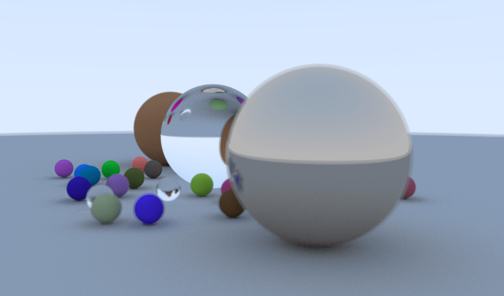

# 从零开始的光线追踪渲染器

::: warning

此文暂未完成，此研究也仍未完成，作者努力学习ing

:::

A shader-based PBR ray tracing demo. Real-time denoise and you can freely adjust the camera's transforms, lens aperture, fov and focal length.

## Demo

- [raytracing.shao.fun](https://raytracing.shao.fun)
- https://shaofun.itch.io/godot-raytracing  

- Hope you can contribute to this repo : )
  - https://github.com/HK-SHAO/Godot-RayTracing-Demo/



## 相关知识

光线追踪图像渲染

- 图像图像
  - 环境
  - 光线
  - 模型
  - 材质
  - 摄像机

## 演示视频

::: details

<BiliBili bvid="BV1qe411F768" :time="33"/>

:::

## 相关链接

- GitHub: https://github.com/RayTracing
- Book: [Ray Tracing in One Weekend](https://raytracing.github.io/books/RayTracingInOneWeekend.html)
- ShaderToy: https://www.shadertoy.com/view/XlycWh
- PlotterApp Demo: https://github.com/HK-SHAO/Plotter/releases/tag/v0.0.0.2-pre-demo

## 关键代码

暂未完成

repo: https://github.com/HK-SHAO/Plotter/

### 修正坐标系

左手系

### 赋予每个像素颜色

```glsl
shader_type canvas_item;

void fragment() {
	vec2 uv = FRAGCOORD.xy * SCREEN_PIXEL_SIZE;
	COLOR = vec4(vec3(uv, 0.2), 1.0);
}
```

### 画一片蓝天

```glsl
shader_type canvas_item;

//// 光线
struct ray {
	vec3 origin, direction;
};

vec3 at(ray r, float t) {
	return r.origin + t * r.direction;
}

//// 渲染
vec3 render(ray r) {
	//// 天空的颜色
	float t = (r.direction.y + 1.0) / 2.0;
	vec3 bottom = vec3(1.0, 1.0, 1.0);
	vec3 top = vec3(0.5, 0.7, 1.0);
	return mix(top, bottom, t);
}

//// 片段着色器程序入口
void fragment() {
	vec2 uv = FRAGCOORD.xy * SCREEN_PIXEL_SIZE;
	
	vec3 lower_left_corner = vec3(-2.0, -1.0, -1.0);
	vec3 horizontal = vec3(4.0, 0.0, 0.0);
	vec3 vertical = vec3(0.0, 2.0, 0.0);
	vec3 origin = vec3(0.0, 0.0, 0.0);
	
	ray r = ray(origin, normalize(lower_left_corner + uv.x*horizontal + uv.y*vertical));
	
	COLOR = vec4(render(r), 1.0);
}
```

### 放置一个球

```glsl
shader_type canvas_item;

#define TMIN 0.001
#define TMAX 20.0
#define RAYMARCH_TIME 128
#define PRECISION 0.001

//// 光线
struct ray {
	vec3 origin, direction;
};

vec3 at(ray r, float t) {
	return r.origin + t * r.direction;
}

//// 光线击中的记录
struct hit_record {
	float t;
	vec3 p, normal;
};

//// SDF 球
float sdSphere(vec3 p, float s) {
    return length(p) - s;
}

//// 地图
float map(vec3 p) {
	return sdSphere(p, 0.5);
}

//// 计算地图法线
vec3 calcNormal(in vec3 p)
{
    const float eps = 0.0001;
    const vec2 h = vec2(eps, 0);
    return normalize(vec3(map(p+h.xyy) - map(p-h.xyy),
                          map(p+h.yxy) - map(p-h.yxy),
                          map(p+h.yyx) - map(p-h.yyx)));
}

//// 光线步进
float raycast(ray r) {
	float t = TMIN;
	for(int i = 0; i < RAYMARCH_TIME && t < TMAX; i++) {
		float d = map(at(r, t));
		if(d < PRECISION) return t;
		t += d;
	}
	//// 没有击中物体
	return -1.0;
}

//// 天空
vec3 sky(ray r) {
	float t = (r.direction.y + 1.0) / 2.0;
	vec3 bottom = vec3(1.0, 1.0, 1.0);
	vec3 top = vec3(0.5, 0.7, 1.0);
	return mix(top, bottom, t);
}

//// 渲染
vec3 render(ray r) {
	float t = raycast(r);
	if (t < 0.0) {
		return sky(r);
	}
	vec3 p = at(r, t);
	vec3 n = calcNormal(p);
	vec3 c = (n + 1.0) / 2.0;
	return c;
}

//// 片段着色器程序入口
void fragment() {
	//// 计算 UV
	// vec2 uv = FRAGCOORD.xy * SCREEN_PIXEL_SIZE;
	vec2 uv = UV;
	
	vec3 lower_left_corner = vec3(-2.0, -1.0, 0.0);
	vec3 horizontal = vec3(4.0, 0.0, 0.0);
	vec3 vertical = vec3(0.0, 2.0, 0.0);
	vec3 origin = vec3(0.0, 0.0, -1.0);
	
	vec3 ro = origin;
	vec3 po = lower_left_corner + uv.x*horizontal + uv.y*vertical;
	vec3 rd = normalize(po - ro);
	
	ray r = ray(ro, rd);
	vec3 color = render(r);
	
	COLOR = vec4(color, 1.0);
}
```

### 加入一个地面

```glsl
shader_type canvas_item;

#define TMIN 0.001
#define TMAX 20.0
#define RAYMARCH_TIME 128
#define PRECISION 0.001
#define MAP_SIZE 10000.0

//// 光线
struct ray {
	vec3 origin, direction;
};

vec3 at(ray r, float t) {
	return r.origin + t * r.direction;
}

//// 光线击中的记录
struct record {
	float t;
	vec3 p, normal;
};

//// SDF 球
float sdSphere(vec3 p, float s) {
    return length(p) - s;
}

//// SDF 地图
float map(vec3 p) {
	float res = MAP_SIZE;
	res = min(res, sdSphere(p - vec3(0, 0, 0), 0.5));
	res = min(res, sdSphere(p - vec3(0, -100.5, 0), 100));
	return res;
}

//// 计算地图法线
vec3 calcNormal(vec3 p)
{
    const float eps = 0.0001;
    const vec2 h = vec2(eps, 0);
    return normalize(vec3(map(p+h.xyy) - map(p-h.xyy),
                          map(p+h.yxy) - map(p-h.yxy),
                          map(p+h.yyx) - map(p-h.yyx)));
}

//// 光线步进
float raycast(ray r) {
	float t = TMIN;
	for(int i = 0; i < RAYMARCH_TIME && t < TMAX; i++) {
		float d = map(at(r, t));
		if(d < PRECISION) return t;
		t += d;
	}
	//// 没有击中物体
	return -1.0;
}

//// 天空
vec3 sky(ray r) {
	float t = (r.direction.y + 1.0) / 2.0;
	vec3 bottom = vec3(1.0, 1.0, 1.0);
	vec3 top = vec3(0.5, 0.7, 1.0);
	return mix(top, bottom, t);
}

//// 渲染
vec3 render(ray r) {
	float t = raycast(r);
	if (t < 0.0) {
		return sky(r);
	}
	vec3 p = at(r, t);
	vec3 n = calcNormal(p);
	vec3 c = (n + 1.0) / 2.0;
	return c;
}

//// 片段着色器程序入口
void fragment() {
	//// 计算 UV
	// vec2 uv = FRAGCOORD.xy * SCREEN_PIXEL_SIZE;
	vec2 uv = vec2(UV.x, 1.0 - UV.y);
	
	vec3 lower_left_corner = vec3(-2.0, -1.0, 0.0);
	vec3 horizontal = vec3(4.0, 0.0, 0.0);
	vec3 vertical = vec3(0.0, 2.0, 0.0);
	vec3 origin = vec3(0.0, 0.0, -1.0);
	
	vec3 ro = origin;
	vec3 po = lower_left_corner + uv.x*horizontal + uv.y*vertical;
	vec3 rd = normalize(po - ro);
	
	ray r = ray(ro, rd);
	vec3 color = render(r);
	
	COLOR = vec4(color, 1.0);
}
```

### 漫反射

```glsl
shader_type canvas_item;

//// 配置常量
const float TMIN = 0.001;
const float TMAX = 20.0;
const float PRECISION = 0.0001; // 必须要小于 TMIN，否则光线会自相交产生阴影痤疮
const float MAP_SIZE = 100000.0;

const uint MAX_RAYMARCH = 512U;
const uint MAX_RAYTRACE = 512U;

const float PHI = 1.61803398874989484820459;

//// 光线（射线）
struct ray {
	vec3 origin;
	vec3 direction;
	vec4 color;
};

struct material {
	vec3 albedo;
};

//// 光子击中的记录
struct record {
	float t; // 沿射线前进的距离，为负代表没有击中
	vec3 position;
	vec3 normal;
	material mat;
};

//// 摄像机
struct camera {
	////  图像平面位置
	vec3 lower_left_corner;
	vec3 horizontal;
	vec3 vertical;
	//// 视点位置
	vec3 origin;
};

struct random {
	vec2 uv;
	float seed;
	float value;
};

//// 生成归一化随机数（uv 和 seed 均必须归一化）
float noise(inout random r) {
	r.seed += 0.1;
	vec2 xy = (r.uv + 1.0) * 3333.3;
	return fract(tan(distance(xy*PHI, xy)*r.seed)*xy.x);
}

//// 光子在射线所在的位置
vec3 at(ray r, float t) {
	return r.origin + t * r.direction;
}

//// 从摄像机获取光线
ray get_ray(camera c, vec2 uv, vec4 color) {
	//// 视点位置
	vec3 ro = c.origin;
	//// 像素位置
	vec3 po = c.lower_left_corner
			+ c.horizontal * uv.x
			+ c.vertical   * uv.y;
	//// 光线方向
	vec3 rd = normalize(po - ro);
	return ray(ro, rd, color);
}

//// SDF 球体
float sphere(vec3 p, float s) {
    return length(p) - s;
}

//// SDF 地图
float map(vec3 p) {
	float res = MAP_SIZE;
	res = min(res, sphere(p - vec3(0, 0, 0), 0.5));
	res = min(res, sphere(p - vec3(0, -100.5, 0), 100));
	return res;
}

//// 计算地图法线
vec3 normal(vec3 p)
{
    const float eps = 0.0001;
    const vec2 h = vec2(eps, 0);
    return normalize(vec3(map(p+h.xyy) - map(p-h.xyy),
                          map(p+h.yxy) - map(p-h.yxy),
                          map(p+h.yyx) - map(p-h.yyx)));
}

//// 光线步进
record raycast(ray r) {
	record rec; rec.t = TMIN;
	for(uint i = 0U; i < MAX_RAYMARCH && rec.t < TMAX; i++) {
		rec.position = at(r, rec.t);
		float dis = map(rec.position);
		if(dis < PRECISION) return rec;
		rec.t += dis;
	}
	//// 没有击中物体
	rec.t = -1.0; // 设置为负值标记
	return rec;
}

//// 天空
vec4 sky(ray r) {
	float t = (r.direction.y + 1.0) / 2.0;
	vec4 bottom = vec4(1.0, 1.0, 1.0, 1.0);
	vec4 top = vec4(0.5, 0.7, 1.0, 1.0);
	return mix(top, bottom, t);
}

//// 产生随机单位向量
vec3 random_unit_vector(inout random rand) {
	float a = mix(0.0, TAU, noise(rand));
	float z = mix(-1.0, 1.0, noise(rand));
	float r = sqrt(1.0 - z*z);
	return vec3(r*cos(a), r*sin(a), z);
}

//// 光线散射
ray scatter(ray r, record rec, random rand) {
	rec.normal = normal(rec.position);
	
	r.origin = rec.position;
	r.direction = normalize(rec.normal + random_unit_vector(rand));
	
	// rec.mat.color = (rec.normal + 1.0) / 2.0;
	rec.mat.albedo = vec3(0.5);
	
	r.color *= vec4(rec.mat.albedo, 1.0);
	return r;
}

//// 光线追踪
ray raytrace(ray r, inout random rand) {
	record rec;
	
	for (uint i = 0U; i < MAX_RAYTRACE; i++) {
		record rec = raycast(r);
		if (rec.t < 0.0) {
			r.color *= sky(r);
			break;
		}
		
		r = scatter(r, rec, rand);
	}
	
	return r;
}

//// 片段着色器程序入口
void fragment() {
	//// 计算并修正 UV 坐标系
	vec2 uv = vec2(UV.x, 1.0 - UV.y);
	
	//// 初始化摄像机
	camera cam;
	cam.lower_left_corner = vec3(-2.0, -1.0, 0.0);
	cam.horizontal = vec3(4.0, 0.0, 0.0);
	cam.vertical = vec3(0.0, 2.0, 0.0);
	cam.origin = vec3(0.0, 0.0, -1.0);
	
	//// 初始化随机数发生器
	random rand;
	rand.seed = fract(TIME);
	rand.uv = uv;
	
	//// 获取光线并逆向追踪光线
	ray r = get_ray(cam, uv, vec4(1.0));
		r = raytrace(r, rand);
	
	//// 对光的颜色进行后处理得到像素颜色
	vec3 color = r.color.rgb;
	vec3 back = vec3(0.0);
	color = mix(back, color, r.color.a);
	
	//// 伽马矫正
	color = pow(color, vec3(0.5));
	// color = vec3(noise(rand));
	COLOR = vec4(color, 1.0);
}
```

::: tip
着色器中产生随机数的想法：

- 利用混沌作为随机数种子
- 使用 backbuffer 和混沌映射逐渐更新随机数
- 利用 alpha 通道和 backbuffer 产生随机数
:::

### 一次更新

- https://www.shadertoy.com/view/MsXfz4
- https://erichlof.github.io/THREE.js-PathTracing-Renderer/

````glsl
shader_type canvas_item;

uniform vec3 camera_position = vec3(0.0, 0.0, 4.0); // 传入摄像机的位置
uniform mat3 camera_rotation = mat3(1);             // 摄像机的旋转
uniform float camera_aspect = 2.0;                  // 画布长宽比
uniform float camera_vfov = 30.0;                   // 摄像机的纵向视野

//// 配置常量
const float TMIN        = 0.001;                    // 光开始传播的起始偏移，避免光线自相交
const float TMAX        = 2000.0;                   // 最大单次光线传播距离
const float PRECISION   = 0.0001;                   // 必须要小于 TMIN，否则光线会自相交产生阴影痤疮
const float MAP_SIZE    = float(0x7fffffff);        // 地图大小

const uint MAX_RAYMARCH = 512U;                     // 最大光线步进次数
const uint MAX_RAYTRACE = 512U;                     // 最大光线追踪次数

const float PHI = 1.61803398874989484820459;        // 黄金比例

//// 光线
struct ray {
    vec3 origin;     // 光的起点
    vec3 direction;  // 光的方向
    vec4 color;      // 光的颜色
};

//// 物体材质
struct material {
    vec3 albedo;     // 反照率
    float roughness; // 粗糙度
    float metallic;  // 金属度
};

//// 光子击中的记录
struct record {
    float t;         // 沿射线前进的距离，为负代表没有击中
    vec3 position;   // 击中的位置
    vec3 normal;     // 击中位置的法线
    material mtl;    // 击中的材质
};

//// SDF 物体
struct object {
    float sd;        // 到物体表面的距离
    material mtl;    // 物体的材质
};

//// 摄像机
struct camera {
    vec3 lookfrom;   // 视点位置
    vec3 lookat;     // 目标位置
    vec3 vup;        // 向上的方向
    float vfov;      // 视野
    float aspect;    // 传感器长宽比
    float aperture;  // 光圈大小
    float focus;     // 对焦距离
};

//// 随机发生器
struct random {
    vec3 seed;       // 随机数种子
    float value;     // 上次的随机值
};

//// 生成归一化随机数
float noise(inout random r) {
    r.seed = fract(r.seed * vec3(.1031, .1030, .0973));
    r.seed += dot(r.seed, r.seed.yzx + 33.33);
    r.seed.xy = fract((r.seed.xx+r.seed.yz)*r.seed.zy);
    
    const vec2 xy = r.seed.xy * 3333.3 + 3.33;
    r.value = fract(tan(distance(xy*PHI, xy+3.3)*r.seed.z)*xy.x);
    return r.value;
}

//// 光子在射线所在的位置
vec3 at(ray r, float t) {
    return r.origin + t * r.direction;
}

// 单位圆内随机取一点
vec2 random_in_unit_disk(inout random seed) {
    float r = mix(0.0, 1.0, noise(seed));
    float a = mix(0.0, TAU, noise(seed));
	return sqrt(r) * vec2(sin(a), cos(a));
}

//// 从摄像机获取光线
ray get_ray(camera c, vec2 uv, vec4 color, inout random rand) {
    //// 根据 VFOV 和显示画布长宽比计算传感器长宽
    float theta = c.vfov * PI / 180.0;
    float half_height = tan(theta / 2.0);
    float half_width = c.aspect * half_height;
    
    //// 以目标位置到摄像机位置为 Z 轴正方向
    vec3 z = normalize(c.lookfrom - c.lookat);
    //// 计算出摄像机传感器的 XY 轴正方向
    vec3 x = normalize(cross(c.vup, z));
    vec3 y = cross(z, x);
    
    vec3 lower_left_corner = c.lookfrom - half_width  * c.focus*x
                                        - half_height * c.focus*y
                                        -               c.focus*z;
    
    vec3 horizontal = 2.0 * half_width  * c.focus * x;
    vec3 vertical   = 2.0 * half_height * c.focus * y;
    
    //// 模拟光进入镜头光圈
    float lens_radius = c.aperture / 2.0;
    vec2 rud = lens_radius * random_in_unit_disk(rand);
    vec3 offset = x * rud.x + y * rud.y;
    
    //// 计算光线起点和方向
    vec3 ro = c.lookfrom + offset;
    vec3 po = lower_left_corner + uv.x*horizontal 
                                + uv.y*vertical;
    vec3 rd = normalize(po - ro);
    
    return ray(ro, rd, color);
}

//// SDF 球体
float sphere(vec3 p, float s) {
    return length(p) - s;
}

//// SDF 地图
object map(vec3 p) {
    const object objs[] = {
        object(sphere(p - vec3(0, -100.5, 0),100), material(vec3(1.0, 1.0, 1.0), 1.0, 0.5)),
        object(sphere(p - vec3(0, 0, 0), 0.5), material(vec3(1.0, 1.9, 1.0), 1.0, 0.0)),
        object(sphere(p - vec3(-1.0, -0.2, 0), 0.3), material(vec3(1.0, 0.3, 0.4), 0.9, 0.1)),
        object(sphere(p - vec3(1.0, -0.2, 0), 0.3), material(vec3(0.4, 0.3, 1.0), 0.1, 0.9))
    };
    
    object o; o.sd = MAP_SIZE;
    for (int i = 0; i < objs.length(); i++) {
        const object oi = objs[i];
        if (oi.sd < o.sd) o = oi;
    }

    return o;
}

//// 计算地图法线
vec3 normal(vec3 p) {
    vec2 e = vec2(1.0, -1.0) * 0.5773 * 0.0005;
    return normalize( e.xyy*map( p + e.xyy ).sd + 
                      e.yyx*map( p + e.yyx ).sd + 
                      e.yxy*map( p + e.yxy ).sd + 
                      e.xxx*map( p + e.xxx ).sd );
}

//// 光线步进
record raycast(ray r) {
    record rec; rec.t = TMIN;
    for(uint i = 0U; i < MAX_RAYMARCH && rec.t < TMAX; i++) {
        rec.position = at(r, rec.t);
        object obj = map(rec.position);
        rec.mtl = obj.mtl;
        if(obj.sd < PRECISION) return rec;
        rec.t += obj.sd;
    }
    //// 没有击中物体
    rec.t = -1.0; // 设置为负值标记
    return rec;
}

//// 天空
vec4 sky(ray r) {
    float t = (r.direction.y + 1.0) / 2.0;
    vec4 bottom = vec4(1.0, 1.0, 1.0, 1.0);
    vec4 top = vec4(0.5, 0.7, 1.0, 1.0);
    return mix(top, bottom, t);
}

//// 产生随机单位向量
vec3 random_unit_vector(inout random rand) {
    float a = mix(0.0, TAU, noise(rand));
    float z = mix(-1.0, 1.0, noise(rand));
    float r = sqrt(1.0 - z*z);
    return vec3(r*cos(a), r*sin(a), z);
}

//// PBR 材质
ray pbr(ray r, record rec, inout random rand) {
    rec.normal = normal(rec.position);
    
    r.origin = rec.position;
    
    vec3 reflex = reflect(r.direction, rec.normal);
    vec3 diffuse = normalize(rec.normal + random_unit_vector(rand));
    vec3 direction = mix(reflex, diffuse, rec.mtl.roughness);
    
    r.direction = direction;
    
    // 测试法线
    // rec.mtl.albedo = (rec.normal + 1.0) / 2.0;
    
    const float attenuation = 0.6;
    r.color *= vec4(rec.mtl.albedo, attenuation);
    return r;
}

//// 光线追踪
ray raytrace(ray r, inout random rand) {
    record rec;
    
    for (uint i = 0U; i < MAX_RAYTRACE; i++) {
        record rec = raycast(r);
        if (rec.t < 0.0) {
            r.color *= sky(r);
            break;
        }
        
        r = pbr(r, rec, rand);
    }
    
    return r;
}

//// 片段着色器程序入口
void fragment() {
    //// 计算并修正 UV 坐标系
    vec2 uv = vec2(UV.x, 1.0 - UV.y);
    
    //// 右手系
    const vec3 lookfrom = camera_position;
    const vec3 direction = camera_rotation * vec3(0.0, 0.0, -1.0);
    const vec3 lookat = lookfrom + direction;
    
    //// 初始化摄像机
    camera cam;
    cam.lookfrom = lookfrom;
    cam.lookat = lookat;
    cam.aspect = camera_aspect;
    cam.vfov = camera_vfov;
    cam.vup = vec3(0.0, 1.0, 0.0);
    cam.focus = 1.0;
    cam.aperture = 0.005;
    
    //// 初始化随机数发生器种子
    random rand;
    rand.seed = vec3(uv, fract(TIME));
    
    //// 获取光线并逆向追踪光线
    ray r = get_ray(cam, uv, vec4(1.0), rand);
        r = raytrace(r, rand);
    
    //// 对光的颜色进行后处理得到像素颜色
    vec3 color = r.color.rgb;
    vec3 back = vec3(0.0);
    color = mix(back, color, r.color.a);
    
    //// 伽马矫正
    color = pow(color, vec3(0.5));
    
    //// 测试随机数
    // color = vec3(noise(rand), noise(rand), noise(rand));
    COLOR = vec4(color, 1.0);
}
````

### 一些优化方案

```glsl
r.color.a *= (sign(dot(L, N)) + 1.0) * 0.5;
L = -L * sign(dot(L, N));
```

等价于

```glsl
if (dot(L, N) < 0.0) {
	r.color.a = 0.0;
}

if (dot(L, N) > 0.0) {
	L = -L;
}
```

### 基本完成 PBR

:::: warning

还没有写重要性采样、PDF、优化地图效率、降噪

::::

```glsl
shader_type canvas_item;

// 传入统一值
uniform vec3 camera_position    = vec3(0.0, 0.0, 4.0);  // 传入摄像机的位置
uniform mat3 camera_rotation    = mat3(1);              // 摄像机的旋转
uniform float camera_aspect     = 2.0;                  // 画布长宽比
uniform float camera_vfov       = 30.0;                 // 摄像机的纵向视野
uniform float camera_focus      = 2.0;                  // 摄像机的对焦距离
uniform float camera_aperture   = 0.005;                // 摄像机的光圈大小
uniform float camera_gamma      = 0.2;                  // gamma 矫正值

// 配置常量
const float TMIN        = 0.001;                        // 光开始传播的起始偏移，避免光线自相交
const float TMAX        = 2000.0;                       // 最大单次光线传播距离
const float PRECISION   = 0.00001;                      // 必须要小于 TMIN，否则光线会自相交产生阴影痤疮
const float MAP_SIZE    = float(0x7fffffff);            // 地图大小

const uint MAX_RAYMARCH = 512U;                         // 最大光线步进次数
const uint MAX_RAYTRACE = 512U;                         // 最大光线追踪次数

const float ENV_IOR = 1.0;                              // 环境的折射率

// 传入贴图
uniform sampler2D environment_hdri;                     // 环境 HDRI 贴图

// 光线
struct ray {
    vec3 origin;        // 光的起点
    vec3 direction;     // 光的方向
    vec4 color;         // 光的颜色
};

// 物体材质
struct material {
    vec3 albedo;        // 反照率
    float roughness;    // 粗糙度
    float metallic;     // 金属度
    float transmission; // 透明度
    float ior;          // 折射率
    vec4 emission;      // 自发光 (RGB, Intensity)
    vec3 normal;        // 切线空间法线
};

// 光子击中的记录
struct record {
    bool hit;           // 是否击中
    float t;            // 沿射线前进的距离
    float sd;           // 击中位置距离表面 (为负代表在物体内部)
    vec3 position;      // 击中的位置
    vec3 normal;        // 击中位置的法线
    material mtl;       // 击中的材质
};

// SDF 物体
struct object {
    float sd;           // 到物体表面的距离
    material mtl;       // 物体的材质
};

// 摄像机
struct camera {
    vec3 lookfrom;      // 视点位置
    vec3 lookat;        // 目标位置
    vec3 vup;           // 向上的方向
    float vfov;         // 视野
    float aspect;       // 传感器长宽比
    float aperture;     // 光圈大小
    float focus;        // 对焦距离
};

// 随机发生器
struct random {
    float seed;         // 随机数种子
    float value;        // 上次的随机值
};

// 对三维向量进行哈希
float hash(vec3 x) {
    uvec3 p = floatBitsToUint(x);
    p = 1103515245U * ((p.xyz >> 1U) ^ (p.yzx));
    uint h32 = 1103515245U * ((p.x ^ p.z) ^ (p.y >> 3U));
    uint n = h32 ^ (h32 >> 16U);
    return float(n) * (1.0 / float(0x7fffffff));
}

// 生成归一化随机数
float noise(inout random r) {
    r.value = fract(sin(r.seed++)*43758.5453123);
    return r.value;
}

// 光子在射线所在的位置
vec3 at(ray r, float t) {
    return r.origin + t * r.direction;
}

// 单位圆内随机取一点
vec2 random_in_unit_disk(inout random seed) {
    float r = noise(seed);
    float a = TAU * noise(seed);
    return sqrt(r) * vec2(sin(a), cos(a));
}

// 从摄像机获取光线
ray get_ray(camera c, vec2 uv, vec4 color, inout random rand) {
    // 根据 VFOV 和显示画布长宽比计算传感器长宽
    float theta = c.vfov * PI / 180.0;
    float half_height = tan(theta / 2.0);
    float half_width = c.aspect * half_height;
    
    // 以目标位置到摄像机位置为 Z 轴正方向
    vec3 z = normalize(c.lookfrom - c.lookat);
    // 计算出摄像机传感器的 XY 轴正方向
    vec3 x = normalize(cross(c.vup, z));
    vec3 y = cross(z, x);
    
    vec3 lower_left_corner = c.lookfrom - half_width  * c.focus*x
                                        - half_height * c.focus*y
                                        -               c.focus*z;
    
    vec3 horizontal = 2.0 * half_width  * c.focus * x;
    vec3 vertical   = 2.0 * half_height * c.focus * y;
    
    // 模拟光进入镜头光圈
    float lens_radius = c.aperture / 2.0;
    vec2 rud = lens_radius * random_in_unit_disk(rand);
    vec3 offset = x * rud.x + y * rud.y;
    
    // 计算光线起点和方向
    vec3 ro = c.lookfrom + offset;
    vec3 po = lower_left_corner + uv.x*horizontal 
                                + uv.y*vertical;
    vec3 rd = normalize(po - ro);
    
    return ray(ro, rd, color);
}

// SDF 球体
float sphere(vec3 p, float s) {
    return length(p) - s;
}

// SDF 盒子
float box(vec3 p, vec3 b) {
    vec3 q = abs(p) - b;
    return length(max(q, 0)) + min(max(q.x, max(q.y, q.z)), 0);
}

// SDF 圆柱
float cylinder(vec3 p, float h, float r) {
    vec2 d = abs(vec2(length(p.xz),p.y)) - vec2(r, h);
    return min(max(d.x,d.y), 0.0) + length(max(d, 0.0));
}

// SDF 地图
object map(vec3 p) {
    object objs[] = {
        object(sphere(p - vec3(0, -100.5, 0), 100),
                        material(vec3(1.0, 1.0, 1.0)*0.3,
                                    1.0, // 粗糙度
                                    0.0, // 金属度
                                    0.0, // 透明度
                                    1.0, // 折射率
                                    vec4(0),
                                    vec3(0, 0, 1)
                        )
        ),
        object(sphere(p - vec3(0, 0, 0), 0.5),
                        material(vec3(1.0, 1.0, 1.0),
                                    1.0, // 粗糙度
                                    0.0, // 金属度
                                    0.0, // 透明度
                                    1.0, // 折射率
                                    vec4(0.1, 1.0, 0.1, 10.0),
                                    vec3(0, 0, 1)
                        )
        ),
        object(sphere(p - vec3(-1.0, -0.2, 0), 0.3),
                        material(vec3(1.0, 0.1, 0.1),
                                    0.9, // 粗糙度
                                    0.1, // 金属度
                                    0.0, // 透明度
                                    1.0, // 折射率
                                    vec4(0),
                                    vec3(0, 0, 1)
                        )
        ),
        object(sphere(p - vec3(1.0, -0.2, 0), 0.3),
                        material(vec3(0.1, 0.1, 1.0),
                                    0.3, // 粗糙度
                                    1.0, // 金属度
                                    0.0, // 透明度
                                    1.0, // 折射率
                                    vec4(0),
                                    vec3(0, 0, 1)
                        )
        ),
        object(box(p - vec3(0, 0, -1), vec3(2, 1, 0.2)),
                        material(vec3(1.0, 1.0, 1.0),
                                    0.1, // 粗糙度
                                    0.9, // 金属度
                                    0.0, // 透明度
                                    1.0, // 折射率
                                    vec4(0),
                                    vec3(0, 0, 1)
                        )
        ),
        object(cylinder(p - vec3(0, 0.1, 1), 0.5, 0.2),
                        material(vec3(1.0, 1.0, 0.1),
                                    0.0, // 粗糙度
                                    1.0, // 金属度
                                    0.0, // 透明度
                                    1.0, // 折射率
                                    vec4(0),
                                    vec3(0, 0, 1)
                        )
        ),
        object(cylinder(p - vec3(0, 0.0, -2), 0.6, 0.5),
                        material(vec3(1.0, 0.0, 1.0),
                                    1.0, // 粗糙度
                                    1.0, // 金属度
                                    0.0, // 透明度
                                    1.0, // 折射率
                                    vec4(0),
                                    vec3(0, 0, 1)
                        )
        ),
        object(sphere(p - vec3(1.0, -0.2, 1), 0.3),
                        material(vec3(1.0, 1.0, 1.0),
                                    0.0, // 粗糙度
                                    0.0, // 金属度
                                    1.0, // 透明度
                                    1.25, // 折射率
                                    vec4(0),
                                    vec3(0, 0, 1)
                        )
        ),
        object(sphere(p - vec3(-1.0, -0.2, 1), 0.3),
                        material(vec3(0.0, 1.0, 1.0),
                                    0.0, // 粗糙度
                                    0.0, // 金属度
                                    1.0, // 透明度
                                    1.25, // 折射率
                                    vec4(0),
                                    vec3(0, 0, 1)
                        )
        )
    };
    
    // 返回距离最近的那个物体
    object o; o.sd = MAP_SIZE;
    for (int i = 0; i < objs.length(); i++) {
        object oi = objs[i];
        if (oi.sd < o.sd) o = oi;
    }

    return o;
}

// 计算地图法线 (这里还可以优化，因为计算法线不应该再次寻找最近物体)
vec3 calc_normal(vec3 p) {
    vec2 e = vec2(1, -1) * 0.5773 * 0.0005;
    return normalize( e.xyy*map( p + e.xyy ).sd + 
                      e.yyx*map( p + e.yyx ).sd + 
                      e.yxy*map( p + e.yxy ).sd + 
                      e.xxx*map( p + e.xxx ).sd );
}

// 用世界坐标下的法线计算 TBN 矩阵
mat3 TBN(vec3 N) {
    vec3 T, B;
    
    if (N.z < -0.999999) {
        T = vec3(0, -1, 0);
        B = vec3(-1, 0, 0);
    } else {
        float a = 1.0 / (1.0 + N.z);
        float b = -N.x*N.y*a;
        
        T = vec3(1.0 - N.x*N.x*a, b, -N.x);
        B = vec3(b, 1.0 - N.y*N.y*a, -N.y);
    }
    
    return mat3(T, B, N);
}

// 光线步进
record raycast(ray r) {
    record rec; rec.t = TMIN;
    for(uint i = 0U; i < MAX_RAYMARCH && rec.t < TMAX; i++) {
        rec.position = at(r, rec.t);
        object obj = map(rec.position);
        if (abs(obj.sd) < PRECISION) {
            rec.mtl = obj.mtl;
            rec.sd = obj.sd;
            rec.hit = true;
            return rec;
        }
        rec.t += abs(obj.sd);
    }
    // 没有击中物体
    rec.hit = false;
    return rec;
}

// 球面坐标到笛卡尔坐标
const vec2 invAtan = vec2(0.1591, 0.3183);
vec2 sample_spherical_map(vec3 v)
{
    vec2 uv = vec2(atan(v.z, v.x), asin(v.y));
    uv *= invAtan;
    uv += 0.5;
    return uv;
}

// 采样天空
vec4 sky(ray r) {
//    float t = 0.5 + 0.5 * r.direction.y;
//    vec4 bottom = vec4(1.0, 1.0, 1.0, 1.0);
//    vec4 top = vec4(0.5, 0.7, 1.0, 1.0);
//    return mix(bottom, top, t);
    vec2 uv = sample_spherical_map(normalize(r.direction));
    uv.y = 1.0 - uv.y;
    vec3 color = texture(environment_hdri, uv).rgb;

    return vec4(color, 1.0);
}

// 快速计算五次方
float pow5(float x) {
    float t = x*x;
    t *= t;
    return t*x;
}

// 用粗糙度计算菲涅尔近似值
float fresnel_schlick(float cosine, float F0, float X) {
    return F0 + (max(1.0 - X, F0) - F0) * pow5(abs(1.0 - cosine));
}

// 以 n 为法线进行半球采样
vec3 hemispheric_sampling(vec3 n, inout random rand) {
    float ra = TAU * noise(rand);
    float rb = noise(rand);
    
    vec2 v = vec2(cos(ra), sin(ra));
    vec2 rxy = sqrt(rb) * v; 
    float rz = sqrt(1.0 - rb);
    
    return TBN(n) * vec3(rxy, rz);
}

// 用粗糙度采样沿向量 n 采样
vec3 hemispheric_sampling_roughness(vec3 n, float roughness, inout random rand) {
    float ra = TAU * noise(rand);
    float rb = noise(rand);

    // 光感越大高光越锐利
    float shiny = pow5(roughness);
    
    float rz = sqrt((1.0 - rb) / (1.0 + (shiny - 1.0)*rb));
    vec2 v = vec2(cos(ra), sin(ra));
    vec2 rxy = sqrt(abs(1.0 - rz*rz)) * v;
    
    return TBN(n) * vec3(rxy, rz);
}

// 应用 PBR 材质
ray PBR(ray r, inout record rec, inout random rand) {
    // 材质参数
    vec3 albedo = rec.mtl.albedo;
    float roughness = rec.mtl.roughness;
    float metallic = rec.mtl.metallic;
    float transmission = rec.mtl.transmission;
    vec3 normal = rec.mtl.normal;
    float ior = rec.mtl.ior;
    
    // 光线和物体表面参数
    vec3 V  = -r.direction;
    vec3 P  = rec.position;
    vec3 N  = TBN(normal) * calc_normal(P);
    vec3 C  = r.color.rgb;
    vec3 L;
    
    float NoV = dot(N, V);
    
    rec.normal = N;

    // 对透明度的处理可能还有问题
    if (noise(rand) < transmission) {
        C *= albedo;
        
        // 折射率之比
        float eta;
        
        if (NoV < 0.0) {
            // 处于 SDF 物体内部
            eta = ior / ENV_IOR;
            N = -N;
        } else {
            eta = ENV_IOR / ior;
        }
        
        const float F0 = 0.08;
        float F = fresnel_schlick(NoV, F0, ior);
        N = hemispheric_sampling_roughness(N, roughness, rand);
        if (noise(rand) < F + metallic && NoV > 0.0) {
            L = reflect(r.direction, N);
            r.color.a *= (sign(dot(L, N)) + 1.0) * 0.5;
        } else {
            L = refract(r.direction, N, eta);
            L = -L * sign(dot(L, N));
  
        }
    } else {
        const float F0 = 0.04;
        float F = fresnel_schlick(NoV, F0, roughness);
    
        // 反射或者漫反射
        if (noise(rand) < F + metallic) {
            C *= albedo; 
            N = hemispheric_sampling_roughness(N, roughness, rand);
            L = reflect(r.direction, N);
        } else {
            // 漫反射
            C *= albedo;
            L = hemispheric_sampling(N, rand);
        }

        // 如果光射到表面下面就直接吸收掉
        r.color.a *= (sign(dot(L, N)) + 1.0) * 0.5;
    }

    // 更新光的方向和颜色
    r.color.rgb = C;
    r.origin = P;
    r.direction = L;
    
//    r.color.rgb = vec3(F);
//    r.color.a = 1.0;
    
    return r;
}

// 光线追踪
ray raytrace(ray r, inout random rand) {
    for (uint i = 0U; i < MAX_RAYTRACE; i++) {
        record rec = raycast(r);
        
        // 没击中物体就肯定击中天空
        if (!rec.hit) {
            r.color *= sky(r);
//            r.color *= 0.0;
            break;
        }
        
        r = PBR(r, rec, rand);
        
//        r.color.rgb = 0.5 + 0.5*rec.normal;
//        r.color.a = 1.0;
//        break;
        
        // 光被吸收完了就不用继续了
        if (r.color.a <= 0.0) {
            break;
        }
        
        // 处理自发光
        if (abs(rec.mtl.emission.a) > 0.0) {
            r.color.rgb *= rec.mtl.emission.rgb*rec.mtl.emission.a;
            break;
        }
    }

    return r;
}

// 一次采样
vec3 sample(camera cam, vec2 uv, vec4 color, inout random rand) {
    // 获取光线并逆向追踪光线
    ray r = get_ray(cam, uv, color, rand);
        r = raytrace(r, rand);
    
    // 对光的颜色进行后处理得到像素颜色
    return r.color.rgb * r.color.a;
}

// HDR 映射色彩
vec3 HDR(vec3 color) {
    return vec3(1) - exp(-color);
}

// 片段着色器程序入口
void fragment() {
    // 计算并修正 UV 坐标系 (左手系，以左下角为原点)
    vec2 uv = vec2(UV.x, 1.0 - UV.y);
    
    // 计算摄像机方位和视线
    vec3 lookfrom = camera_position;
    vec3 direction = camera_rotation * vec3(0, 0, -1);
    vec3 lookat = lookfrom + direction;
    
    // 初始化摄像机
    camera cam;
    cam.lookfrom = lookfrom;
    cam.lookat = lookat;
    cam.aspect = camera_aspect;
    cam.vfov = camera_vfov;
    cam.vup = vec3(0, 1, 0);
    cam.focus = camera_focus;
    cam.aperture = camera_aperture;
    
    // 用 UV 和时间初始化随机数发生器种子
    random rand;
    rand.seed  = hash(vec3(uv, TIME));

    // 超采样
    uv += vec2(noise(rand), noise(rand)) * SCREEN_PIXEL_SIZE;
    
    // 对每个光子经过的表面采样一次
    vec3 color = sample(cam, uv, vec4(1), rand);
    
//    vec2 oz = vec2(1, 0);
//    vec3 R = sample(cam, uv, oz.xyyx, rand);
//    vec3 G = sample(cam, uv, oz.yxyx, rand);
//    vec3 B = sample(cam, uv, oz.yyxx, rand);
//
//    color = (R + G + B) / 3.0;
    
    // 单帧内多重采样
//    const uint N = 10U;
//    for (uint i = 0U; i < N; i++) {
//        color += sample(cam, uv, vec4(1), rand);
//    }
//    color = color / float(N + 1U);
    
    // HDR 映射色彩
    color = HDR(color);
    // 伽马矫正
    color = pow(color, vec3(camera_gamma));
    
    // 测试随机数
//    color = vec3(noise(rand), noise(rand), noise(rand));
    COLOR = vec4(color, 1.0);
}
```

### 猜想

- 改进 raycast/raymarch 算法，用物体的大小来选择合适的 precision，这样可以提高精度，同时也可以提高性能。
- 包围盒

```glsl
shader_type canvas_item;

// 传入统一值
uniform vec3 camera_position    = vec3(0.0, 0.0, 4.0);  // 传入摄像机的位置
uniform mat3 camera_rotation    = mat3(1);              // 摄像机的旋转
uniform float camera_aspect     = 2.0;                  // 画布长宽比
uniform float camera_vfov       = 30.0;                 // 摄像机的纵向视野
uniform float camera_focus      = 2.0;                  // 摄像机的对焦距离
uniform float camera_aperture   = 0.005;                // 摄像机的光圈大小
uniform float camera_gamma      = 0.2;                  // gamma 矫正值
uniform float light_quality     = 0.2;                  // 间接光质量

// 配置常量
const float TMIN        = 0.001;                        // 光开始传播的起始偏移，避免光线自相交
const float TMAX        = 2000.0;                       // 最大单次光线传播距离
const float PRECISION   = 0.0001;                       // 必须要小于 TMIN，否则光线会自相交产生阴影痤疮
const float MAP_SIZE    = float(0x7fffffff);            // 地图大小

const uint MAX_RAYMARCH = 512U;                         // 最大光线步进次数
const uint MAX_RAYTRACE = 512U;                         // 最大光线追踪次数

const float ENV_IOR = 1.000277;                         // 环境的折射率

// 传入贴图
uniform sampler2D environment_hdri;                     // 环境 HDRI 贴图

// 枚举形状
const int SHAPE_SPHERE      = 0;
const int SHAPE_BOX         = 1;
const int SHAPE_CYLINDER    = 2;

const float NONE = 0.0;

// 光线
struct ray {
    vec3 origin;        // 光的起点
    vec3 direction;     // 光的方向
    vec4 color;         // 光的颜色
};

// 物体材质
struct material {
    vec3 albedo;        // 反照率
    float roughness;    // 粗糙度
    float metallic;     // 金属度
    float transmission; // 透明度
    float ior;          // 折射率
    vec4 emission;      // 自发光 (RGB, Intensity)
    vec3 normal;        // 切线空间法线
};

// 物体变换
struct transform {
    vec3 position;        // 位置
    vec3 rotation;        // 旋转
    vec3 scale;           // 缩放
};

// SDF 物体
struct object {
    int shape;          // 形状
    float sd;           // 距离物体表面
    transform trs;      // 变换
    material mtl;       // 材质
};

// 光子击中的记录
struct record {
    object obj;         // 物体
    bool hit;           // 是否击中
    float t;            // 沿射线前进的距离
    vec3 position;      // 击中的位置
};

// 摄像机
struct camera {
    vec3 lookfrom;      // 视点位置
    vec3 lookat;        // 目标位置
    vec3 vup;           // 向上的方向
    float vfov;         // 视野
    float aspect;       // 传感器长宽比
    float aperture;     // 光圈大小
    float focus;        // 对焦距离
};

// 随机发生器
struct random {
    float seed;         // 随机数种子
    float value;        // 上次的随机值
};

// 对三维向量进行哈希
float hash(vec3 x) {
    uvec3 p = floatBitsToUint(x);
    p = 1103515245U * ((p.xyz >> 1U) ^ (p.yzx));
    uint h32 = 1103515245U * ((p.x ^ p.z) ^ (p.y >> 3U));
    uint n = h32 ^ (h32 >> 16U);
    return float(n) * (1.0 / float(0x7fffffff));
}

// 生成归一化随机数
float noise(inout random r) {
    r.value = fract(sin(r.seed++)*43758.5453123);
    return r.value;
}

// 光子在射线所在的位置
vec3 at(ray r, float t) {
    return r.origin + t * r.direction;
}

// 单位圆内随机取一点
vec2 random_in_unit_disk(inout random seed) {
    float r = noise(seed);
    float a = TAU * noise(seed);
    return sqrt(r) * vec2(sin(a), cos(a));
}

// 从摄像机获取光线
ray get_ray(camera c, vec2 uv, vec4 color, inout random rand) {
    // 根据 VFOV 和显示画布长宽比计算传感器长宽
    float theta = radians(c.vfov);
    float half_height = tan(theta / 2.0);
    float half_width = c.aspect * half_height;
    
    // 以目标位置到摄像机位置为 Z 轴正方向
    vec3 z = normalize(c.lookfrom - c.lookat);
    // 计算出摄像机传感器的 XY 轴正方向
    vec3 x = normalize(cross(c.vup, z));
    vec3 y = cross(z, x);
    
    vec3 lower_left_corner = c.lookfrom - half_width  * c.focus*x
                                        - half_height * c.focus*y
                                        -               c.focus*z;
    
    vec3 horizontal = 2.0 * half_width  * c.focus * x;
    vec3 vertical   = 2.0 * half_height * c.focus * y;
    
    // 模拟光进入镜头光圈
    float lens_radius = c.aperture / 2.0;
    vec2 rud = lens_radius * random_in_unit_disk(rand);
    vec3 offset = x * rud.x + y * rud.y;
    
    // 计算光线起点和方向
    vec3 ro = c.lookfrom + offset;
    vec3 po = lower_left_corner + uv.x*horizontal 
                                + uv.y*vertical;
    vec3 rd = normalize(po - ro);
    
    return ray(ro, rd, color);
}

// SDF 球体
float sd_sphere(vec3 p, float s) {
    return length(p) - s;
}

// SDF 盒子
float sd_box(vec3 p, vec3 b) {
    vec3 q = abs(p) - b;
    return length(max(q, 0)) + min(max(q.x, max(q.y, q.z)), 0);
}

// SDF 圆柱
float sd_cylinder(vec3 p, float h, float r) {
    vec2 d = abs(vec2(length(p.xz),p.y)) - vec2(r, h);
    return min(max(d.x,d.y), 0.0) + length(max(d, 0.0));
}

// 欧拉角转旋转矩阵
mat3 angle(vec3 a) {
    vec3 s = sin(a), c = cos(a);
    return mat3(vec3( c.z,  s.z,    0),
                vec3(-s.z,  c.z,    0),
                vec3(   0,    0,    1)) *
           mat3(vec3( c.y,    0, -s.y),
                vec3(   0,    1,    0),
                vec3( s.y,    0,  c.y)) *
           mat3(vec3(   1,    0,    0),
                vec3(   0,  c.x,  s.x),
                vec3(   0, -s.x,  c.x));
}

// 计算有向距离 (物体内部距离为负)
float signed_distance(object obj, vec3 pos) {
    vec3 position = obj.trs.position;
    vec3 rotation = obj.trs.rotation;
    vec3 scale    = obj.trs.scale;
    
    vec3 p = pos - position;
    
    // 会重复的将欧拉角转换成旋转矩阵，实际上只用在第一次计算就行了
    // 也有可能被编译器优化掉了
    p = angle(rotation) * p;
    
    switch(obj.shape) {
        case SHAPE_SPHERE:
            return sd_sphere(p, scale.x);
        case SHAPE_BOX:
            return sd_box(p, scale);
        case SHAPE_CYLINDER:
            return sd_cylinder(p, scale.y, scale.x);
        default:
            return sd_sphere(p, scale.x);
    }
}

// 找到最近的物体并计算距离
object nearest_object(vec3 p) {
    // 地图
    object map[] = {
        object(SHAPE_SPHERE, NONE,
            transform(  vec3(0, -100.5, 0),
                        vec3(0, 0, 0),
                        vec3(100, 0, 0)
            ),
            material(vec3(1.0, 1.0, 1.0)*0.3,   // 基础色
                        0.0, // 粗糙度
                        1.0, // 金属度
                        0.0, // 透明度
                        1.0, // 折射率
                        vec4(0), // 自发光
                        vec3(0, 0, 1) // 切线空间法线
            )
        ),
        object(SHAPE_SPHERE, NONE,
            transform(  vec3(0, 0, 0),
                        vec3(0, 0, 0),
                        vec3(0.5, 0, 0)
            ),
            material(vec3(1.0, 1.0, 1.0),   // 基础色
                        1.0, // 粗糙度
                        0.0, // 金属度
                        0.0, // 透明度
                        1.0, // 折射率
                        vec4(0.1, 1.0, 0.1, 10.0), // 自发光
                        vec3(0, 0, 1) // 切线空间法线
            )
        ),
        object(SHAPE_CYLINDER, NONE,
            transform(  vec3(-1.0, -0.3, 0),
                        vec3(0, 0, 0),
                        vec3(0.3, 0.33, 0)
            ),
            material(vec3(1.0, 0.1, 0.1),   // 基础色
                        0.9, // 粗糙度
                        0.1, // 金属度
                        0.0, // 透明度
                        1.0, // 折射率
                        vec4(0), // 自发光
                        vec3(0, 0, 1) // 切线空间法线
            )
        ),
        object(SHAPE_SPHERE, NONE,
            transform(  vec3(1.0, -0.2, 0),
                        vec3(0, 0, 0),
                        vec3(0.3, 0, 0)
            ),
            material(vec3(0.1, 0.1, 1.0),   // 基础色
                        0.3, // 粗糙度
                        1.0, // 金属度
                        0.0, // 透明度
                        1.0, // 折射率
                        vec4(0), // 自发光
                        vec3(0, 0, 1) // 切线空间法线
            )
        ),
        object(SHAPE_SPHERE, NONE,
            transform(  vec3(0.5, -0.2, -1),
                        vec3(0, 0, 0),
                        vec3(0.3, 0, 0)
            ),
            material(vec3(0.9, 0.9, 0.9),   // 基础色
                        0.0, // 粗糙度
                        0.0, // 金属度
                        1.0, // 透明度
                        1.5, // 折射率
                        vec4(0), // 自发光
                        vec3(0, 0, 1) // 切线空间法线
            )
        ),
        object(SHAPE_BOX, NONE,
            transform(  vec3(0, 0, -2),
                        vec3(0, 0, 0),
                        vec3(2, 1, 0.2)
            ),
            material(vec3(1.0, 1.0, 1.0),   // 基础色
                        0.0, // 粗糙度
                        0.9,  // 金属度
                        0.0,  // 透明度
                        1.0,  // 折射率
                        vec4(0), // 自发光
                        vec3(0, 0, 1) // 切线空间法线
            )
        ),
        object(SHAPE_BOX, NONE,
            transform(  vec3(0, 0, 5),
                        vec3(0, 0, 0),
                        vec3(2, 1, 0.2)
            ),
            material(vec3(1.0, 1.0, 1.0),   // 基础色
                        0.0, // 粗糙度
                        0.9,  // 金属度
                        0.0,  // 透明度
                        1.0,  // 折射率
                        vec4(0), // 自发光
                        vec3(0, 0, 1) // 切线空间法线
            )
        )
    };
    
    object o; o.sd = MAP_SIZE;
    for (int i = 0; i < map.length(); i++) {
        object oi = map[i];
        oi.sd = signed_distance(oi, p);
        if (oi.sd < o.sd) o = oi;
    }
    return o;
}

// 计算物体法线
vec3 calc_normal(object obj, vec3 p) {
    vec2 e = vec2(1, -1) * 0.5773 * 0.0005;
    return normalize( e.xyy*signed_distance(obj, p + e.xyy) + 
                      e.yyx*signed_distance(obj, p + e.yyx) + 
                      e.yxy*signed_distance(obj, p + e.yxy) + 
                      e.xxx*signed_distance(obj, p + e.xxx) );
}

// 用世界坐标下的法线计算 TBN 矩阵
mat3 TBN(vec3 N) {
    vec3 T, B;
    
    if (N.z < -0.99999) {
        T = vec3(0, -1, 0);
        B = vec3(-1, 0, 0);
    } else {
        float a = 1.0 / (1.0 + N.z);
        float b = -N.x*N.y*a;
        
        T = vec3(1.0 - N.x*N.x*a, b, -N.x);
        B = vec3(b, 1.0 - N.y*N.y*a, -N.y);
    }
    
    return mat3(T, B, N);
}

// 光线步进
record raycast(ray r) {
    record rec; rec.t = TMIN;
    for(uint i = 0U; i < MAX_RAYMARCH && rec.t < TMAX; i++) {
        rec.position = at(r, rec.t);
        object obj = nearest_object(rec.position);
        float dis = abs(obj.sd);
        if (dis < PRECISION) {
            rec.obj = obj;
            rec.hit = true;
            return rec;
        }
        rec.t += dis;
    }
    // 没有击中物体
    rec.hit = false;
    return rec;
}

// 球面坐标到笛卡尔坐标
const vec2 inv_atan = vec2(0.1591, 0.3183);
vec2 sample_spherical_map(vec3 v) {
    vec2 uv = vec2(atan(v.z, v.x), asin(v.y));
    uv *= inv_atan;
    uv += 0.5;
    return uv;
}

// 采样天空
vec4 sky(ray r) {
//    float t = 0.5 + 0.5 * r.direction.y;
//    vec4 bottom = vec4(1.0, 1.0, 1.0, 1.0);
//    vec4 top = vec4(0.5, 0.7, 1.0, 1.0);
//    return mix(bottom, top, t);

    // 采样 HDRi 环境贴图
    vec2 uv = sample_spherical_map(r.direction); uv.y = 1.0 - uv.y;
    return texture(environment_hdri, uv);
}

// 快速计算五次方
float pow5(float x) {
    float t = x*x; t *= t;
    return t*x;
}

// 计算菲涅尔近似值
float fresnel_schlick(float cosine, float F0) {
    return F0 + (1.0 - F0) * pow5(abs(1.0 - cosine));
}

// 用粗糙度计算菲涅尔近似值
float fresnel_schlick_roughness(float cosine, float F0, float roughness) {
    return F0 + (max(1.0 - roughness, F0) - F0) * pow5(abs(1.0 - cosine));
}

// 以 n 为法线进行半球采样
vec3 hemispheric_sampling(vec3 n, inout random rand) {
    float ra = TAU * noise(rand);
    float rb = noise(rand);
    
    float rz = sqrt(rb);
    vec2 v = vec2(cos(ra), sin(ra));
    vec2 rxy = sqrt(1.0 - rb) * v; 
    
    return TBN(n) * vec3(rxy, rz);
}

// 用粗糙度采样沿向量 n 半球采样
vec3 hemispheric_sampling_roughness(vec3 n, float roughness, inout random rand) {
    float ra = TAU * noise(rand);
    float rb = noise(rand);

    // 光感越大高光越锐利
    float shiny = pow5(roughness);
    
    float rz = sqrt((1.0 - rb) / (1.0 + (shiny - 1.0)*rb));
    vec2 v = vec2(cos(ra), sin(ra));
    vec2 rxy = sqrt(abs(1.0 - rz*rz)) * v;
    
    return TBN(n) * vec3(rxy, rz);
}

// 应用 PBR 材质
ray PBR(ray r, inout record rec, inout random rand) {
    // 材质参数
    vec3 albedo = rec.obj.mtl.albedo;
    float roughness = rec.obj.mtl.roughness;
    float metallic = rec.obj.mtl.metallic;
    float transmission = rec.obj.mtl.transmission;
    vec3 normal = rec.obj.mtl.normal;
    float ior = rec.obj.mtl.ior;
    
    // 光线和物体表面参数
    vec3 V  = -r.direction;
    vec3 P  = rec.position;
    vec3 N  = TBN(normal) * calc_normal(rec.obj, P);
    vec3 C  = r.color.rgb;
    vec3 L;
    
    float NoV = dot(N, V);

    // 对透明度的处理可能还有问题
    if (noise(rand) < transmission) {
        // 折射率之比
        float eta = ENV_IOR / ior;
        
        // 如果处于 SDF 物体内部就反过来
        float outer = sign(NoV);
        eta = pow(eta, outer);
        N  *= outer;
        
        float F0 = (eta - 1.0) / (eta + 1.0);
        F0 *= 5.0 * F0; // 让透明材质的反射更明显一些
        float F = fresnel_schlick(NoV, F0);
        N = hemispheric_sampling_roughness(N, roughness, rand);
        
        if (noise(rand) < F + metallic && outer > 0.0) {
            L = reflect(r.direction, N);
            r.color.a *= (sign(dot(L, N)) + 1.0) * 0.5;
        } else {
            L = refract(r.direction, N, eta);
            L = -L * sign(dot(L, N));
        }
    } else {
        const float F0 = 0.04;
        float F = fresnel_schlick_roughness(NoV, F0, roughness);
    
        // 反射或者漫反射
        if (noise(rand) < F + metallic) {
            N = hemispheric_sampling_roughness(N, roughness, rand);
            L = reflect(r.direction, N);
        } else {
            // 漫反射
            L = hemispheric_sampling(N, rand);
        }

        // 如果光射到表面下面就直接吸收掉
        r.color.a *= (sign(dot(L, N)) + 1.0) * 0.5;
    }
    
//    const float brightness = 1.0; // 光强
//    const float pdf = 1.0; // 重要性采样
//    C *= albedo * brightness / pdf;

    C *= albedo;

    // 更新光的方向和颜色
    r.color.rgb = C;
    r.origin = P;
    r.direction = L;
    
    return r;
}

// 光线追踪
ray raytrace(ray r, inout random rand) {
    for (uint i = 0U; i < MAX_RAYTRACE; i++) {
        // 俄罗斯轮盘赌概率，防止光线过分的反复反射
        float inv_pdf = exp(float(i) * light_quality);
        float roulette_prob = 1.0 - (1.0 / inv_pdf);
    
        // 光被吸收掉或者光线毙掉就不用继续了
        float visible = length(r.color.rgb*r.color.a);
        if (visible <= 0.001 || noise(rand) < roulette_prob) {
            r.color *= roulette_prob;
            break;
        }
        
        // 与地图求交
        record rec = raycast(r);
        
        //  测试法线
//        r.color.rgb = 0.5 + 0.5*calc_normal(rec.obj, rec.position);
//        r.color.a = 1.0;
//        break;
        
        // 没击中物体就肯定击中天空
        if (!rec.hit) {
            r.color *= sky(r);
//            r.color *= 0.0;
            break;
        }
        
        // 处理自发光
        if (abs(rec.obj.mtl.emission.a) > 0.0) {
            r.color.rgb *= rec.obj.mtl.emission.rgb*rec.obj.mtl.emission.a;
            break;
        }
        
        // 应用 PBR 材质
        r = PBR(r, rec, rand);
        
        // 能量守恒
        r.color *= inv_pdf;
    }

    return r;
}

// 一次采样
vec3 sample(camera cam, vec2 uv, vec4 color, inout random rand) {
    // 获取光线并逆向追踪光线
    ray r = get_ray(cam, uv, color, rand);
        r = raytrace(r, rand);
    
    // 对光的颜色进行后处理得到像素颜色
    return r.color.rgb * r.color.a;
}

// HDR 映射色彩
vec3 HDR(vec3 color) {
    return vec3(1) - exp(-color);
}

// 片段着色器程序入口
void fragment() {
    // 计算并修正 UV 坐标系 (左手系，以左下角为原点)
    vec2 uv = vec2(UV.x, 1.0 - UV.y);
    
    // 计算摄像机方位和视线
    vec3 lookfrom = camera_position;
    vec3 direction = camera_rotation * vec3(0, 0, -1);
    vec3 lookat = lookfrom + direction;
    
    // 初始化摄像机
    camera cam;
    cam.lookfrom = lookfrom;
    cam.lookat = lookat;
    cam.aspect = camera_aspect;
    cam.vfov = camera_vfov;
    cam.vup = vec3(0, 1, 0);
    cam.focus = camera_focus;
    cam.aperture = camera_aperture;
    
    // 用 UV 和时间初始化随机数发生器种子
    random rand;
    rand.seed  = hash(vec3(uv, TIME));

    // 超采样
    uv += vec2(noise(rand), noise(rand)) * SCREEN_PIXEL_SIZE;
    
    // 对每个光子经过的表面采样一次
    vec3 color = sample(cam, uv, vec4(1), rand);
    
    // 单帧内多重采样
//    const uint N = 10U;
//    for (uint i = 0U; i < N; i++) {
//        color += sample(cam, uv, vec4(1), rand);
//    }
//    color = color / float(N + 1U);

    // HDR 映射色彩
    color.rgb = HDR(color.rgb);
    // 伽马矫正
    color.rgb = pow(color.rgb, vec3(camera_gamma));

    // 测试随机数
//    color = vec3(noise(rand), noise(rand), noise(rand));
    COLOR = vec4(color, 1.0);
}
```

@include(@src/shared/license.md)