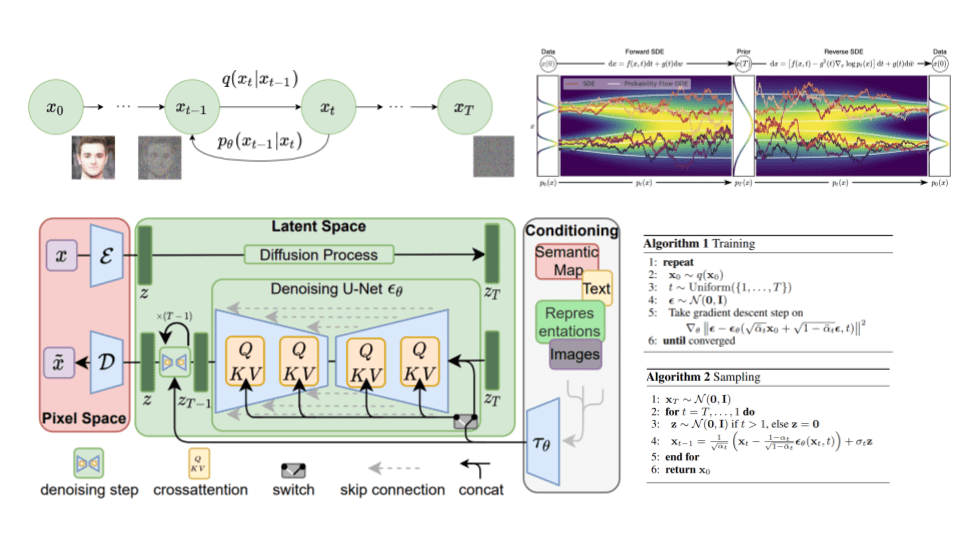
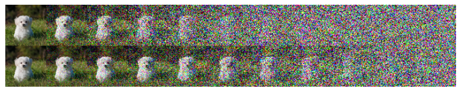
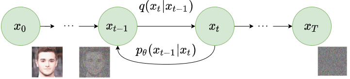
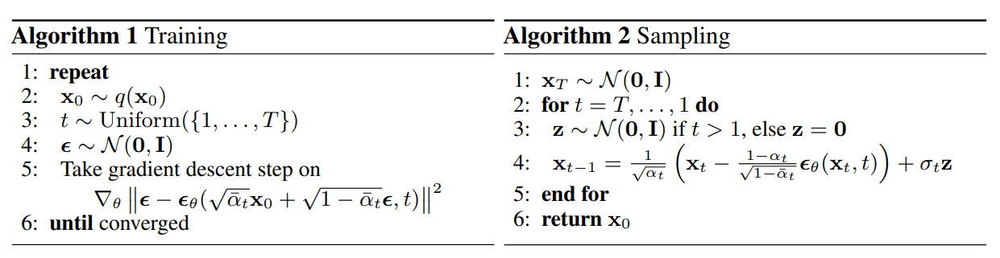
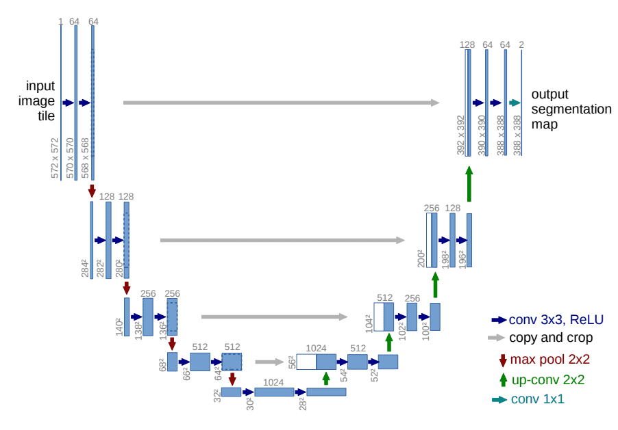

# 扩散模型是如何工作的：从零开始的数学原理

::: warning

由于某些原因，本文暂未完成

:::



## 目录

[[TOC]]

## 译者前言

基于生成对抗网络 GANs 的 AI 生成图像往年在互联网不温不热，但就在最近这几个月， Open AI 于 2022 年 4 月初发布的 DALL-E 2 (基于 GPT Model) ，以及 stability.ai 于 2022 年 8 月底发布的 Stable Diffusion (基于 Diffusion Model)  ，其生成的照片、画作的效果让人乍舌，随即引发了一股新的互联网 AI 创作热潮.  

而真正引发一系列热潮的，是 Novel AI 于 2022 年 10 月初发布的，能够画各种精致二次元美少女的 NovelAI Diffusion  (基于 Stable Diffusion) 一下子把 AI 绘画推向风口浪尖.  无数乐子人蜂拥而至，甚至有黑客把 Novel AI 的官网源码和模型全部扒了下来.  AI 创作数量极快，乍一看都很精致，而这些 “AI Based” 作品正在以一种极快的速度挤压创作者的空间，随即引发的便是关于伦理道德和法律的一系列疑问.  

但是本文暂不讨论伦理道德等方面的问题（也许之后会另发一篇文章讨论），仅仅先从技术角度和数学原理上简要介绍效果出众、“秒杀” GANs 的，改变了人们对原本 AI 绘画认知的 Diffusion Model 的数学原理.  

**本文翻译自 AI Summer 的工作人员 Sergios Karagiannakos, Nikolas Adaloglou 等几人发布的一篇科普文章 [How diffusion models work: the math from scratch | AI Summer (theaisummer.com)](https://theaisummer.com/diffusion-models/)**

## 扩散模型是什么？

扩散模型 (Diffusion Model) 是一种新型的、先进的生成模型，可以生成各种高分辨率图像.  在 OpenAI, Nvidia 和 Google 成功地训练了大规模的模型后，扩散模型已经吸引了很多人的注意.  基于扩散模型的架构有 GLIDE, DALLE-2, Imagen 和 完全开源的 stable diffusion

它们背后的原理是什么呢？

在这篇文章，我们将从基本原理开始挖掘.  目前已经有许多不同的基于扩散模型的架构，我们将重点讨论其中最突出的一个，即由 [Sohl-Dickstein et al](https://arxiv.org/abs/1503.03585) 最初提出的去噪扩散概率模型 (DDPM, denoising diffusion probabilistic model) ，然后由 [Ho. et al 2020](https://arxiv.org/abs/2006.11239) 提出。其它各种方法将不会具体讨论，如 stable diffusion 和 score-based models

::: info

扩散模型与之前所有的生成方法有着本质的区别。直观地说，它们旨在将图像生成过程（采样）分解为许多小的“去噪”步骤

:::

直观点说，模型可以在这些小的步骤中自我修正，并逐渐产生一个好的样本。在某种程度上，这种完善表征的想法已经在 [alphafold](https://youtu.be/nGVFbPKrRWQ?t=1148) 等模型中得到了应用。但是，没有什么是零成本的。这种迭代过程使得它们的采样速度很慢，至少与 [GANs](https://theaisummer.com/gan-computer-vision/) 相比是如此

## 扩散过程

扩散模型的基本思想是相当简单的。他们把输入图像 $\mathbf{x}_0$ 并通过一系列的 $T$ 步骤，逐渐向其添加高斯噪声，我们将此称为正向过程。值得注意的是，这与神经网络的前向传递无关。如果你愿意，这部分对于为我们的神经网络生成目标（应用 $t \lt T$ 噪声步骤后的图像）是必要的

之后，神经网络被训练为通过逆转噪声过程来恢复原始数据。通过能够对反向过程进行建模，我们可以生成新的数据。这就是所谓的反向扩散过程，或者一般来说，生成式模型的采样过程

具体是怎样的？让我们深入研究一下其中的数学，让它变得清晰

## 前向过程

扩散模型可以被看作是潜在变量模型。“潜在”意味着我们指的是一个隐藏的连续特征空间。以这种方式，它们可能看起来类似于 [变分自动编码器 (VAEs)](https://theaisummer.com/latent-variable-models/)

在实践中，它们是用一个马尔科夫链的 $T$ 步骤来制定的。这里，马尔可夫链意味着每一步只取决于前一步，这是一个很自然的假设。重要的是，与基于流量的模型不同，我们不受限制地使用特定类型的神经网络
给定一个数据点 $\mathbf{x}_0$ ，从真实数据分布 $q(\mathbf{x})$ （ $\mathbf{x}_0 \sim q(\mathbf{x})$ ） 中采样，我们可以通过添加噪声来定义一个前向扩散过程。具体来说，在马尔科夫链的每一步，我们添加方差为 $\beta_t$ 到 $\mathbf{x}_{t-1}$ 的高斯噪声，产生一个新的潜在变量 $\mathbf{x}_{t}$ ，其分布为 $q(\mathbf{x}_t|\mathbf{x}_{t-1})$ 。这个扩散过程可以表述如下：

$$
q(\mathbf{x}_t \vert \mathbf{x}_{t-1}) = \mathcal{N}(\mathbf{x}_t; \boldsymbol{\mu}_t=\sqrt{1 - \beta_t} \mathbf{x}_{t-1}, \boldsymbol{\Sigma}_t = \beta_t\mathbf{I})
$$


::: center

Forward diffusion process. Image modified by [Ho et al. 2020](https://arxiv.org/abs/2006.11239)

:::

由于我们处于多维情况下， $\textbf{I}$ 是身份矩阵，表明每个维度有相同的标准偏差 $\beta_t$ 。注意到， $q(\mathbf{x}_t \vert \mathbf{x}_{t-1})$ 是一个正态分布，其均值是 $\boldsymbol{\mu}_t =\sqrt{1 - \beta_t} \mathbf{x}_{t-1}$​​ ，方差为 $\boldsymbol{\Sigma}_t=\beta_t\mathbf{I}$ ，其中 $\boldsymbol{\Sigma}$ 是一个对角矩阵的方差（这里就是 $\beta_t$ ）
因此，我们可以自 $\mathbf{x}_0$ 到 $\mathbf{x}_t$ 以一种可操作的方式来近似输入。在数学上，这种后验概率定义如下：

$$
q(\mathbf{x}_{1:T} \vert \mathbf{x}_0) = \prod^T_{t=1} q(\mathbf{x}_t \vert \mathbf{x}_{t-1}) 
$$

其中，$q(\mathbf{x}_{1:T})$ 意味着我们从时间 $1$ 到 $T$ 重复应用 $q$

到目前为止，看起来还不错？并不！对于时间步长 $t=500<T$ 我们需要应用 $q$ 500 次为了样品 $\mathbf{x}_t$ 。难道就没有更好的方式吗？

[重参数化 (reparametrization trick)](https://theaisummer.com/latent-variable-models/#reparameterization-trick) 对此提供了一个魔法般的补救办法
### 重新参数化的技巧：在任何时间步长的可操作的闭式采样

如果我们定义 $\alpha_t= 1- \beta_t$, $\bar{\alpha}_t = \prod_{s=0}^t \alpha_s$ ，其中 $\boldsymbol{\epsilon}_{0},..., \epsilon_{t-2}, \epsilon_{t-1} \sim \mathcal{N}(\textbf{0},\mathbf{I})$ ，那么我们可以使用重新参数化的技巧证明：

$$
\begin{aligned}

\mathbf{x}_t 

&=\sqrt{1 - \beta_t} \mathbf{x}_{t-1} + \sqrt{\beta_t}\boldsymbol{\epsilon}_{t-1}\\

&= \sqrt{\alpha_t}\mathbf{x}_{t-2} + \sqrt{1 - \alpha_t}\boldsymbol{\epsilon}_{t-2}  \\

&= \dots \\

&= \sqrt{\bar{\alpha}_t}\mathbf{x}_0 + \sqrt{1 - \bar{\alpha}_t}\boldsymbol{\epsilon_0} 

\end{aligned}
$$

::: tip

由于所有时间段都有相同的高斯噪声，我们从现在开始只使用符号 $ϵ$

:::

因此，为了产生一个样本，我们可以使用如下公式：

$$
\mathbf{x}_t  \sim q(\mathbf{x}_t \vert \mathbf{x}_0) = \mathcal{N}(\mathbf{x}_t; \sqrt{\bar{\alpha}_t} \mathbf{x}_0, (1 - \bar{\alpha}_t)\mathbf{I})
$$

由于 $\beta_t$ 是一个超参数，我们可以预先计算所有时间步长的 $\alpha_t$ 和 $\bar{\alpha}_t$ 。这意味着我们在任何一个时间点 $t$ 对噪声进行采样，并一次性得到 $\mathbf{x}_t$ 。因此，我们可以在任何一个任意的时间段对我们的潜变量 $\mathbf{x}_t$ 进行采样。这将是我们以后计算可操作的目标损失 $L_t$ 的目标

### 方差表

方差参数 $\beta_t$ 可以固定为一个常数，也可以选择作为 $T$ 时间段的一个时间表。事实上，人们可以定义一个方差表，它可以是线性的、二次的、余弦的等等。最初的DDPM作者利用了一个从 $\beta_1= 10^{-4}$ 到 $\beta_T = 0.02$ 增加的线性时间表。 [Nichol et al. 2021](https://arxiv.org/abs/2102.09672) 的研究表明，采用余弦时间表效果更好



::: center

Latent samples from linear (top) and cosine (bottom) schedules respectively. Source: [Nichol & Dhariwal 2021](https://arxiv.org/abs/2102.09672)

:::

## 反向扩散

当 $T \to \infty$ 时，潜在的 $\mathbf{x}_T$ 几乎是一个 [各向同性 (isotropic)](https://math.stackexchange.com/questions/1991961/gaussian-distribution-is-isotropic#:~:text=TLDR%3A%20An%20isotropic%20gaussian%20is,%CE%A3%20is%20the%20covariance%20matrix.) 的高斯分布。因此，如果我们设法学习反向分布 $q(\mathbf{x}_{t-1} \vert \mathbf{x}_{t})$ ，我们可以对 $\mathbf{x}_t$ 进行采样，从 $\mathcal{N}(0,\mathbf{I})$ 中获取样本，运行反向过程并从 $q(\mathbf{x}_0)$ ，从原始数据分布中产生一个新的数据点
问题是我们如何对反向扩散过程进行建模

### 用神经网络逼近反向过程

在实际情况中，我们不知道 $q(\mathbf{x}_{t-1} \vert \mathbf{x}_{t})$ ，由于估计 $q(\mathbf{x}_{t-1} \vert \mathbf{x}_{t})$ 需要涉及数据分布的计算，所以这是难以解决的

相反，我们用一个参数化的模型 $p_{\theta}$ （例如一个神经网络）来近似 $q(\mathbf{x}_{t-1} \vert \mathbf{x}_{t})$ 。由于 $q(\mathbf{x}_{t-1} \vert \mathbf{x}_{t})$ 也将是高斯的，对于足够小的 $\beta_t$ ，我们可以选择是高斯的 $p_{\theta}$ ，只需对平均值和方差进行参数化：

$$
p_\theta(\mathbf{x}_{t-1} \vert \mathbf{x}_t) = \mathcal{N}(\mathbf{x}_{t-1}; \boldsymbol{\mu}_\theta(\mathbf{x}_t, t), \boldsymbol{\Sigma}_\theta(\mathbf{x}_t, t))
$$



::: center

Reverse diffusion process. Image modified by [Ho et al. 2020](https://arxiv.org/abs/2006.11239)

:::

如果我们对所有的时间步数应用反向公式 $p_\theta(\mathbf{x}_{0:T})$ ，我们可以从 $\mathbf{x}_T$ 到数据分布：

$$
p_\theta(\mathbf{x}_{0:T}) = p_{\theta}(\mathbf{x}_T) \prod^T_{t=1} p_\theta(\mathbf{x}_{t-1} \vert \mathbf{x}_t)
$$

通过对时间段 $t$ 的额外调节，该模型将学会预测每个时间段的高斯参数（指平均值 $\boldsymbol{\mu}_\theta(\mathbf{x}_t, t)$ ）和协方差矩阵 $\boldsymbol{\Sigma}_\theta(\mathbf{x}_t, t)$ 但我们如何训练这样一个模型呢？

## 训练一个扩散模型

如果我们退一步讲，我们可以注意到， $q$ 和 $p$ 的组合与变异自动编码器（VAE）非常相似。因此，我们可以通过优化训练数据的负对数似然来训练它。经过一系列的计算（我们在此不做分析），我们可以把证据下限（ELBO）写成如下：

$$
\begin{aligned}

\log p(\mathbf{x}) \geq ~

&\mathbb{E}_{q(x_1 \vert x_0)} [\log p_{\theta} (\mathbf{x}_0 \vert \mathbf{x}_1)] - \\ &D_{KL}(q(\mathbf{x}_T \vert \mathbf{x}_0) \vert\vert p(\mathbf{x}_T))- \\

&\sum_{t=2}^T \mathbb{E}_{q(\mathbf{x}_t \vert \mathbf{x}_0)} [D_{KL}(q(\mathbf{x}_{t-1} \vert \mathbf{x}_t, \mathbf{x}_0) \vert \vert p_{\theta}(\mathbf{x}_{t-1} \vert \mathbf{x}_t)) ] \\

& = L_0 - L_T - \sum_{t=2}^T L_{t-1}

\end{aligned}
$$

我们来分析一下这些内容：

1. $\mathbb{E}_{q(x_1 \vert x_0)} [log p_{\theta} (\mathbf{x}_0 \vert \mathbf{x}_1)]$ 可以当作是一个重建项 (reconstruction term) ，类似于变量自动编码器 ELBO 中的一个。在 [Ho et al 2020](https://arxiv.org/abs/2006.11239) 的研究中，这个术语是用一个单独的解码器学习的
2. $D_{KL}(q(\mathbf{x}_T \vert \mathbf{x}_0) \vert\vert p(\mathbf{x}_T))$ 显示了 $\mathbf{x}_T$ 与标准高斯是多么的相似。注意到，整个项都没有可训练的参数，因此，训练过程这个项会被忽略
3. 最后的第三项 $\sum_{t=2}^T L_{t-1}$ 也表示为 $L_t$ ，描述了期望的去噪步骤 $p_{\theta}(\mathbf{x}_{t-1} \vert \mathbf{x}_t))$ 与近似项 $q(\mathbf{x}_{t-1} \vert \mathbf{x}_t, \mathbf{x}_0)$ 之间的差异
很明显，通过 ELBO ，最大化的可能性可以归结为学习去噪步骤 $L_t$

::: tip

尽管 $q(\mathbf{x}_{t-1} \vert \mathbf{x}_{t})$ 是难以解决的，但 [Sohl-Dickstein et al](https://arxiv.org/abs/1503.03585) 说明，通过对 $\textbf{x}_0$ 的附加条件，可以使它变得容易解决

:::

直观地说，画家（我们的生成模型）需要一个参考图像 ($\textbf{x}_0$) 来慢慢绘制（反向扩散步骤 $q(\mathbf{x}_{t-1} \vert \mathbf{x}_t, \mathbf{x}_0)$ ）一个图像。因此，当且仅当我们有 $\mathbf{x}_0$ 作为参考时，我们可以向后退一小步，即从噪声中生成一个图像
换句话说，我们可以在噪声水平 $t$ 的条件下对 $\textbf{x}_t$ 进行采样。由于 $\alpha_t= 1- \beta_t$ 和 $\bar{\alpha}_t = \prod_{s=0}^t \alpha_s$ ，我们可以证明：

$$
\begin{aligned}

q(\mathbf{x}_{t-1} \vert \mathbf{x}_t, \mathbf{x}_0) &= \mathcal{N}(\mathbf{x}_{t-1}; {\tilde{\boldsymbol{\mu}}}(\mathbf{x}_t, \mathbf{x}_0), {\tilde{\beta}_t} \mathbf{I}) \\

\tilde{\beta}_t &= \frac{1 - \bar{\alpha}_{t-1}}{1 - \bar{\alpha}_t} \cdot \beta_t \\

\tilde{\boldsymbol{\mu}}_t (\mathbf{x}_t, \mathbf{x}_0) &= \frac{\sqrt{\bar{\alpha}_{t-1}}\beta_t}{1 - \bar{\alpha}_t} \mathbf{x_0} + \frac{\sqrt{\alpha_t}(1 - \bar{\alpha}_{t-1})}{1 - \bar{\alpha}_t} \mathbf{x}_t 

\end{aligned}
$$

::: tip

$\alpha_t$ 和 $\bar{\alpha}_t$ 只取决于​ $\beta_t$ ，所以它们可以被预先计算出来

:::

这个小技巧为我们提供了一个完全可操作的 ELBO 。上述属性还有一个重要的副作用，正如我们在重参数化技巧中已经看到的，我们可以将 $\mathbf{x}_0$ 表示为：

$$
\mathbf{x}_0 = \frac{1}{\sqrt{\bar{\alpha}_t}}\left(\mathbf{x}_t - \sqrt{1 - \bar{\alpha}_t} \boldsymbol{\epsilon}\right),
$$

其中 $\boldsymbol{\epsilon} \sim \mathcal{N}(\textbf{0},\mathbf{I})$

通过合并最后两个方程，现在每个时间步长将有一个平均数 $\tilde{\boldsymbol{\mu}}_t$ （我们的目标），它只取决于 $\mathbf{x}_t$ :

$$
\tilde{\boldsymbol{\mu}}_t (\mathbf{x}_t) = {\frac{1}{\sqrt{\alpha_t}} \left( \mathbf{x}_t - \frac{\beta_t}{\sqrt{1 - \bar{\alpha}_t}} \boldsymbol{\epsilon}  \right)}
$$

因此，我们可以使用一个神经网路 $\epsilon_{\theta}(\mathbf{x}_t,t)$ 来近似 $\boldsymbol{\epsilon}$ 并得到如下均值结果：

$$
\tilde{\boldsymbol{\mu}_{\theta}}( \mathbf{x}_t,t) = {\frac{1}{\sqrt{\alpha_t}} \left( \mathbf{x}_t - \frac{\beta_t}{\sqrt{1 - \bar{\alpha}_t}} \boldsymbol{\epsilon}_{\theta}(\mathbf{x}_t,t) \right)}
$$

因此，损失函数（ELBO中的去噪项）可以表示为：

$$
\begin{aligned}

L_t &= \mathbb{E}_{\mathbf{x}_0,t,\boldsymbol{\epsilon}}\Big[\frac{1}{2||\boldsymbol{\Sigma}_\theta (x_t,t)||_2^2} ||\tilde{\boldsymbol{\mu}}_t - \boldsymbol{\mu}_\theta(\mathbf{x}_t, t)||_2^2 \Big] \\

&= \mathbb{E}_{\mathbf{x}_0,t,\boldsymbol{\epsilon}}\Big[\frac{\beta_t^2}{2\alpha_t (1 - \bar{\alpha}_t) ||\boldsymbol{\Sigma}_\theta||^2_2} \| \boldsymbol{\epsilon}_{t}-  \boldsymbol{\epsilon}_{\theta}(\sqrt{\bar{a}_t} \mathbf{x}_0 + \sqrt{1-\bar{a}_t}\boldsymbol{\epsilon}, t ) ||^2 \Big]

\end{aligned}
$$

这有效地告诉我们，该模型不是预测分布的平均值，而是预测每个时间点 $t$ 的噪声 $\boldsymbol{\epsilon}$

[Ho et.al 2020](https://arxiv.org/abs/2006.11239) 对实际损失项做了一些简化，因为他们忽略了一个加权项。简化后的版本优于完整的目标：

$$
L_t^\text{simple} = \mathbb{E}_{\mathbf{x}_0, t, \boldsymbol{\epsilon}} \Big[\|\boldsymbol{\epsilon}- \boldsymbol{\epsilon}_{\theta}(\sqrt{\bar{a}_t} \mathbf{x}_0 + \sqrt{1-\bar{a}_t} \boldsymbol{\epsilon}, t ) ||^2 \Big]
$$

作者发现，优化上述目标比优化原始 ELBO 效果更好。这两个方程的证明可以在 [Lillian Weng](https://lilianweng.github.io/posts/2021-07-11-diffusion-models/#reverse-diffusion-process) 的这篇优秀文章或 [Luo et al. 2022](https://arxiv.org/abs/2208.11970) 中找到

此外，[Ho et. al 2020](https://arxiv.org/abs/2006.11239) 决定保持方差固定，让网络只学习平均值。后来 [Nichol et al. 2021](https://arxiv.org/abs/2102.09672) 对此进行了改进，他们让网络学习协方差矩阵 $(\boldsymbol{\Sigma})$ （通过修改 $L_t^\text{simple}$ ），取得了更好的结果



::: center

Training and sampling algorithms of DDPMs. Source: [Ho et al. 2020](https://arxiv.org/abs/2006.11239)

:::

## 架构

到目前为止，我们还没有提到的一件事是模型的架构是什么样子的。请注意，模型的输入和输出应该是相同大小的
为此， [Ho et al.](https://arxiv.org/abs/2006.11239) 采用了一个 U-Net 。如果你对 U-Net 不熟悉，请随时查看我们过去关于 [主要 U-Net 架构](https://theaisummer.com/unet-architectures/) 的文章。简而言之， U-Net 是一种对称的架构，其输入和输出的空间大小相同，在相应特征维度的编码器和解码器块之间使用 [跳过连接](https://theaisummer.com/skip-connections/) 。通常情况下，输入图像首先被降频，然后被升频，直到达到其初始尺寸
在 DDPMs 的原始实现中， U-Net 由宽 [ResNet 块](https://theaisummer.com/skip-connections/#resnet-skip-connections-via-addition) 、 [分组归一化](https://theaisummer.com/normalization/#group-normalization-2018) 以及 [自我注意](https://theaisummer.com/attention/) 块组成

扩散时间段 $t$ 是通过在每个残差块中加入一个正弦的 [位置嵌入](https://theaisummer.com/positional-embeddings/) 来指定的。欲了解更多细节，请随时访问 [官方 GitHub 仓库](https://github.com/hojonathanho/diffusion)  。关于扩散模型的详细实现，请查看 [Hugging Face 的这篇精彩文章](https://huggingface.co/blog/annotated-diffusion)




::: center

The U-Net architecture. Source: [Ronneberger et al.](https://arxiv.org/abs/1505.04597)

:::

## 条件性图像生成：引导扩散

### 分类指导

### 无分类指导

## 扩大扩散模型的规模

### 级联扩散模型

### 稳定的扩散（Stable diffusion）：潜在扩散模型

## 基于分数的生成模型

### 为基于分数的模型添加噪音：噪声条件得分网络(NCSN)

### 通过随机微分方程（SDE）进行基于分数的生成性建模

## 总结

## 引用

```bibtex
@article{karagiannakos2022diffusionmodels,
    title   = "Diffusion models: toward state-of-the-art image generation",
    author  = "Karagiannakos, Sergios, Adaloglou, Nikolaos",
    journal = "https://theaisummer.com/",
    year    = "2022",
    howpublished = {https://theaisummer.com/diffusion-models/},
  }
```

## 参考文献
::: info

- [1] Sohl-Dickstein, Jascha, et al. Deep Unsupervised Learning Using Nonequilibrium Thermodynamics. arXiv:1503.03585, arXiv, 18 Nov. 2015  
- [2] Ho, Jonathan, et al. Denoising Diffusion Probabilistic Models. arXiv:2006.11239, arXiv, 16 Dec. 2020  
- [3] Nichol, Alex, and Prafulla Dhariwal. Improved Denoising Diffusion Probabilistic Models. arXiv:2102.09672, arXiv, 18 Feb. 2021  
- [4] Dhariwal, Prafulla, and Alex Nichol. Diffusion Models Beat GANs on Image Synthesis. arXiv:2105.05233, arXiv, 1 June 2021  
- [5] Nichol, Alex, et al. GLIDE: Towards Photorealistic Image Generation and Editing with Text-Guided Diffusion Models. arXiv:2112.10741, arXiv, 8 Mar. 2022  
- [6] Ho, Jonathan, and Tim Salimans. Classifier-Free Diffusion Guidance. 2021. openreview.net  
- [7] Ramesh, Aditya, et al. Hierarchical Text-Conditional Image Generation with CLIP Latents. arXiv:2204.06125, arXiv, 12 Apr. 2022  
- [8] Saharia, Chitwan, et al. Photorealistic Text-to-Image Diffusion Models with Deep Language Understanding. arXiv:2205.11487, arXiv, 23 May 2022  
- [9] Rombach, Robin, et al. High-Resolution Image Synthesis with Latent Diffusion Models. arXiv:2112.10752, arXiv, 13 Apr. 2022  
- [10] Ho, Jonathan, et al. Cascaded Diffusion Models for High Fidelity Image Generation. arXiv:2106.15282, arXiv, 17 Dec. 2021  
- [11] Weng, Lilian. What Are Diffusion Models? 11 July 2021  
- [12] O'Connor, Ryan. Introduction to Diffusion Models for Machine Learning AssemblyAI Blog, 12 May 2022  
- [13] Rogge, Niels and Rasul, Kashif. The Annotated Diffusion Model . Hugging Face Blog, 7 June 2022  
- [14] Das, Ayan. “An Introduction to Diffusion Probabilistic Models.” Ayan Das, 4 Dec. 2021  
- [15] Song, Yang, and Stefano Ermon. Generative Modeling by Estimating Gradients of the Data Distribution. arXiv:1907.05600, arXiv, 10 Oct. 2020  
- [16] Song, Yang, and Stefano Ermon. Improved Techniques for Training Score-Based Generative Models. arXiv:2006.09011, arXiv, 23 Oct. 2020  
- [17] Song, Yang, et al. Score-Based Generative Modeling through Stochastic Differential Equations. arXiv:2011.13456, arXiv, 10 Feb. 2021  
- [18] Song, Yang. Generative Modeling by Estimating Gradients of the Data Distribution, 5 May 2021  
- [19] Luo, Calvin. Understanding Diffusion Models: A Unified Perspective. 25 Aug. 2022

:::