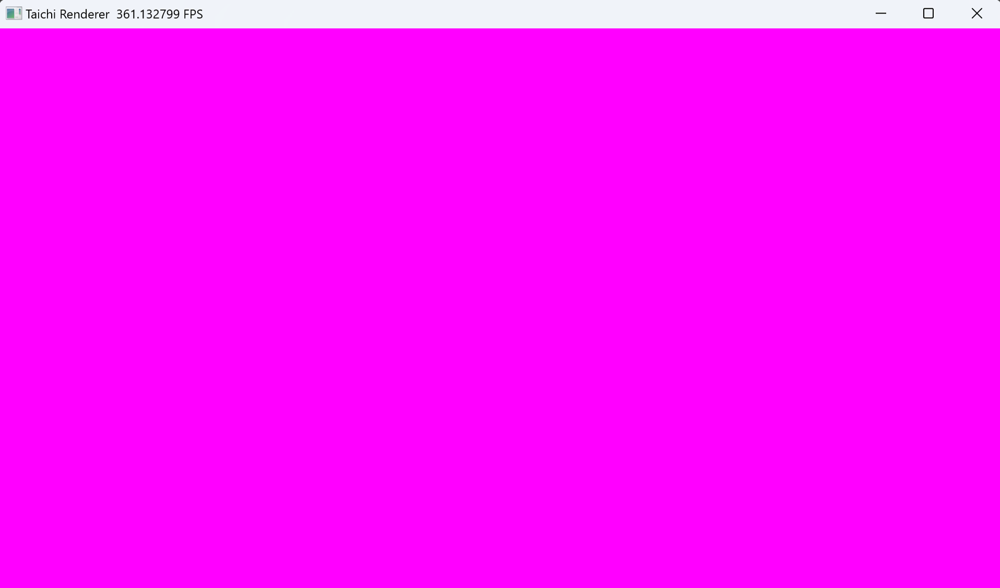
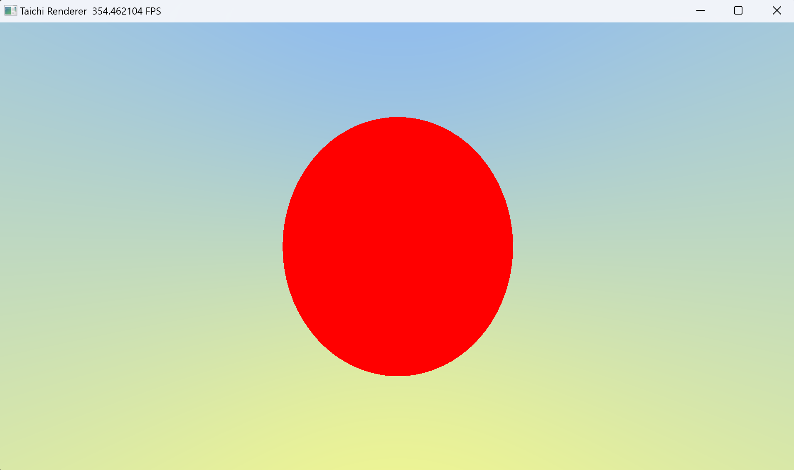

# Taichi: 从零开始的光线追踪

::: danger
这篇文章目前还没写完，正在更新中
:::


::: center
用 Taichi 渲染 100 万面镜子
:::

## 前言

这篇文章会分若干章节，教你使用并行计算框架 Taichi 来从零开始、一步一步地实现一个基于物理的 (Physically Based Rendering) 光线追踪渲染器，然后用它构建一个场景，渲染出有真实感的画面。

### 什么是并行计算

正如我前面所说，Taichi 是一个并行计算框架，当前许多计算密集型任务（例如图像渲染、物理仿真和人工智能等任务）高度依托于并行计算。为什么呢，因为这些任务都可以被分解为可以被并行处理的最简单的数学运算，通常我们会把它们交给多核心的 CPU 或 GPU 来进行处理。

如何区分 CPU 和 GPU ？形象点来说，CPU 的若干个大核心就像是几个博士为你处理任务，而 GPU 就像是有成百上千个小学生（英伟达的 4090 GPU 拥有超过一万个 CUDA 核心）为你同时处理任务。所以通常，我们会使用 GPU 来加速并行计算。

### 为什么用 Taichi

我高三和大一的时候曾构想过一个专门进行数值计算和可视化的工具 Plotter ，它将循环和分支结构视为对矩阵的处理，并且当时使用 JavaScript 实现了这个工具的原型，创作了一些简单的数学可视化效果。

但是它的问题是效率非常低下。后来我接触了游戏开发，并入门了着色器，然后震惊于并行计算带来的极高计算效率，但是使用着色器任然存在许多桎梏，它的兼容性和灵活度并不是很好。

再后来我了解了 Taichi ，作为领域特定语言，能够让你以更好的灵活度和简便的语法轻松玩转并行编程，无需配置复杂的 C++/CUDA 环境、使用冗长的语法并处理各种编译和运行时问题。

下面是一段 Taichi 代码的示意图，相信你能从其中感受到 Taichi 的简洁和灵活性。

::: center

:::

::: center

用蒙特卡洛算法计算圆周率  
图片来自 Taichi 官网 [taichi-lang.org](https://www.taichi-lang.org/apps/python-code.svg)

:::

### 并行离我们远吗

并不远！并行计算时时刻刻都在发生，包括我们每天在看的视频、玩的游戏都需要经过大量并行计算。而多媒体创作本身，例如我们在使用相机拍下照片的瞬间、用剪辑软件或特效软件处理视频、影视特效对物体的仿真和渲染、AI 模型的训练和使用（相信不少人已经了解了由 Novel AI 和 niji·journey 等 AI 模型创作的不少令人惊人的画作）等等也需要大量并行计算的任务。

## 如何使用 Taichi

Taichi 是一门开源的、嵌入在 Python 中的并行编程语言。在开始之前，你需要先安装 Python ，然后使用 Python 的包管理器 `pip` 来安装 Taichi 。

::: tip
在安装 Python 时，记得勾选 `Add Python 3.x to PATH` 选项，这样你就可以在任意路径下使用 `python` 命令来启动 Python 了
:::

在 [Python 官网](https://www.python.org/) 下载安装 Python 后，使用 `pip` 安装 Taichi 。

```bash
pip install taichi -U
```

之后，你可以使用下面的命令来验证是否安装成功，并查看一些 taichi 程序的演示。

```bash
ti gallery
```

### Taichi 速查表

::: info
- 这份速查表来自 Taichi 开发团队的 GitHub 仓库，它可以帮助你快速了解 Taichi 的基本语法。
- https://github.com/taichi-dev/cheatsheet
- 你可以在这里获取它的 SVG 版本
- [Taichi Lang Cheatsheet SVG](/blog/p/taichi-lang-cheatsheet-svg.md)
:::

::: center

:::

::: tip
你现在可能并不需要清楚每一个函数背后的意义。在后面的教程中，你会逐渐了解它们的一部分，然后完成一个光线追踪渲染器
:::

### 运行 Taichi 程序

现在，我会教你使用 Taichi 定义一个向量场，然后使用 GPU 绘制一片紫色并显示在窗口中。

你也许已经知道，显示设备显示图像的原理是每个像素以混合不同强度的红绿蓝 (RGB) 三色光的方式显示五彩斑斓的颜色，而在计算机中也最常用 RGB 色彩空间来处理颜色。紫色是由红色光与蓝色光混合而成，绿色光的强度为 0 ，所以我们用 `vec3(1, 0, 1)` 表示紫色。

我们将图像视为一个二维的、由像素组成的向量场，每个像素都有一个颜色值，用一个三维的向量表示 RGB 三个分量的强度，且每个分量被标准化到 0 和 1 之间，用 0 表示强度最弱，用 1 表示强度最强。在 Taichi 中，我们先用 `ti.init(arch=ti.gpu)` 初始化 Taichi ，并告诉它我们要将程序在 GPU 中加速运行，然后使用 `ti.Vector.field` 来定义一个向量场。

这个场的大小便是图像的分辨率，在这里我们设置为常见的 `1920x1080` ，即 1920 个像素宽、1080 个像素高的图像。然后，我们在用 `ti.kernel` 装饰 Taichi 运行时的入口（这里是 `render` 函数），使用 Taichi 的并行 `for` 为每个像素赋予紫色 `vec3(1, 0, 1)` 。最后我们用 `ti.ui.Window` 创建一个窗口，并用 `canvas.set_image` 将这个场绘制到窗口的画布中。

创建一个 `00.py` 文本文件，输入下面的代码。

```python
from taichi.math import *   # 导入 Taichi 数学库
import taichi as ti # 导入 Taichi 库

ti.init(arch=ti.gpu)    # 初始化 Taichi ，GPU 加速

image_resolution = (1920, 1080) # 图像分辨率
image_pixels = ti.Vector.field(3, float, image_resolution) # 图像的像素场

@ti.kernel
def render():   # 渲染函数
    for i, j in image_pixels:   # 并行遍历像素场
        image_pixels[i, j] = vec3(1, 0, 1)  # 设置像素颜色为紫色

window = ti.ui.Window("Taichi Renderer", image_resolution)  # 创建窗口
canvas = window.get_canvas()    # 获取画布

while window.running:
    render()    # 调用渲染函数
    canvas.set_image(image_pixels)  # 为画布设置图像
    window.show()   # 显示窗口
```

在当前路径下，使用终端命令 `ti 00.py` 运行这个 Taichi 程序，你便可以看到一个紫色的窗口。



::: center
你的第一个 Taichi 图形程序：紫色的窗口
:::

::: tip
- 到这一步的完整代码在 GitHub
- https://github.com/HK-SHAO/RayTracingPBR/blob/taichi/taichi/RT01/00.py
:::

## 让我们正式开始

别忘了我们的目标是创建一个光线追踪渲染器，但是凡事都得一步一步地来不是吗？现在你已经会运行 Taichi 程序，并成功在画布里绘制出了一片纯紫色，这已经是一个很好的开始了。

接下来我们要建立坐标系，并对坐标值进行归一化，这是我们能够自由控制画面中物体位置的基础。

什么是归一化？通常是指将数值压缩到 0 到 1 之间，或者 -1 到 1 之间。在这里，我们的图像分辨率是 `image_resolution = (1920, 1080)` ，但这个数值是可以被我们自由变更的，因此我们将第 i 行、第 j 列的像素的坐标值归一化为 `u = i / image_resolution[0]` 和 `v = j / image_resolution[1]` ，这样我们就可以使用归一化的 uv 坐标来描述像素位置了。

之后，我们将红色强度设置为 u ，绿色强度设置为 v ，蓝色强度设置为 0 ，这样我们就可以看到一个渐变的彩色图像，并且沿着 u 轴从左到右红色强度上升，沿着 v 轴从下到上绿色强度上升。


::: center
彩色的画布，沿着 u 轴从左到右红色强度上升，沿着 v 轴从下到上绿色强度上升
:::

创建一个 `01.py` 文本文件，在 `00.py` 基础上加入下面的代码。

```python{12-15}
from taichi.math import *   # 导入 Taichi 数学库
import taichi as ti # 导入 Taichi 库

ti.init(arch=ti.gpu)    # 初始化 Taichi ，GPU 加速

image_resolution = (1920, 1080) # 图像分辨率
image_pixels = ti.Vector.field(3, float, image_resolution) # 图像的像素场

@ti.kernel
def render():   # 渲染函数
    for i, j in image_pixels:   # 并行遍历像素场
        u = i / image_resolution[0] # 计算归一化的 u 坐标
        v = j / image_resolution[1] # 计算归一化的 v 坐标

        image_pixels[i, j] = vec3(u, v, 0)  # 设置像素颜色

window = ti.ui.Window("Taichi Renderer", image_resolution)  # 创建窗口
canvas = window.get_canvas()    # 获取画布

while window.running:
    render()    # 调用渲染函数
    canvas.set_image(image_pixels)  # 为画布设置图像
    window.show()   # 显示窗口
```

在当前路径下，使用终端命令 `ti 01.py` 运行这个 Taichi 程序，你便可以看到一个彩色的窗口。

::: tip
- 到这一步的完整代码在 GitHub
- https://github.com/HK-SHAO/RayTracingPBR/blob/taichi/taichi/RT01/01.py
:::

## 使画面动起来

一副静态画面有什么好看的呢？让我们更进一步，使画面动起来吧。

我们需要做的是获取当前程序运行经过的时间，然后将这个时间传入 `render` 函数，让它影响蓝色分量的强度。我们希望画面整体蓝色强度会随着时间周期性的变化。

别忘了归一化，程序经过的时间是以秒为单位不断增加的，但是我们的蓝色分量必须在 0 和 1 之间，在这之外的值会被截断。因此，我们使用 $\sin(t)$ 函数将时间归一化到 -1 到 1 之间，然后将其缩放并平移到 0 到 1 之间，这只需要 $0.5 * \sin(t) + 0.5$ 。

创建一个 `02.py` 文本文件，在 `01.py` 基础上加入下面的代码。

```python{11,16-17,22-25}
from taichi.math import *   # 导入 Taichi 数学库
import taichi as ti # 导入 Taichi 库
import time # 导入时间库

ti.init(arch=ti.gpu)    # 初始化 Taichi ，GPU 加速

image_resolution = (1920, 1080) # 图像分辨率
image_pixels = ti.Vector.field(3, float, image_resolution) # 图像的像素场

@ti.kernel
def render(time: float):   # 渲染函数
    for i, j in image_pixels:   # 并行遍历像素场
        u = i / image_resolution[0] # 计算归一化的 u 坐标
        v = j / image_resolution[1] # 计算归一化的 v 坐标

        blue = 0.5 * sin(time) + 0.5 # 计算蓝色分量
        image_pixels[i, j] = vec3(u, v, blue)  # 设置像素颜色

window = ti.ui.Window("Taichi Renderer", image_resolution)  # 创建窗口
canvas = window.get_canvas()    # 获取画布

start_time = time.time()    # 获取程序开始时时间
while window.running:
    delta_time = time.time() - start_time   # 计算时间差
    render(delta_time)  # 调用渲染函数
    canvas.set_image(image_pixels)  # 为画布设置图像
    window.show()   # 显示窗口
```

在当前路径下，使用终端命令 `ti 02.py` 运行这个 Taichi 程序，可以看到一个不断变化色彩的窗口。


::: center
这副画面的色调会随着时间周期性变化
:::

::: tip
- 到这一步的完整代码在 GitHub
- https://github.com/HK-SHAO/RayTracingPBR/blob/taichi/taichi/RT01/02.py
:::

## 光子与光线

光线追踪渲染利用了光路可逆的原理，我们将光的传播逆向表达，从每个像素发出光线，光击中材质表面后改变了自身的强度、颜色和方向，然后继续传播，直到光线被完全吸收或者到达了光源。最后我们将累积的颜色显示在这个像素上，便渲染出了场景。

接下来，我们来到了光线追踪最基础的一步——定义光线。光线是光子沿射线传播的路径，在基于光线追踪的渲染器中，我们假定光线仅沿着一条直线传播，因此光线可以用一个起点 $\vec{\mathbf{ro}}$ 和一个方向 $\vec{\mathbf{rd}}$ 来表示，其中 $\vec{\mathbf{rd}}$ 应是一个单位向量。这样，光子在三维空间中所在的位置可以用 $\mathbf{p}(t)=\vec{\mathbf{ro}} + t \cdot \vec{\mathbf{rd}}$ 表示，其中 $t$ 是光从起点开始传播的距离。

另外，用一个四维向量 `vec4` 表示光线的颜色和强度，这方便我们后面对光的处理。在这里，我们使用面向对象 (OOP) 的建模方法，利用 Taichi 的 `ti.dataclass` 装饰器写一个光线类，`at` 函数传入 `t` 计算光所在位置。

```python
@ti.dataclass
class Ray:  # 光线类
    origin: vec3    # 光线起点
    direction: vec3 # 光线方向
    color: vec4     # 光的颜色

    @ti.func
    def at(r, t: float) -> vec3: # 计算光子所在位置
        return r.origin + t * r.direction
```

## 建立坐标系

为什么要建立坐标系？因为接下来我们要在虚拟的三维空间中定义我们摄像机的位置，在这之前，我们已经用 uv 坐标建立了一个二维的坐标系了，我们还需要一个 z 轴正方向。使用过三维软件、游戏引擎的同学可能知道，图形学中常使用左手系来建立三维空间坐标。

因此，从屏幕向你眼睛的方向，z 轴分量是负的。我们将视点（好比眼睛的位置）放在原点 $(0,0,0)$ ，画布（相当于你的屏幕）的中心位置设置为 $(0,0,-1)$，然后从视点向画布中每个像素发射一条光线。


::: center
建立左手系坐标系，将画布放到 z 负半轴方向
:::

在 `render` 函数中，初始化视点和画布的位置，然后创建一条光线。在这里，我们使用了 `normalize` 函数将向量化为仅表示方向的单位向量。

```python
lower_left_corner = vec3(-2, -1, -1)    # 视野左下角
horizontal = vec3(4, 0, 0)  # 视野水平方向
vertical = vec3(0, 2, 0)    # 视野垂直方向
origin = vec3(0, 0, 0)      # 视点

ro = origin # 光线起点
rd = normalize(lower_left_corner + u*horizontal + v*vertical - ro)  # 光线方向
ray = Ray(ro, rd)   # 创建光线
```

## 画一片蓝天

有了光线之后，我们尝试使用光线方向的 y 分量来混合白色和蓝色，从而得到一片随时间变化的蓝天。`mix` 函数是对向量的插值（混合），用数学公式表达是
$$
{\rm mix}(\vec{\mathbf{a}}, \vec{\mathbf{b}}, t)=(1-t)\cdot\vec{\mathbf{a}}+t\cdot\vec{\mathbf{b}}
$$

用 `ti.func` 装饰这个函数是一个 Taichi 函数，这样我们才可以在 Taichi 的 `ti.kernel` 中使用它。

```python
@ti.func
def sky_color(ray, time) -> vec3:
    t = 0.5 * ray.direction.y + 0.5 # 将 y 分量归一化
    blue = 0.5 * sin(time) + 0.5    # 计算蓝色分量
    return mix(vec3(1.0, 1.0, blue), vec3(0.5, 0.7, 1.0), t)    # 混合两种颜色
```

在 `render` 函数中，我们将光线传入 `sky_color` 函数，得到背景颜色，再将背景颜色赋值给像素。

```python
ray.color.rgb = sky_color(ray, time)    # 获取天空颜色
image_pixels[i, j] = ray.color.rgb  # 设置像素颜色
```


::: center
一片渐变的蓝天，随时间改变颜色
:::

::: tip
- 到这一步的完整代码在 GitHub
- https://github.com/HK-SHAO/RayTracingPBR/blob/taichi/taichi/RT01/03.py
:::

## 往地图放入物体

### 符号距离场函数

接下来我们要往虚拟世界里放入一些几何物体，最简单的物体是一个半径为 $r$ 的球，我们可以使用一个函数来表示这个球，这个函数称为符号距离场函数 (Signed Distance Field，SDF) 。 它表示的是某点到物体表面的距离，如果距离为负数，表示这个点在物体内部，如果距离为正数，表示这个点在物体外部，如果距离为零，表示这个点刚好在物体表面上。

用 $\left\|\vec{\mathbf{p}}\right\|$ 表示向量 $\vec{\mathbf{p}}$ 的 $L_2$ 范数，即

$$
\left\|\vec{\mathbf{p}}\right\|=\sqrt{\vec{\mathbf{p}}\cdot\vec{\mathbf{p}}}
$$

球的 SDF 函数是到球心的距离减去球半径，即

$$
{\rm sphere}(\vec{\mathbf{p}}, r) = \left\|\vec{\mathbf{p}}\right\| - r
$$

使用 SDF 表示物体的好处是，我们可以很方便地计算出物体的表面法线，这在后面的光照计算中会用到。此外， SDF 函数不仅能够表达简单的集合物体，也可以表达复杂的物体，还可以使用简单的运算对多个物体进行变换、组合和重复等操作，这使得我们可以很方便地创建出复杂的场景。

```python
@ti.func
def sd_sphere(p: vec3, r: float) -> float:  # SDF 球体
    return length(p) - r
```

### 光线步进求交

有了用 SDF 表示的球体之后，接下来就是让光线前进，然后找到光线与物体最近的交点。我们可以使用光线步进 (Ray Marching) 的方法来找到交点，即沿着光线方向，每次前进一小步，然后计算出这一步的有向距离 (SD) 值，一直前进直到 SD 值与 0 相差非常小 `abs(SD) < PRECISION` ，就认为光线到达了物体的表面。

可是每次前进的步长是多少呢？如果步长太大，光线可能会跳过物体表面，如果步长太小，光线前进的速度就会极慢，这样就会带来非常多冗余的计算，使得画面帧数下降。

一个聪明的做法是让光线每次前进的距离刚好等于 SD 的绝对值，因为它是当前点到物体表面的最短距离。最好的情况下，光线只需要前进一两次就可以刚好到达表面。

当光线偏离物体很远时，光线也很快就会传播到无穷远处，当光线步进的距离足够远而仍然没有到达物体表面，就认为这条光线没有击中任何物体，那我们就可以认为它击中了天空。

下面是三维空间的一个二维切面，可视化这个算法中光线步进和与物体求交的过程

::: center
|||
|:-:|:-:|
|较好的情况下很快到达物体表面|没有交点的情况很快就发散|
:::

::: center
图片截取自 https://www.shadertoy.com/view/lslXD8
:::

一种比较差的情况是，光线刚好与物体擦肩而过，这个时候步进次数会急剧上升，不过好在光线总会离开物体表面附近，我们可以设置一个最大步进次数，当步进次数超过这个值时，也认为这条光线没有击中任何物体。

::: center

:::

::: center
图片截取自 https://www.shadertoy.com/view/lslXD8
:::

首先，我需要定义一个光线击中物体的数据类

```python
@ti.dataclass
class HitRecord:    # 光子碰撞记录类
    position: vec3  # 光子碰撞的位置
    distance: float # 光子步进的距离
    hit: ti.i32     # 是否击中到物体
```

接着，声明一个阈值 `PRECISION` ，当光子距离物体表面足够近时，便认为击中了物体表面。还需要一个最大的步进次数 `MAX_RAYMARCH` 和最大步进距离 `TMAX` ，如果超出这两个值，便认为这条光线没有击中任何物体。此外，还需要一个 `TMIN` 让每次求交时光线起始位置向光线方向移动一小步，避免在下次求交时光线又立刻与物体相交 (`abs(sd) < PRECISION`) 。

```python
TMIN        = 0.001     # 光开始传播的起始偏移，避免光线自相交
TMAX        = 2000.0    # 最大单次光线传播距离
PRECISION   = 0.0001    # 必须要小于 TMIN，否则光线会自相交产生阴影痤疮

MAX_RAYMARCH = 512      # 最大光线步进次数
```

与物体求交的函数如下

```python
@ti.func
def raycast(ray) -> HitRecord:  # 光线步进求交
    record = HitRecord(ray.origin, TMIN, False) # 初始化光子碰撞记录
    for _ in range(MAX_RAYMARCH):   # 光线步进
        record.position = ray.at(record.distance)   # 计算光子所在位置
        # 计算光子与球体的有向距离，将球体位移到了 (0, 0, -1)，半径为 0.5
        sd = sd_sphere(record.position - vec3(0, 0, -1), 0.5)
        dis = abs(sd)   # 绝对值为无符号距离
        if dis < PRECISION: # 如果光子与球体的距离小于精度即为击中
            record.hit = True   # 设置击中状态
            break
        record.distance += dis  # 光子继续步进
        if record.distance > TMAX:  # 如果光子步进距离大于最大步进距离
            break
    return record   # 返回光子碰撞记录
```

最后在 `render` 函数里执行 `raycast` 函数，如果击中了物体，就将像素点的颜色设置为红色，否则设置为天空的颜色。

```python
record = raycast(ray)   # 光线步进求交
if record.hit:
    ray.color.rgb = vec3(1.0, 0.0, 0.0) # 设置为红色
else:
    ray.color.rgb = sky_color(ray, time)    # 获取天空颜色
```

好的！运行你的代码，你会看到我们成功地在屏幕上渲染出了一个形状。但似乎有点奇怪？为什么我们看到的球体不是圆形的，而是椭圆形的？



这是因为我们设置的窗口比例是 `1920:1080` 而我们在虚拟世界里定义的画布长宽并不是这个比例，而是 `2:1` （如下面代码所示），你注意到了吗？要更好的解决这个问题，下一节我们会创建一个摄像机类。

```python
lower_left_corner = vec3(-2, -1, -1)    # 视野左下角
horizontal = vec3(4, 0, 0)  # 视野水平方向
vertical = vec3(0, 2, 0)    # 视野垂直方向
origin = vec3(0, 0, 0)      # 视点
```

::: tip
- 到这一步的完整代码在 GitHub
- https://github.com/HK-SHAO/RayTracingPBR/blob/taichi/taichi/RT01/04.py
:::

## 创建摄像机类

我们的目标是传入 `uv` 坐标，从摄像机类获取光线的起点 `ro` 和方向 `rd` 。

现实中，摄像机除了有位置 (`lookfrom`) 、朝向 (`lookat`, `vup`) 之外，还有视野 (`vfov`)、传感器（画布）长宽比 (`aspect`)、光圈直径 (`aperture`)、合焦距离 (`focus`) 等。

### 视野 FOV

当摄像机传感器的长宽比与显示长宽比一致时，画面才不会出现不自然的拉伸。 视场 (Field of View, FOV) 指的是摄像机能够观测的范围。`vfov` 表示的是摄像机在纵向能够看到的角度，通常人眼的极限 `vfov` 为 135 度，30 度是一个较为舒适的感知范围。如果你了解摄影，50 mm 全画幅镜头的 `vfov` 大约为 30 度 [^50mmvfov] 。

由于我们的窗口可以调整长宽比，因此横向视野 `hfov` 可以取决于窗口长宽比和 `vfov` ，我们只需要设置 `vfov` 即可。

::: center

:::

::: center
人眼纵向的视野，出处见图片左下角
:::

[^50mmvfov]: Field-of-view of lenses by focal length. https://www.nikonians.org/reviews/fov-tables

### 光圈与焦平面

为简化模型，我们将画布平面视为焦平面，因此摄像机到画布中心的距离为合焦距离 `focus` ，然后以 `lookat` 为原点，`normalize(lookfrom - lookat)` 为 z 轴正方向，建立左手系。

对光圈的表示简化为光线从光圈内任意一点 `ro` 出发，向焦平面上某一点前进，因此我们只需要利用已有的量，建立从 uv 坐标系到世界空间坐标系下焦平面上的点 `rp` 的映射，就可以表示出光线的方向 `normalize(rp - ro)` 。

光线应该从光圈的哪个位置出发？在现实中，进入光圈的光线在光圈内的分布应该是均匀的，按照光路可逆原理，我们也应该在光圈内均匀的选取位置发射光线，但在我们的程序中，我们无法一次采样光圈内的所有点，因此我们只能使用 [蒙特卡洛方法 (Monte Carlo method)](https://en.wikipedia.org/wiki/Monte_Carlo_method) 在光圈内随机采样一个点。

::: center

:::

如何在在单位圆内均匀的随机采样一个点呢？想象我们往单位圆内随机撒豆子，一个豆子落到半径为 $r$ ，角度为 $\theta$ 的扇形的概率是扇形的面积 $\theta r^2/2$ 比上单位圆面积 $\pi$ ，这就是它的概率分布函数 $F_1(r,\theta)$

$$
F_1(r,\theta) = \frac{\theta r^2}{2\pi}
$$

我们希望分布是均匀的，也就是概率分布函数的导数——概率密度函数 $f_1(r,\theta)$ 是常数，但是

$$
f_1(r,\theta) = \frac{\mathrm{d}^2 F_1(r,\theta)}{\mathrm{d}r\mathrm{d}\theta} = \frac{r}{\pi}
$$

是一个关于 $r$ 的函数，并不是一个常数，因此如果让 $r$ 在 $[0,1]$取值的话采样并不均匀，如下图所示

::: center

:::

如果令 $x=r^2$ ，那么概率密度函数 $f_2(r,\theta)$ 就是一个常数了

$$
F_2(x,\theta) = \frac{\theta x}{2\pi}
$$

$$
f_2(x,\theta) = \frac{\mathrm{d}^2 F_2(x,\theta)}{\mathrm{d}x\mathrm{d}\theta} = \frac{1}{2\pi}
$$

因此我们只需要使用随机变量 $x$ 和 $\theta$ ，就可以得到在单位圆内均匀的随机采样一个点的坐标

$$
x \in [0, 1], \theta \in [0, 2\pi], r=\sqrt x
$$

$$
\vec{\mathbf{p}} = (r \cos \theta, r \sin \theta)
$$

::: center

:::

```python
@ti.func
def random_in_unit_disk():  # 单位圆内随机取一点
    x = ti.random()
    a = ti.random() * 2 * pi
    return sqrt(x) * vec2(sin(a), cos(a))
```

### 代码实现


::: center
我为这个摄像机模型总结了一幅图，根据这幅图可以直观的写出代码
:::

我们的摄像机类代码如下

```python
@ti.dataclass
class Camera:           # 相机类
    lookfrom: vec3      # 视点位置
    lookat: vec3        # 目标位置
    vup: vec3           # 向上的方向
    vfov: float         # 纵向视野
    aspect: float       # 传感器长宽比
    aperture: float     # 光圈大小
    focus: float        # 对焦距离

    @ti.func
    def get_ray(c, uv: vec2, color: vec4) -> Ray:
        # 根据 vfov 和画布长宽比计算出半高和半宽
        theta = radians(c.vfov) # 角度转弧度
        half_height = tan(theta * 0.5)
        half_width = c.aspect * half_height

        # 以目标位置到摄像机位置为 Z 轴正方向
        z = normalize(c.lookfrom - c.lookat)
        # 计算出摄像机传感器的 XY 轴正方向
        x = normalize(cross(c.vup, z))
        y = cross(z, x)

        # 计算出画布左下角
        lower_left_corner = c.lookfrom  - half_width  * c.focus*x \
                                        - half_height * c.focus*y \
                                        -               c.focus*z

        horizontal = 2.0 * half_width  * c.focus * x
        vertical   = 2.0 * half_height * c.focus * y

        # 模拟光进入镜头光圈
        lens_radius = c.aperture * 0.5
        rud = lens_radius * random_in_unit_disk()
        offset = x * rud.x + y * rud.y

        # 计算光线起点和方向 
        ro = c.lookfrom + offset
        rp = lower_left_corner  + uv.x*horizontal \
                                + uv.y*vertical
        rd = normalize(rp - ro)
    
        return Ray(ro, rd, color)
```

之后在 `render` 函数中初始化摄像机并获取光线

```python
camera = Camera()
camera.lookfrom = vec3(0, 0, 4)     # 设置摄像机位置
camera.lookat = vec3(0, 0, 2)       # 设置目标位置
camera.vup = vec3(0, 1, 0)          # 设置向上的方向
camera.aspect = aspect_ratio        # 设置长宽比
camera.vfov = 30                    # 设置视野
camera.aperture = 0.01              # 设置光圈大小
camera.focus = 4                    # 设置对焦距离

ray = camera.get_ray(uv, vec4(1.0)) # 生成光线
```

现在让我们看看运行的效果。很好，我们终于看到了一个完美的圆

::: center

:::

::: tip
- 到这一步的完整代码在 GitHub
- https://github.com/HK-SHAO/RayTracingPBR/blob/taichi/taichi/RT01/05.py
:::

## 计算物体法线

计算物体表面法线对光线追踪渲染非常重要，因为我们要根据物体表面法线决定光碰撞到物体表面时如何与之发生反应，也就是光的颜色、强弱和方向如何改变，之后才能进行下一步追踪。

法线是垂直于物体表面某点的单位向量，利用 SDF 函数表示的物体表面，可以比较容易的计算出法线。为什么呢？

我们直到 SDF 函数在某点的值表示的是该点到物体表面的距离，而函数某点的梯度表示的是函数增长最快的方向。对于 SDF 函数来说，梯度方向就是远离物体表面的方向，如果该点在物体表面，那么梯度方向刚好是物体表面法线 $\vec{\mathbf n}$ 的方向，也就是

$$
\vec{\mathbf n}=\mathrm{normalize}\left(\nabla f\left(\vec{\mathbf{p}}\right)\right)
$$

而梯度的定义是

$$
\nabla f\left(\vec{\mathbf{p}}\right)=\left(\frac{\partial f}{\partial x},\frac{\partial f}{\partial y},\frac{\partial f}{\partial z}\right)
$$

::: tip
taichi 支持 [可微编程](https://docs.taichi-lang.org/zh-Hans/docs/master/differentiable_programming) ，拥有一个强大的自动微分系统，可以很方便的自动计算梯度。但是这里我仍然先采用传统的办法，即利用数值微分计算梯度
:::

$$
\nabla f\left(\vec{\mathbf{p}}\right)=\left(\frac{f\left(\vec{\mathbf{p}}+\vec{\mathbf{e}}_{x}\right)-f\left(\vec{\mathbf{p}}\right)}{\epsilon},\frac{f\left(\vec{\mathbf{p}}+\vec{\mathbf{e}}_{y}\right)-f\left(\vec{\mathbf{p}}\right)}{\epsilon},\frac{f\left(\vec{\mathbf{p}}+\vec{\mathbf{e}}_{z}\right)-f\left(\vec{\mathbf{p}}\right)}{\epsilon}\right)
$$

因为计算法线只需要知道梯度方向，并不需要知道大小，所以求法线可以进一步化简为

$$
\vec{\mathbf n}=\mathrm{normalize}\left(f\left(\vec{\mathbf{p}}+\vec{\mathbf{e}}_{x}\right)-f\left(\vec{\mathbf{p}}\right),f\left(\vec{\mathbf{p}}+\vec{\mathbf{e}}_{y}\right)-f\left(\vec{\mathbf{p}}\right),f\left(\vec{\mathbf{p}}+\vec{\mathbf{e}}_{z}\right)-f\left(\vec{\mathbf{p}}\right)\right)
$$

它的 Taichi 代码看起来很简洁

```python
@ti.func
def calcNormal(p: vec3):
    eps = 0.0001
    h = vec2(eps, 0)
    return normalize( vec3( f(p+h.xyy) - f(p-h.xyy), \
                            f(p+h.yxy) - f(p-h.yxy), \
                            f(p+h.yyx) - f(p-h.yyx) ) )
```

### 优化求法线的效率

在 [iq 的这篇文章](https://iquilezles.org/articles/normalsSDF/) 中，有一种四面体技术可以很好的减少计算量，所以我在这里改用为这种方法。此外，如果我们想在地图中放入若干不同的物体，不同的物体有不同位置和材质，因此在求法线时我们要传入具体是哪个物体

```python
@ti.func
def calc_normal(obj, p: vec3) -> vec3:  # 计算物体法线
    e = vec2(1, -1) * 0.5773 * 0.0005
    return normalize(   e.xyy*signed_distance(obj, p + e.xyy) + \
                        e.yyx*signed_distance(obj, p + e.yyx) + \
                        e.yxy*signed_distance(obj, p + e.yxy) + \
                        e.xxx*signed_distance(obj, p + e.xxx)   )
```

### 可视化法线

由于法线是一个单位向量，每个分量都可以在 $[-1,1]$ 之间，如果我们要可视化法线，需要先将其每个分量映射到 $[0,1]$ 之间，然后将其作为颜色值赋予像素。与前面映射 $\sin(x)$ 函数到 $[0,1]$ 的方法一样，这也是将物体表面法线储存为一张图片（法线贴图）的方法。

```python
normal = calc_normal(record.obj, record.position)   # 计算法线
ray.color.rgb = 0.5 + 0.5 * normal  # 设置为法线颜色
```

让我们欣赏一下这个五彩斑斓的球体，它看起来很漂亮

::: center

:::

## 基础变换和材质

在这一章，我们会为物体赋予最简单的材质——反照率 (albedo) 以及一个最基础的变换——位置 (position) 。为方便读者理解，这里先放上 taichi 结构体类的定义代码

```python
@ti.dataclass
class Material:
    albedo: vec3    # 材质颜色

@ti.dataclass
class Transform:
    position: vec3  # 物体位置

@ti.dataclass
class Object:
    sd: float       # 到物体表面的符号距离
    mtl: Material   # 物体材质
    trs: Transform  # 物体变换
```

### 基础反照率

反照率可以粗略表示为光线入射物体表面后，物体出射光的颜色与物体入射光之比。因此在光线追踪时，出射光的颜色就是

```python:no-line-numbers
ray.color.rgb *= record.obj.mtl.albedo
```

### 位移物体

位移物体相当于对物体的 SDF 函数进行平移，在求 SDF 距离值阶段对传入的点减去物体位置

```python
@ti.func
def signed_distance(obj, pos: vec3) -> float:
    p = pos - obj.trs.position  # 计算物体位移后的点
    r = 0.5 # 球体半径
    sd = sd_sphere(p, r) # 计算 SDF 值
    return sd
```

::: tip
- 到这一步的完整代码在 GitHub
- https://github.com/HK-SHAO/RayTracingPBR/blob/taichi/taichi/RT01/06.py
:::

## 移动摄像机

在之前的章节，我们已经为我们的 taichi 程序创建了一个摄像机类。为了方便我们在不同位置和角度观察物体，这一章我们会利用 taichi 内置的 `ti.ui.Camera()` 来创建一个 freelook 摄像机，并将它与我们渲染程序中的摄像机类进行绑定。

创建摄像机很简单，在初始化画布后实例化一个摄像机，然后为其设置初始位置

```python{3-4}
window = ti.ui.Window("Taichi Renderer", image_resolution)  # 创建窗口
canvas = window.get_canvas()    # 获取画布
camera = ti.ui.Camera()         # 创建摄像机
camera.position(0, 0, 4)        # 设置摄像机初始位置
```

然后在运行的循环中，每帧根据用户输入更新摄像机

```python{2-3}
while window.running:
    # 从用户输入更新摄像机，设置移动速度为 0.03 ，按住鼠标左键旋转视角
    camera.track_user_inputs(window, movement_speed=0.03, hold_key=ti.ui.LMB)
```

然后分别为 `render` 函数声明形参并传入实参

```python{4-6}
@ti.kernel
def render(
    time: float, 
    camera_position: vec3, 
    camera_lookat: vec3, 
    camera_up: vec3):   # 渲染函数
    ...
```

循环内每帧传入摄像机的位置、朝向和上方向

```python{7-9}
while window.running:
    # 从用户输入更新摄像机，设置移动速度为 0.03 ，按住鼠标左键旋转视角
    camera.track_user_inputs(window, movement_speed=0.03, hold_key=ti.ui.LMB)
    delta_time = time.time() - start_time   # 计算时间差
    render(
        delta_time, 
        camera.curr_position, 
        camera.curr_lookat, 
        camera.curr_up) # 调用渲染函数
    canvas.set_image(image_pixels)  # 为画布设置图像
    window.show()   # 显示窗口
```

这样我们就可以以 FPS 游戏的方式，按住鼠标左键和 <kbd>W</kbd> <kbd>A</kbd> <kbd>S</kbd> <kbd>D</kbd> <kbd>Q</kbd> <kbd>E</kbd> 来自由移动摄像机啦。

::: tip
- 到这一步的完整代码在 GitHub
- https://github.com/HK-SHAO/RayTracingPBR/blob/taichi/taichi/RT01/07.py
:::

## 更多形状和物体

这一章，我们为 `Object` 类加入物体的形状属性，以支持物体拥有不同的形状（在本章，我们先添加一个简单的 BOX 形状）。在 `Transform` 类加入物体的缩放，以改变物体在各个轴上的大小。然后创建一个 `Object.field(shape=objects_num)` 场，在里面添加不同的物体。最后写一个 `nearest_object` 函数，为计算光线与场景中所有物体的最近的一个交点，利用 SDF 函数的特性，寻找距离点 $\vec{\mathbf{p}}$ 最近的物体。

```python
# 举形状类型
SHAPE_NONE      = 0 # 无形状
SHAPE_SPHERE    = 1 # 球体
SHAPE_BOX       = 2 # 箱体
```

```python{4,8}
@ti.dataclass
class Transform:
    position: vec3
    scale: vec3

@ti.dataclass
class Object:
    type: ti.u32
    trs: Transform
    mtl: Material
    sd: float
```

由于物体有了不同形状和大小，所以物体的 SDF 函数需要根据类型进行选择，对 `signed_distance` 函数的更改如下

```python
@ti.func
def signed_distance(obj, pos: vec3) -> float:   # 对物体求 SDF 距离
    position = obj.trs.position # 位置空间变换（下一步再实现旋转变换）
    scale = obj.trs.scale   # 用缩放控制物体大小

    p = pos - position
    # 为不同形状选择不同的 SDF 函数
    if obj.type == SHAPE_SPHERE:
        obj.sd = sd_sphere(p, scale.x)
    elif obj.type == SHAPE_BOX:
        obj.sd = sd_box(p, scale)
    else:
        obj.sd = sd_sphere(p, scale.x)

    return obj.sd   # 返回符号距离
```

其中 BOX 的 SDF 函数可以在 [iq 大佬的文章](https://iquilezles.org/articles/distfunctions/) 中查到如下

```python
@ti.func
def sd_box(p: vec3, b: vec3) -> float:  # SDF 盒子
    q = abs(p) - b
    return length(max(q, 0)) + min(max(q.x, max(q.y, q.z)), 0)
```


::: tip
- 到这一步的完整代码在 GitHub
- https://github.com/HK-SHAO/RayTracingPBR/blob/taichi/taichi/RT01/09.py
:::

@include(@src/shared/license.md)