import Bilibili from "../../../components/mdx/Bilibili.astro";
import Callout from "../../../components/mdx/Callout.astro";
import Center from "../../../components/mdx/Center.astro";
import Invert from "../../../components/mdx/Invert.astro";

<Callout>

- 本文是追光小队为 Taichi Hackathon 2022 所写
- GitHub 仓库在 https://github.com/HK-SHAO/RayTracingPBR
- 在线效果演示 [bilibili.com/toy/rt](https://www.bilibili.com/toy/rt/index.html), [shadertoy.com/view/Dtj3DG](https://www.shadertoy.com/view/Dtj3DG)

</Callout>

<Callout tone="warm">

四天极限开发，爆肝写文，笔者也只是业余爱好者，本文可能会有诸多纰漏和错误，真诚期望读者能在评论区指出，谢谢啦！

</Callout>

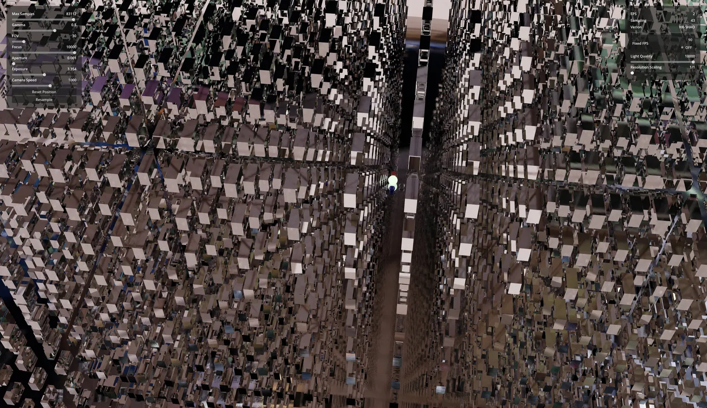

<Center>
用 Taichi 渲染 100 万面镜子
</Center>

<Bilibili bvid="BV17v4y1o7GA" />

## 前言

这篇教程用并行计算框架 Taichi，从零实现一个基于物理（Physically Based Rendering, PBR）的光线追踪渲染器，再构建一个场景，渲染出有真实感的画面。每一步都配自然语言、图和公式，讲清背后的物理和数学。

### 什么是并行计算

Taichi 是一个并行计算框架。图像渲染、物理仿真和人工智能这些计算密集型任务，都可以拆成最简单的数学运算，交给多核 CPU 或 GPU 同时处理。英伟达的 4090 拥有超过一万个 CUDA 核心，GPU 加速并行计算靠的就是这个数量级。

<Center width={300}>
<Invert>


</Invert>

GPU 拥有大量处理单元，可以同时处理大量任务[^tbos]
</Center>

[^tbos]: The Book of Shaders. https://thebookofshaders.com/

### 为什么用 Taichi

我高三和大一的时候曾构想过一个专门进行数值计算和可视化的工具 Plotter ，它将循环和分支结构视为对矩阵的处理，并且当时使用 JavaScript 实现了这个工具的原型，创作了一些简单的数学可视化效果。

|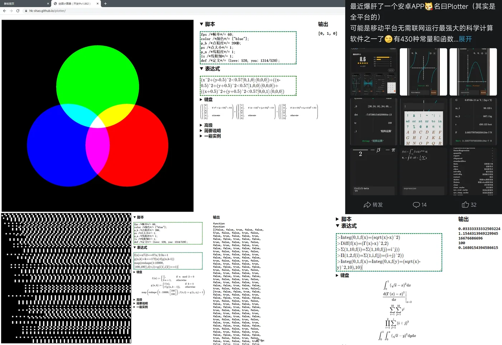|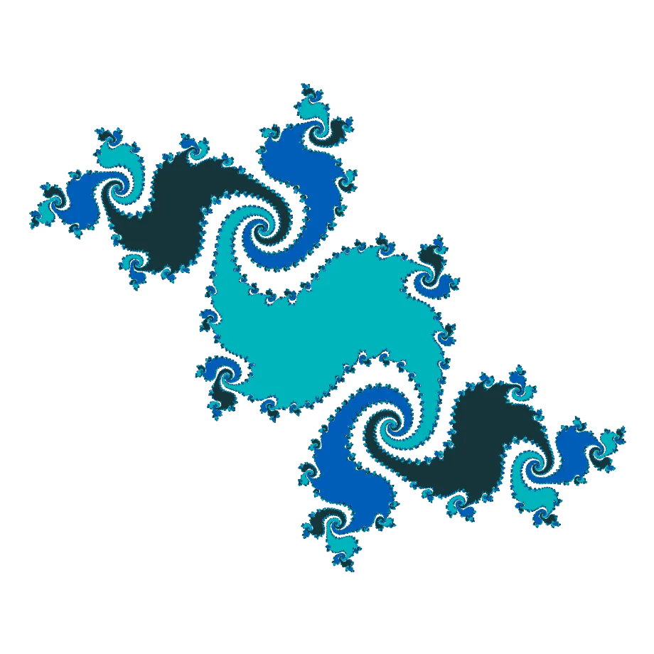|
|:-:|:-:|
|高中和大学的时候做的一些数学绘图小玩具|用我自己写的小工具画的 Julia 集|

但是它的问题是效率非常低下。后来我接触了游戏开发，并入门了着色器，然后震惊于并行计算带来的极高计算效率，但是使用着色器仍然存在许多桎梏，它的兼容性和灵活度并不是很好。

再后来我了解了 Taichi ，作为领域特定语言，能够让你以更好的灵活度和简便的语法轻松玩转并行编程，无需配置复杂的 C++/CUDA 环境、使用冗长的语法并处理各种编译和运行时问题。

下面是一段 Taichi 代码的示意图，相信你能从其中感受到 Taichi 的简洁和灵活性。

<Center width={460}>
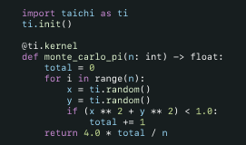
</Center>

<Center>
用蒙特卡洛算法计算圆周率
图片来自 Taichi 官网 [taichi-lang.org](https://www.taichi-lang.org/apps/python-code.svg)
</Center>

### 并行离我们远吗

并不远！并行计算时时刻刻都在发生，包括我们每天在看的视频、玩的游戏都需要经过大量并行计算。而多媒体创作本身，例如我们在使用相机拍下照片的瞬间、用剪辑软件或特效软件处理视频、影视特效对物体的仿真和渲染、AI 模型的训练和使用（相信不少人已经了解了由 Novel AI 和 niji·journey 等 AI 模型创作的不少令人惊人的画作）等等也需要大量并行计算的任务。

||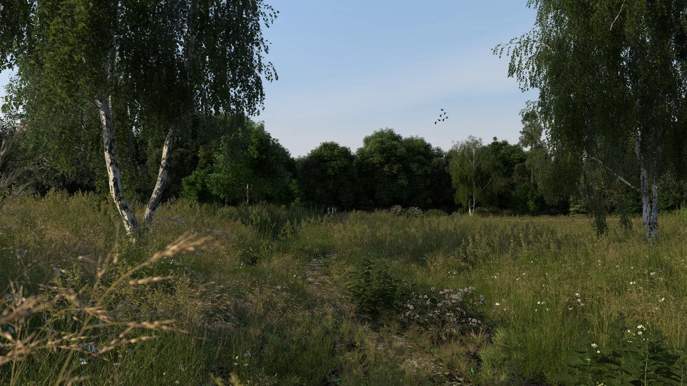|
|:-:|:-:|
|你能一眼分辨出这是 AI 画的吗？|你能一眼分辨出这是游戏渲染的吗？[^pbrbook]|

[^pbrbook]: Physically Based Rendering: From Theory To Implementation. https://www.pbr-book.org/

## 如何使用 Taichi

Taichi 是一门开源的、嵌入在 Python 中的并行编程语言。在开始之前，你需要先安装 Python ，然后使用 Python 的包管理器 `pip` 来安装 Taichi 。

<Callout>

在安装 Python 时，记得勾选 `Add Python 3.x to PATH` 选项，这样你就可以在任意路径下使用 `python` 命令来启动 Python 了

</Callout>

在 [Python 官网](https://www.python.org/) 下载安装 Python 后，使用 `pip` 安装 Taichi 。

```bash {12-15}
pip install taichi -U
```

之后，你可以使用下面的命令来验证是否安装成功，并查看一些 taichi 程序的演示。

```bash {11,16-17,22-25}
ti gallery
```

### Taichi 速查表

<Callout title="Taichi 语言速查表">

这份[速查表](https://github.com/taichi-dev/cheatsheet)来自 Taichi 开发团队，可以帮助你快速了解 Taichi 的基本语法。我把它转成了矢量 SVG 版本，文本转成了路径、按钮接上超链接，仓库在 [HK-SHAO/taichi-cheatsheet-svg](https://github.com/HK-SHAO/taichi-cheatsheet-svg)。

</Callout>

<Callout>

你现在可能并不需要清楚每一个函数背后的意义。在后面的教程中，你会逐渐了解它们的一部分，然后完成一个光线追踪渲染器

</Callout>

### 运行 Taichi 程序

现在，我会教你使用 Taichi 定义一个向量场，然后使用 GPU 绘制一片紫色并显示在窗口中。

你也许已经知道，显示设备显示图像的原理是每个像素以混合不同强度的红绿蓝 (RGB) 三色光的方式[^rgbmod]显示五彩斑斓的颜色，而在计算机中也最常用 RGB 色彩空间来处理颜色。紫色是由红色光与蓝色光混合而成，绿色光的强度为 0 ，所以我们用 `vec3(1, 0, 1)` 表示紫色。

[^rgbmod]: RGB color model. https://en.wikipedia.org/wiki/RGB_color_model

<Center width={300}>
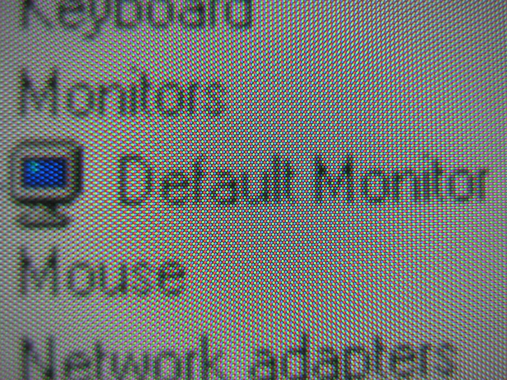

放大看显示器，实际上是由 RGB 像素构成的[^rgbmod]
</Center>

我们将图像视为一个二维的、由像素组成的向量场[^vecf]，每个像素都有一个颜色值，用一个三维的向量表示 RGB 三个分量的强度，且每个分量被标准化到 0 和 1 之间，用 0 表示强度最弱，用 1 表示强度最强。在 Taichi 中，我们先用 `ti.init(arch=ti.gpu)` 初始化 Taichi ，并告诉它我们要将程序在 GPU 中加速运行，然后使用 `ti.Vector.field` 来定义一个向量场。

[^vecf]: Vector field. https://en.wikipedia.org/wiki/Vector_field

这个场的大小便是图像的分辨率，在这里我们设置为常见的 `1920x1080` ，即 1920 个像素宽、1080 个像素高的图像。然后，我们在用 `ti.kernel` 装饰 Taichi 运行时的入口（这里是 `render` 函数），使用 Taichi 的并行 `for` 为每个像素赋予紫色 `vec3(1, 0, 1)` 。最后我们用 `ti.ui.Window` 创建一个窗口[^tiggui]，并用 `canvas.set_image` 将这个场绘制到窗口的画布中。

创建一个 `00.py` 文本文件，输入下面的代码。

```python {3-4}
from taichi.math import *   # 导入 Taichi 数学库
import taichi as ti # 导入 Taichi 库

ti.init(arch=ti.gpu)    # 初始化 Taichi ，GPU 加速

image_resolution = (1920, 1080) # 图像分辨率
image_pixels = ti.Vector.field(3, float, image_resolution) # 图像的像素场

@ti.kernel
def render():   # 渲染函数
    for i, j in image_pixels:   # 并行遍历像素场
        image_pixels[i, j] = vec3(1, 0, 1)  # 设置像素颜色为紫色

window = ti.ui.Window("Taichi Renderer", image_resolution)  # 创建窗口
canvas = window.get_canvas()    # 获取画布

while window.running:
    render()    # 调用渲染函数
    canvas.set_image(image_pixels)  # 为画布设置图像
    window.show()   # 显示窗口
```

在当前路径下，使用终端命令 `ti 00.py` 运行这个 Taichi 程序，你便可以看到一个紫色的窗口。

<Center>
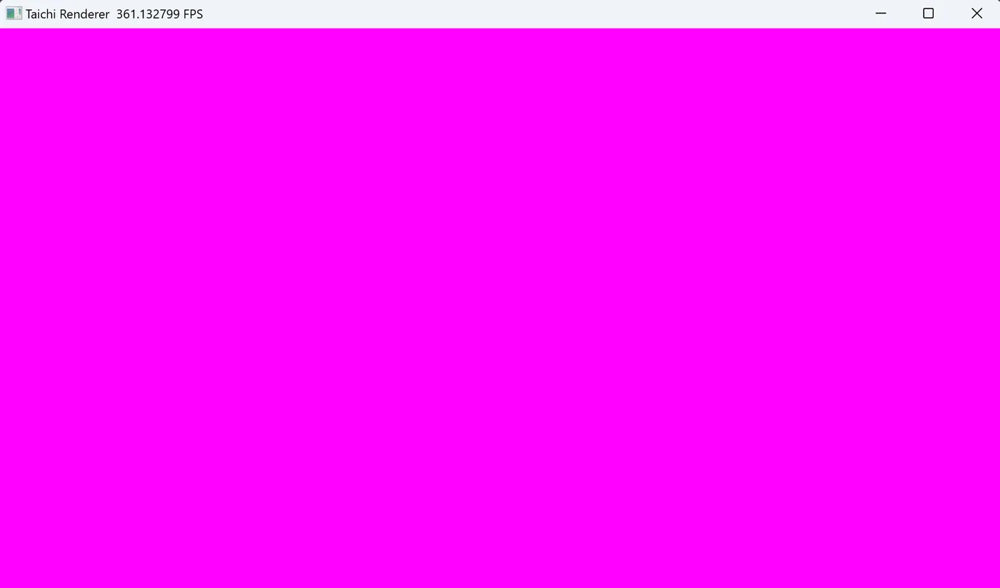

你的第一个 Taichi 图形程序：紫色的窗口
</Center>

<Callout>

- 到这一步的完整代码在 GitHub
- https://github.com/HK-SHAO/RayTracingPBR/blob/taichi/taichi/RT01/00.py

</Callout>

## 正式开始

别忘了我们的目标是创建一个光线追踪渲染器，但是凡事都得一步一步地来不是吗？现在你已经会运行 Taichi 程序，并成功在画布里绘制出了一片纯紫色，这已经是一个很好的开始了。

先建立坐标系并把坐标值归一化，这是自由控制画面中物体位置的基础。

什么是归一化？通常是指将数值压缩到 0 到 1 之间，或者 -1 到 1 之间。在这里，我们的图像分辨率是 `image_resolution = (1920, 1080)` ，但这个数值是可以被我们自由变更的，因此我们将像素 `(i, j)` 的坐标值归一化为 `u = i / image_resolution[0]` 和 `v = j / image_resolution[1]`（`i` 沿宽度、`j` 沿高度），这样我们就可以使用归一化的 uv 坐标来描述像素位置了。

之后，我们将红色强度设置为 u ，绿色强度设置为 v ，蓝色强度设置为 0 ，这样我们就可以看到一个渐变的彩色图像，并且沿着 u 轴从左到右红色强度上升，沿着 v 轴从下到上绿色强度上升。

<Center>
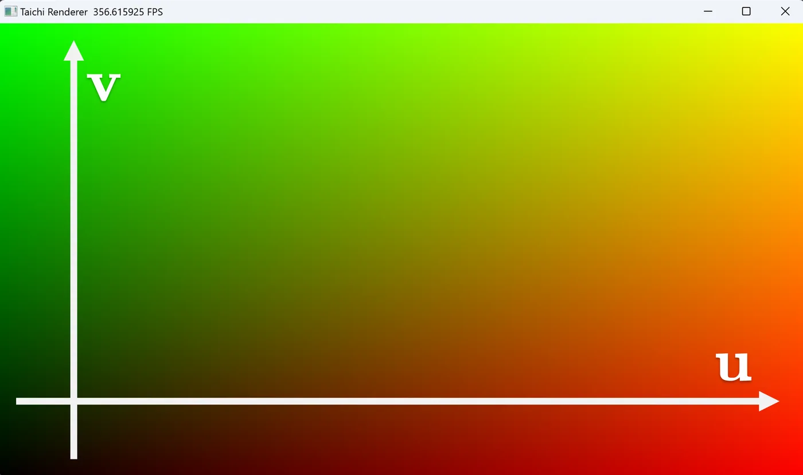

彩色的画布，沿着 u 轴从左到右红色强度上升，沿着 v 轴从下到上绿色强度上升
</Center>

创建一个 `01.py` 文本文件，在 `00.py` 基础上加入下面的代码。

```python {2-3}
from taichi.math import *   # 导入 Taichi 数学库
import taichi as ti # 导入 Taichi 库

ti.init(arch=ti.gpu)    # 初始化 Taichi ，GPU 加速

image_resolution = (1920, 1080) # 图像分辨率
image_pixels = ti.Vector.field(3, float, image_resolution) # 图像的像素场

@ti.kernel
def render():   # 渲染函数
    for i, j in image_pixels:   # 并行遍历像素场
        u = i / image_resolution[0] # 计算归一化的 u 坐标
        v = j / image_resolution[1] # 计算归一化的 v 坐标

        image_pixels[i, j] = vec3(u, v, 0)  # 设置像素颜色

window = ti.ui.Window("Taichi Renderer", image_resolution)  # 创建窗口
canvas = window.get_canvas()    # 获取画布

while window.running:
    render()    # 调用渲染函数
    canvas.set_image(image_pixels)  # 为画布设置图像
    window.show()   # 显示窗口
```

在当前路径下，使用终端命令 `ti 01.py` 运行这个 Taichi 程序，你便可以看到一个彩色的窗口。

<Callout>

- 到这一步的完整代码在 GitHub
- https://github.com/HK-SHAO/RayTracingPBR/blob/taichi/taichi/RT01/01.py

</Callout>

## 使画面动起来

静态画面只是第一步，接下来让画面动起来。

我们需要做的是获取当前程序运行经过的时间，然后将这个时间传入 `render` 函数，让它影响蓝色分量的强度。我们希望画面整体蓝色强度会随着时间周期性的变化。

别忘了归一化，程序经过的时间是以秒为单位不断增加的，但是我们的蓝色分量必须在 0 和 1 之间，在这之外的值会被截断。因此，我们使用 $\sin(t)$ 函数将时间归一化到 -1 到 1 之间，然后将其缩放并平移到 0 到 1 之间，这只需要 $0.5 * \sin(t) + 0.5$ 。

创建一个 `02.py` 文本文件，在 `01.py` 基础上加入下面的代码。

```python {4-6}
from taichi.math import *   # 导入 Taichi 数学库
import taichi as ti # 导入 Taichi 库
import time # 导入时间库

ti.init(arch=ti.gpu)    # 初始化 Taichi ，GPU 加速

image_resolution = (1920, 1080) # 图像分辨率
image_pixels = ti.Vector.field(3, float, image_resolution) # 图像的像素场

@ti.kernel
def render(time: float):   # 渲染函数
    for i, j in image_pixels:   # 并行遍历像素场
        u = i / image_resolution[0] # 计算归一化的 u 坐标
        v = j / image_resolution[1] # 计算归一化的 v 坐标

        blue = 0.5 * sin(time) + 0.5 # 计算蓝色分量
        image_pixels[i, j] = vec3(u, v, blue)  # 设置像素颜色

window = ti.ui.Window("Taichi Renderer", image_resolution)  # 创建窗口
canvas = window.get_canvas()    # 获取画布

start_time = time.time()    # 获取程序开始时时间
while window.running:
    delta_time = time.time() - start_time   # 计算时间差
    render(delta_time)  # 调用渲染函数
    canvas.set_image(image_pixels)  # 为画布设置图像
    window.show()   # 显示窗口
```

在当前路径下，使用终端命令 `ti 02.py` 运行这个 Taichi 程序，可以看到一个不断变化色彩的窗口。

<Center>
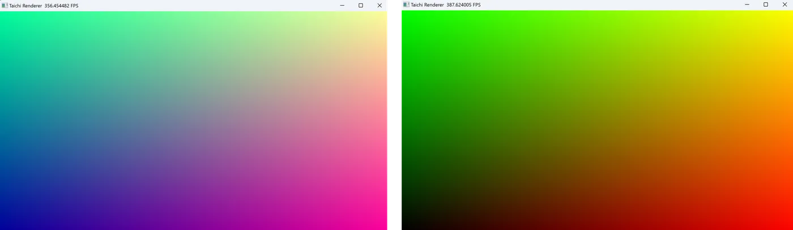

这幅画面的色调会随着时间周期性变化
</Center>

<Callout>

- 到这一步的完整代码在 GitHub
- https://github.com/HK-SHAO/RayTracingPBR/blob/taichi/taichi/RT01/02.py

</Callout>

## 光子与光线

光线追踪渲染利用了光路可逆的原理，我们将光的传播逆向表达，从每个像素发出光线，光击中材质表面后改变了自身的强度、颜色和方向，然后继续传播，直到光线被完全吸收或者到达了光源。最后我们将累积的颜色显示在这个像素上，便渲染出了场景。

接下来，我们来到了光线追踪最基础的一步——定义光线。光线是光子沿射线传播的路径，在基于光线追踪的渲染器中，我们假定光线仅沿着一条直线传播，因此光线可以用一个起点 $\vec{\mathbf{ro}}$ 和一个方向 $\vec{\mathbf{rd}}$ 来表示，其中 $\vec{\mathbf{rd}}$ 应是一个单位向量。这样，光子在三维空间中所在的位置可以用 $\vec{\mathbf{p}}(t)=\vec{\mathbf{ro}} + t \cdot \vec{\mathbf{rd}}$ 表示，其中 $t$ 是光从起点开始传播的距离（因为 $\vec{\mathbf{rd}}$ 已单位化）。

<Center width={400}>
<Invert>


</Invert>

光线的起点和方向
</Center>

另外，用一个四维向量 `vec4` 表示光线的颜色和强度，这方便我们后面对光的处理。在这里，我们使用面向对象 (OOP) 的建模方法，利用 Taichi 的 `ti.dataclass` 装饰器写一个光线类，`at` 函数传入 `t` 计算光所在位置。

```python {7-9}
@ti.dataclass
class Ray:  # 光线类
    origin: vec3    # 光线起点
    direction: vec3 # 光线方向
    color: vec4     # 光的颜色

    @ti.func
    def at(r, t: float) -> vec3: # 计算光子所在位置
        return r.origin + t * r.direction
```

## 建立坐标系

在虚拟的三维空间里定义摄像机位置之前，还差一个 z 轴正方向：uv 坐标已经建立了二维坐标系。这里采用图形学里常见的右手系：摄像机在原点看向 $-z$（OpenGL 那一套）。

因此，画布落在 $z$ 的负半轴上。我们将视点（好比眼睛的位置）放在原点 $(0,0,0)$ ，画布（相当于你的屏幕）的中心位置设置为 $(0,0,-1)$，然后从视点向画布中每个像素发射一条光线。

<Center>
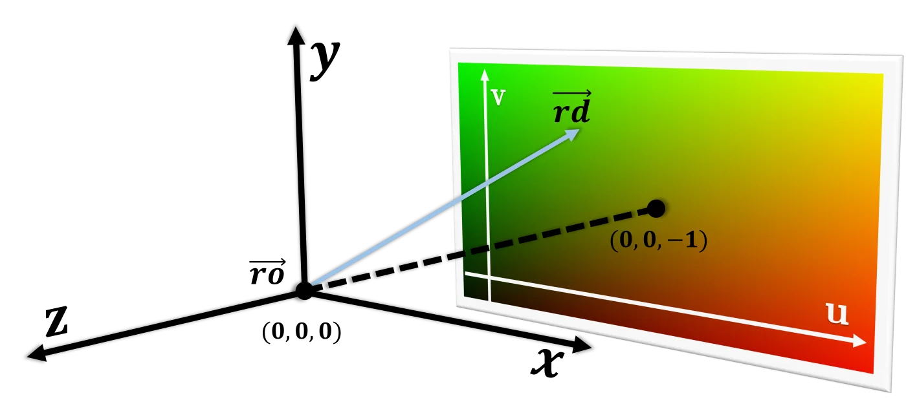

建立右手系，将画布放到 z 负半轴方向
</Center>

在 `render` 函数中，初始化视点和画布的位置，然后创建一条光线。在这里，我们使用了 `normalize` 函数将向量化为仅表示方向的单位向量。

$$
\mathrm{normalize}(\vec{\mathbf{p}})=\frac{\vec{\mathbf{p}}}{\|\vec{\mathbf{p}}\|}
$$

```python {4,8}
lower_left_corner = vec3(-2, -1, -1)    # 视野左下角
horizontal = vec3(4, 0, 0)  # 视野水平方向
vertical = vec3(0, 2, 0)    # 视野垂直方向
origin = vec3(0, 0, 0)      # 视点

ro = origin # 光线起点
rd = normalize(lower_left_corner + u*horizontal + v*vertical - ro)  # 光线方向
ray = Ray(ro, rd)   # 创建光线
```

## 画一片蓝天

有了光线之后，我们尝试使用光线方向的 y 分量来混合白色和蓝色，从而得到一片随时间变化的蓝天。`mix` 函数是对向量的插值（混合），用数学公式表达是
$$
{\rm mix}(\vec{\mathbf{a}}, \vec{\mathbf{b}}, t)=(1-t)\cdot\vec{\mathbf{a}}+t\cdot\vec{\mathbf{b}}
$$

用 `ti.func` 装饰这个函数是一个 Taichi 函数，这样我们才可以在 Taichi 的 `ti.kernel` 中使用它。

```python {4,7-13}
@ti.func
def sky_color(ray, time) -> vec3:
    t = 0.5 * ray.direction.y + 0.5 # 将 y 分量归一化
    blue = 0.5 * sin(time) + 0.5    # 计算蓝色分量
    return mix(vec3(1.0, 1.0, blue), vec3(0.5, 0.7, 1.0), t)    # 混合两种颜色
```

在 `render` 函数中，我们将光线传入 `sky_color` 函数，得到背景颜色，再将背景颜色赋值给像素。

```python {6}
ray.color.rgb = sky_color(ray, time)    # 获取天空颜色
image_pixels[i, j] = ray.color.rgb  # 设置像素颜色
```
<Center>
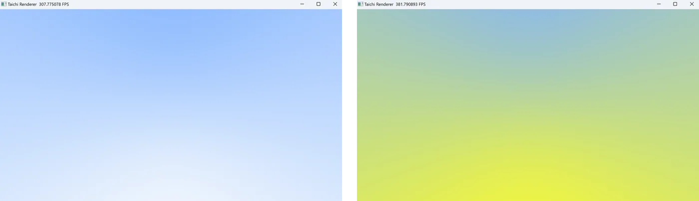

一片渐变的蓝天，随时间改变颜色
</Center>

<Callout>

- 到这一步的完整代码在 GitHub
- https://github.com/HK-SHAO/RayTracingPBR/blob/taichi/taichi/RT01/03.py

</Callout>

## 往地图放入物体

### 符号距离场函数

往虚拟世界里放入几何物体。最简单的是半径为 $r$ 的球，一个函数就能表示它，这个函数称为符号距离场（Signed Distance Field，SDF）：返回某点到物体表面的距离，负数在物体内部，正数在外部，零在表面上。

用 $\left\|\vec{\mathbf{p}}\right\|$ 表示向量 $\vec{\mathbf{p}}$ 的 $L_2$ 范数，即

$$
\left\|\vec{\mathbf{p}}\right\|=\sqrt{\vec{\mathbf{p}}\cdot\vec{\mathbf{p}}}
$$

球的 SDF 函数是相对球心的距离减去半径（$\vec{\mathbf{p}}$ 已平移到球心为原点），即

$$
{\rm sphere}(\vec{\mathbf{p}}, r) = \left\|\vec{\mathbf{p}}\right\| - r
$$

```python {6-14,21}
@ti.func
def sd_sphere(p: vec3, r: float) -> float:  # SDF 球体
    return length(p) - r
```

使用 SDF 表示物体的好处是，我们可以很方便地计算出物体的表面法线，这在后面的光照计算中会用到。此外，SDF 函数不仅能够表达简单的几何物体，也可以表达复杂的物体，还可以使用简单的运算对多个物体进行变换、组合和重复等操作[^boxsdf]，这使得我们可以很方便地创建出复杂的场景，如下图所示

<Center>
|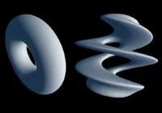|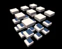|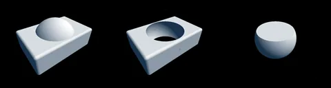|
|:--:|:--:|:--:|
|扭曲物体|重复物体|并集、差集、交集|

图片来自 https://iquilezles.org/articles/distfunctions/
</Center>

### 光线步进求交

有了用 SDF 表示的球体之后，接下来就是让光线前进，然后找到光线与物体最近的交点。我们可以使用光线步进 (Ray Marching) 的方法来找到交点，即沿着光线方向，每次前进一小步，然后计算出这一步的有向距离 (SD) 值，一直前进直到 SD 值与 0 相差非常小 `abs(SD) < PRECISION` ，就认为光线到达了物体的表面。

可是每次前进的步长是多少呢？如果步长太大，光线可能会跳过物体表面，如果步长太小，光线前进的速度就会极慢，这样就会带来非常多冗余的计算，使得画面帧数下降。

一个聪明的做法是让光线每次前进的距离刚好等于 SD 的绝对值，因为它是当前点到物体表面的最短距离。最好的情况下，光线只需要前进一两次就可以刚好到达表面。

当光线偏离物体很远时，光线也很快就会传播到无穷远处，当光线步进的距离足够远而仍然没有到达物体表面，就认为这条光线没有击中任何物体，那我们就可以认为它击中了天空。

下面是三维空间的一个二维切面，可视化这个算法中光线步进和与物体求交的过程。

<Center>
|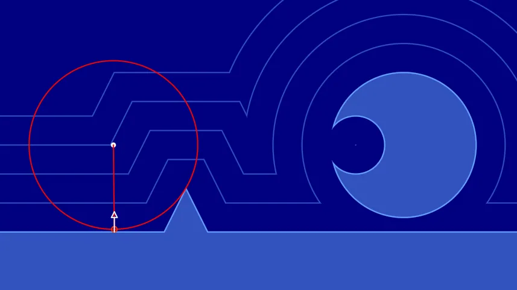|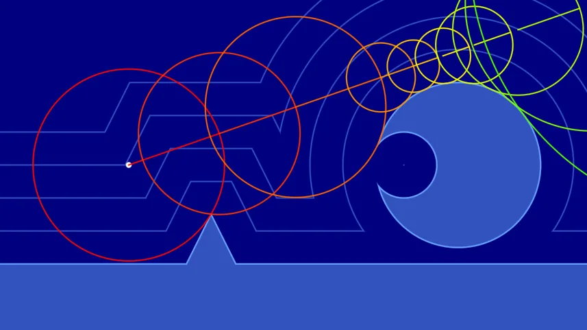|
|:-:|:-:|
|较好的情况下很快到达物体表面|没有交点的情况很快就发散|

图片截取自 https://www.shadertoy.com/view/lslXD8
</Center>

一种比较差的情况是，光线刚好与物体擦肩而过，这个时候步进次数会急剧上升，不过好在光线总会离开物体表面附近，我们可以设置一个最大步进次数，当步进次数超过这个值时，也认为这条光线没有击中任何物体。

<Center width={400}>
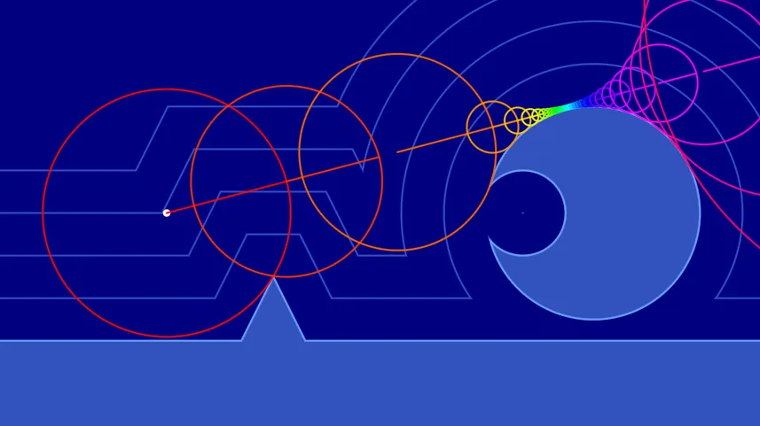

图片截取自 https://www.shadertoy.com/view/lslXD8
</Center>

首先，我需要定义一个光线击中物体的数据类

```python {18-24}
@ti.dataclass
class HitRecord:    # 光子碰撞记录类
    position: vec3  # 光子碰撞的位置
    distance: float # 光子步进的距离
    hit: ti.i32     # 是否击中到物体
```

接着，声明一个阈值 `PRECISION` ，当光子距离物体表面足够近时，便认为击中了物体表面。还需要一个最大的步进次数 `MAX_RAYMARCH` 和最大步进距离 `TMAX` ，如果超出这两个值，便认为这条光线没有击中任何物体。此外，还需要一个 `TMIN` 让每次求交时光线起始位置向光线方向移动一小步，避免在下次求交时光线又立刻与物体相交 (`abs(sd) < PRECISION`) 。

```python {2-5}
TMIN        = 0.001     # 光开始传播的起始偏移，避免光线自相交
TMAX        = 2000.0    # 最大单次光线传播距离
PRECISION   = 0.0001    # 必须要小于 TMIN，否则光线会自相交产生阴影痤疮

MAX_RAYMARCH = 512      # 最大光线步进次数
```

与物体求交的函数如下

```python {4-6}
@ti.func
def raycast(ray) -> HitRecord:  # 光线步进求交
    record = HitRecord(ray.origin, TMIN, False) # 初始化光子碰撞记录
    for _ in range(MAX_RAYMARCH):   # 光线步进
        record.position = ray.at(record.distance)   # 计算光子所在位置
        # 计算光子与球体的有向距离，将球体位移到了 (0, 0, -1)，半径为 0.5
        sd = sd_sphere(record.position - vec3(0, 0, -1), 0.5)
        dis = abs(sd)   # 绝对值为无符号距离
        if dis < PRECISION: # 如果光子与球体的距离小于精度即为击中
            record.hit = True   # 设置击中状态
            break
        record.distance += dis  # 光子继续步进
        if record.distance > TMAX:  # 如果光子步进距离大于最大步进距离
            break
    return record   # 返回光子碰撞记录
```

最后在 `render` 函数里执行 `raycast` 函数，如果击中了物体，就将像素点的颜色设置为红色，否则设置为天空的颜色。

```python {3}
record = raycast(ray)   # 光线步进求交
if record.hit:
    ray.color.rgb = vec3(1.0, 0.0, 0.0) # 设置为红色
else:
    ray.color.rgb = sky_color(ray, time)    # 获取天空颜色
```

好的！运行你的代码，你会看到我们成功地在屏幕上渲染出了一个形状。但似乎有点奇怪？为什么我们看到的球体不是圆形的，而是椭圆形的？

<Center>
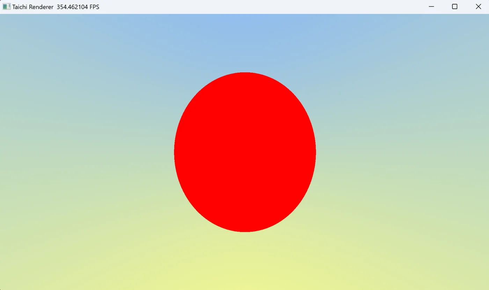

我们看到场景中的球并不是一个标准的圆
</Center>

这是因为我们设置的窗口比例是 `1920:1080` 而我们在虚拟世界里定义的画布长宽并不是这个比例，而是 `2:1` （如下面代码所示），你注意到了吗？要更好的解决这个问题，下一节我们会创建一个摄像机类。

```python {4}
lower_left_corner = vec3(-2, -1, -1)    # 视野左下角
horizontal = vec3(4, 0, 0)  # 视野水平方向
vertical = vec3(0, 2, 0)    # 视野垂直方向
origin = vec3(0, 0, 0)      # 视点
```

<Callout>

- 到这一步的完整代码在 GitHub
- https://github.com/HK-SHAO/RayTracingPBR/blob/taichi/taichi/RT01/04.py

</Callout>

## 创建摄像机类

我们的目标是传入 `uv` 坐标，从摄像机类获取光线的起点 `ro` 和方向 `rd` 。

现实中，摄像机除了有位置 (`lookfrom`) 、朝向 (`lookat`, `vup`) 之外，还有视野 (`vfov`)、传感器（画布）长宽比 (`aspect`)、光圈直径 (`aperture`)、合焦距离 (`focus`) 等。

### 视野 FOV

当摄像机传感器的长宽比与显示长宽比一致时，画面才不会出现不自然的拉伸。 视场 (Field of View, FOV) 指的是摄像机能够观测的范围。`vfov` 表示的是摄像机在纵向能够看到的角度，通常人眼的极限 `vfov` 为 135 度，30 度是一个较为舒适的感知范围。如果你了解摄影，50 mm 全画幅镜头的 `vfov` 大约为 30 度 [^50mmvfov] 。

由于我们的窗口可以调整长宽比，因此横向视野 `hfov` 可以取决于窗口长宽比和 `vfov` ，我们只需要设置 `vfov` 即可。

<Center width={500}>
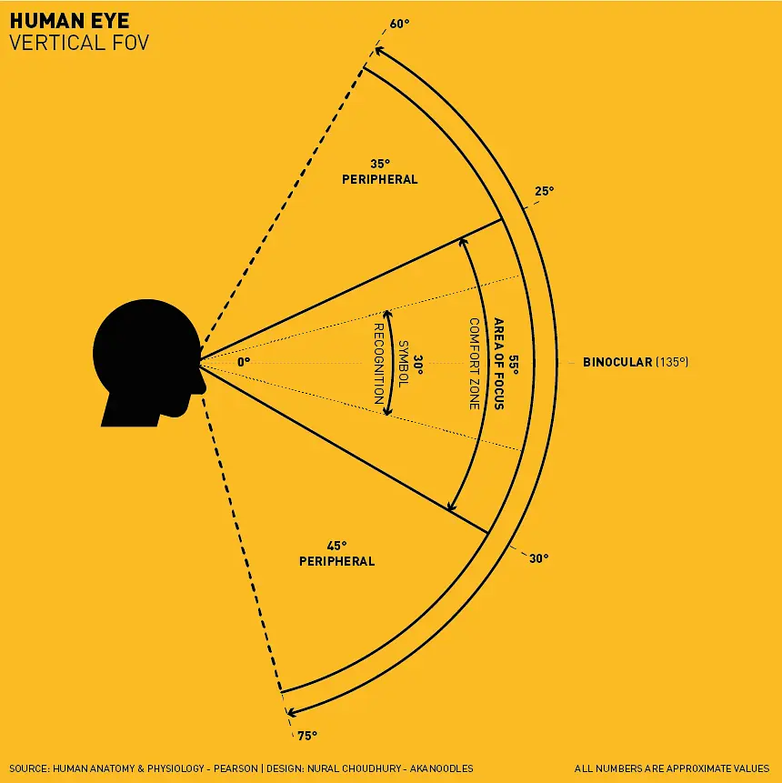

人眼纵向的视野，出处见图片左下角
</Center>

[^50mmvfov]: Field-of-view of lenses by focal length. https://www.nikonians.org/reviews/fov-tables

### 光圈与焦平面

为简化模型，我们将画布平面视为焦平面，因此摄像机到画布中心的距离为合焦距离 `focus` 。摄像机坐标系的原点在 `lookfrom`，以 `normalize(lookfrom - lookat)` 为 z 轴正方向（从目标指向相机），再与 `vup` 叉乘得到 x、y，构成右手系。

对光圈的表示简化为光线从光圈内任意一点 `ro` 出发，向焦平面上某一点前进，因此我们只需要利用已有的量，建立从 uv 坐标系到世界空间坐标系下焦平面上的点 `rp` 的映射，就可以表示出光线的方向 `normalize(rp - ro)` 。

光线应该从光圈的哪个位置出发？在现实中，进入光圈的光线在光圈内的分布应该是均匀的，按照光路可逆原理，我们也应该在光圈内均匀的选取位置发射光线，但在我们的程序中，我们无法一次采样光圈内的所有点，因此我们只能使用 [蒙特卡洛方法 (Monte Carlo method)](https://en.wikipedia.org/wiki/Monte_Carlo_method) 在光圈内随机采样一个点。

<Center width={200}>
<Invert>

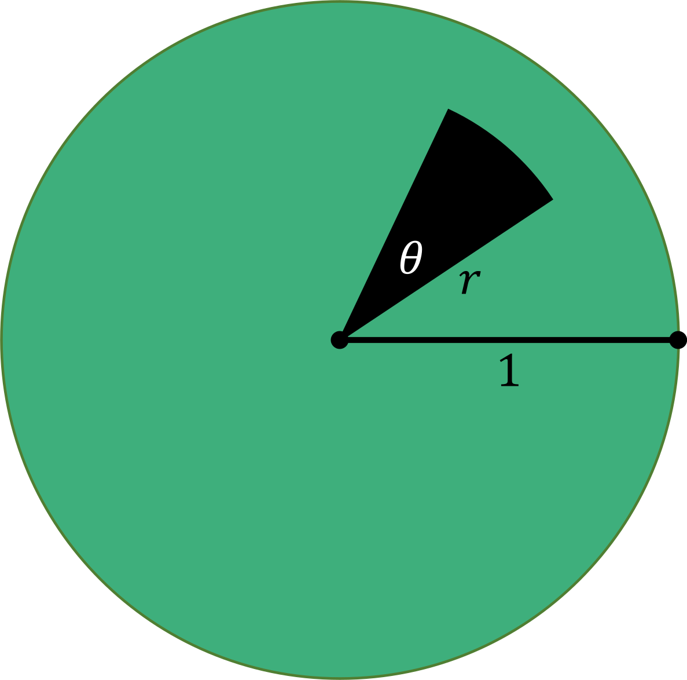

</Invert>

在一个单位圆内随机撒豆子，豆子有一定概率落在扇形内
</Center>

如何在单位圆内均匀的随机采样一个点呢？想象我们往单位圆内随机撒豆子，一个豆子落到半径为 $r$ 、角度不超过 $\theta$ 的扇形的概率是扇形的面积 $\theta r^2/2$ 比上单位圆面积 $\pi$ ，这就是联合分布函数 $F_1(r,\theta)$

$$
F_1(r,\theta) = \frac{\theta r^2}{2\pi}
$$

我们希望用来采样的随机变量本身是均匀的。把分布函数对 $r$、$\theta$ 求偏导，得到概率密度函数 $f_1(r,\theta)$ ，但是

$$
f_1(r,\theta) = \frac{\partial^2 F_1(r,\theta)}{\partial r\partial\theta} = \frac{r}{\pi}
$$

是一个关于 $r$ 的函数，并不是一个常数，因此如果让 $r$ 在 $[0,1]$取值的话采样并不均匀，如下图所示

<Center width={200}>
<Invert>


</Invert>

在单位圆的撒下的豆子并不是均匀分布的
</Center>

如果令 $X=r^2$ ，那么关于 $(X,\theta)$ 的概率密度函数 $f_2(X,\theta)$ 就是一个常数了

$$
F_2(X,\theta) = \frac{\theta X}{2\pi}
$$

$$
f_2(X,\theta) = \frac{\partial^2 F_2(X,\theta)}{\partial X\partial\theta} = \frac{1}{2\pi}
$$

因此我们只需要使用随机变量 $X$ 和 $\theta$ ，就可以得到在单位圆内均匀的随机采样一个点，它的坐标 $\vec{\mathbf{p}}$ 如下

$$
X \in [0, 1], \theta \in [0, 2\pi], r=\sqrt X
$$

$$
\vec{\mathbf{p}} = \left(r \cos \theta, r \sin \theta\right)
$$

<Center width={200}>


现在，豆子均匀的分布在单位圆内
</Center>

在 taichi 中，可以用 `ti.random()` 非常轻松的获取处于 $[0,1)$ 范围内均匀的随机数[^tirand]

[^tirand]: Random number generator. https://docs.taichi-lang.org/docs/operator#random-number-generator

```python {6}
@ti.func
def random_in_unit_disk():  # 单位圆内随机取一点
    x = ti.random()
    a = ti.random() * 2 * pi
    return sqrt(x) * vec2(sin(a), cos(a))
```

### 实现摄像机

<Center>
<Invert>

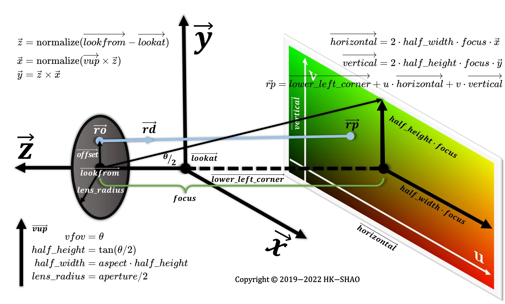

</Invert>

我为这个摄像机模型总结了一幅图，根据这幅图可以直观的写出代码
</Center>

我们的摄像机类代码如下

```python {5-9}
@ti.dataclass
class Camera:           # 摄像机类
    lookfrom: vec3      # 视点位置
    lookat: vec3        # 目标位置
    vup: vec3           # 向上的方向
    vfov: float         # 纵向视野
    aspect: float       # 传感器长宽比
    aperture: float     # 光圈大小
    focus: float        # 对焦距离

    @ti.func
    def get_ray(c, uv: vec2, color: vec4) -> Ray:
        # 根据 vfov 和画布长宽比计算出半高和半宽
        theta = radians(c.vfov) # 角度转弧度
        half_height = tan(theta * 0.5)
        half_width = c.aspect * half_height

        # 以目标位置到摄像机位置为 Z 轴正方向
        z = normalize(c.lookfrom - c.lookat)
        # 计算出摄像机传感器的 XY 轴正方向
        x = normalize(cross(c.vup, z))
        y = cross(z, x)

        # 计算出画布左下角
        lower_left_corner = c.lookfrom  - half_width  * c.focus*x \
                                        - half_height * c.focus*y \
                                        -               c.focus*z

        horizontal = 2.0 * half_width  * c.focus * x
        vertical   = 2.0 * half_height * c.focus * y

        # 模拟光进入镜头光圈
        lens_radius = c.aperture * 0.5
        rud = lens_radius * random_in_unit_disk()
        offset = x * rud.x + y * rud.y

        # 计算光线起点和方向
        ro = c.lookfrom + offset
        rp = lower_left_corner  + uv.x*horizontal \
                                + uv.y*vertical
        rd = normalize(rp - ro)

        return Ray(ro, rd, color)
```

之后在 `render` 函数中初始化摄像机并获取光线

```python
camera = Camera()
camera.lookfrom = vec3(0, 0, 4)     # 设置摄像机位置
camera.lookat = vec3(0, 0, 2)       # 设置目标位置
camera.vup = vec3(0, 1, 0)          # 设置向上的方向
camera.aspect = aspect_ratio        # 设置长宽比
camera.vfov = 30                    # 设置视野
camera.aperture = 0.01              # 设置光圈大小
camera.focus = 4                    # 设置对焦距离

ray = camera.get_ray(uv, vec4(1.0)) # 生成光线
```

运行一下，一个完美的圆

<Center>
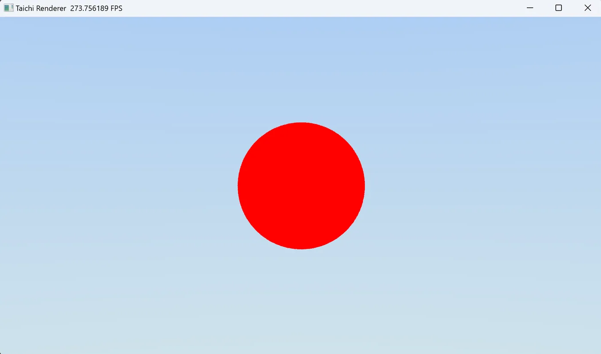

一个完美的圆（实际上是球在平面上的投影）
</Center>

<Callout>

要移动摄像机，请查看 [移动摄像机](#移动摄像机)

</Callout>

<Callout>

- 到这一步的完整代码在 GitHub
- https://github.com/HK-SHAO/RayTracingPBR/blob/taichi/taichi/RT01/05.py

</Callout>

## 计算物体法线

计算物体表面法线对光线追踪渲染非常重要，因为我们要根据物体表面法线决定光碰撞到物体表面时如何与之发生反应，也就是光的颜色、强弱和方向如何改变，之后才能进行下一步追踪。

法线是垂直于物体表面某点的单位向量。用 SDF 表示的物体表面，可以比较容易地算出法线。

### 梯度与法线

我们知道 SDF 函数在某点的值表示的是该点到物体表面的有向距离，而函数某点的梯度表示的是函数增长最快的方向。对真 SDF 来说，梯度指向外侧、远离表面；在表面上，这个方向就是外法线 $\vec{\mathbf n}$，也就是

$$
\vec{\mathbf n}=\mathrm{normalize}\left(\nabla f\left(\vec{\mathbf{p}}\right)\right)
$$

而梯度的定义是

$$
\nabla f\left(\vec{\mathbf{p}}\right)=\left(\frac{\partial f}{\partial x},\frac{\partial f}{\partial y},\frac{\partial f}{\partial z}\right)
$$

<Callout>

taichi 支持可微编程[^diffp]，拥有一个强大的自动微分系统，可以很方便的自动计算梯度。但为了方便读者理解，这里我仍然先采用传统的办法，即利用数值微分计算梯度

</Callout>

[^diffp]: Differentiable Programming. https://docs.taichi-lang.org/docs/differentiable_programming

$$
\nabla f\left(\vec{\mathbf{p}}\right)=\left(\frac{f\left(\vec{\mathbf{p}}+\vec{\mathbf{e}}_{x}\right)-f\left(\vec{\mathbf{p}}\right)}{\epsilon},\frac{f\left(\vec{\mathbf{p}}+\vec{\mathbf{e}}_{y}\right)-f\left(\vec{\mathbf{p}}\right)}{\epsilon},\frac{f\left(\vec{\mathbf{p}}+\vec{\mathbf{e}}_{z}\right)-f\left(\vec{\mathbf{p}}\right)}{\epsilon}\right)
$$

因为计算法线只需要知道梯度方向，并不需要知道大小，中心差分里的 $2\epsilon$ 也可以省掉。代码里用的就是中心差分：

$$
\vec{\mathbf n}=\mathrm{normalize}\bigl(f(\vec{\mathbf{p}}+\vec{\mathbf{e}}_{x})-f(\vec{\mathbf{p}}-\vec{\mathbf{e}}_{x}),\;
f(\vec{\mathbf{p}}+\vec{\mathbf{e}}_{y})-f(\vec{\mathbf{p}}-\vec{\mathbf{e}}_{y}),\;
f(\vec{\mathbf{p}}+\vec{\mathbf{e}}_{z})-f(\vec{\mathbf{p}}-\vec{\mathbf{e}}_{z})\bigr)
$$

它的 Taichi 代码看起来很简洁

```python
@ti.func
def calc_normal(p: vec3):
    eps = 0.0001
    h = vec2(eps, 0)
    return normalize( vec3( f(p+h.xyy) - f(p-h.xyy), \
                            f(p+h.yxy) - f(p-h.yxy), \
                            f(p+h.yyx) - f(p-h.yyx)) )
```

### 优化求法线的效率

在 [iq 的这篇文章](https://iquilezles.org/articles/normalsSDF/) 中，有一种四面体技术[^iq4]可以很好的减少计算量，所以我在这里改用为这种方法。此外，如果我们想在地图中放入若干不同的物体，不同的物体有不同位置和材质，因此在求法线时我们要传入具体是哪个物体

[^iq4]: Normals for an SDF - 2015. https://iquilezles.org/articles/normalsSDF/

```python
@ti.func
def calc_normal(obj, p: vec3) -> vec3:  # 计算物体法线
    e = vec2(1, -1) * 0.5773 * 0.0005
    return normalize(   e.xyy*signed_distance(obj, p + e.xyy) + \
                        e.yyx*signed_distance(obj, p + e.yyx) + \
                        e.yxy*signed_distance(obj, p + e.yxy) + \
                        e.xxx*signed_distance(obj, p + e.xxx)   )
```

### 可视化法线

由于法线是一个单位向量，每个分量都可以在 $[-1,1]$ 之间，如果我们要可视化法线，需要先将其每个分量映射到 $[0,1]$ 之间，然后将其作为颜色值赋予像素。与前面映射 $\sin(x)$ 函数到 $[0,1]$ 的方法一样，这也是将物体表面法线储存为一张图片（法线贴图）的方法。

```python
normal = calc_normal(record.obj, record.position)   # 计算法线
ray.color.rgb = 0.5 + 0.5 * normal  # 设置为法线颜色
```

一个五彩斑斓的球体

<Center>
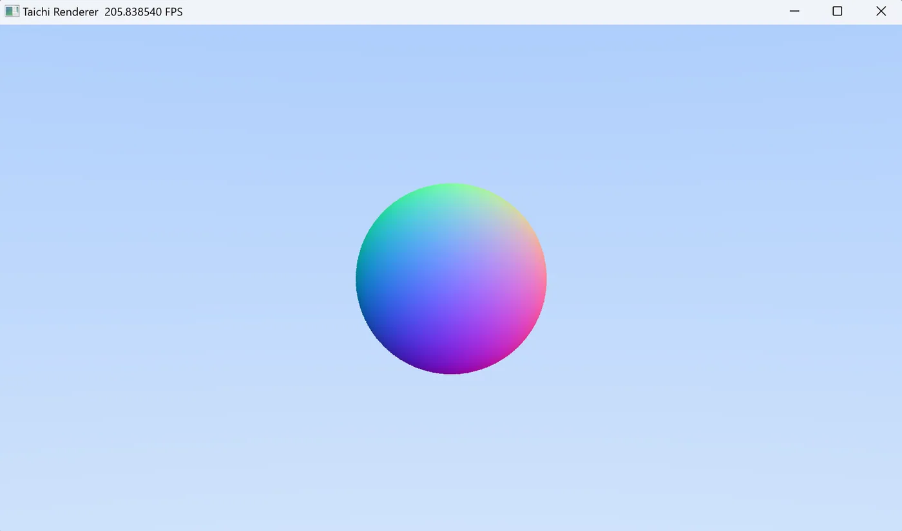

将法线映射为球表面的颜色
</Center>

## 基础变换和材质

<Callout>

- [物体的形状和缩放](#物体形状和缩放)
- [物体的旋转](#物体的旋转)

</Callout>

在这一章，我们会为物体赋予最简单的材质——反照率 (albedo) 以及一个最基础的变换——位置 (position) 。为方便读者理解，这里先放上 taichi 结构体类的定义代码

```python
@ti.dataclass
class Material:
    albedo: vec3    # 材质颜色

@ti.dataclass
class Transform:
    position: vec3  # 物体位置

@ti.dataclass
class Object:
    sd: float       # 到物体表面的符号距离
    mtl: Material   # 物体材质
    trs: Transform  # 物体变换
```

### 基础反照率

反照率可以粗略看成表面反射出去的能量与入射能量之比，漫反射里常常直接拿它当表面颜色。因此在光线追踪时，出射光的颜色就是

```python
ray.color.rgb *= record.obj.mtl.albedo
```

### 位移物体

位移物体相当于对物体的 SDF 函数进行平移，在求 SDF 距离值阶段对传入的点减去物体位置

```python
@ti.func
def signed_distance(obj, pos: vec3) -> float:
    p = pos - obj.trs.position  # 计算物体位移后的点
    r = 0.5 # 球体半径
    sd = sd_sphere(p, r) # 计算 SDF 值
    return sd
```

<Callout>

- 到这一步的完整代码在 GitHub
- https://github.com/HK-SHAO/RayTracingPBR/blob/taichi/taichi/RT01/06.py

</Callout>

## 移动摄像机

在之前的章节，我们已经为我们的 taichi 程序创建了一个摄像机类。为了方便我们在不同位置和角度观察物体，这一章我们会利用 taichi GGUI 内置的 `ti.ui.Camera()` 来创建一个 freelook 摄像机[^tiggui]，并将它与我们渲染程序中的摄像机类进行绑定。

[^tiggui]: A New UI system: GGUI. https://docs.taichi-lang.org/docs/ggui

创建摄像机很简单，在初始化画布后实例化一个摄像机，然后为其设置初始位置

```python
window = ti.ui.Window("Taichi Renderer", image_resolution)  # 创建窗口
canvas = window.get_canvas()    # 获取画布
camera = ti.ui.Camera()         # 创建摄像机
camera.position(0, 0, 4)        # 设置摄像机初始位置
```

然后在运行的循环中，每帧根据用户输入更新摄像机

```python
while window.running:
    # 从用户输入更新摄像机，设置移动速度为 0.03 ，按住鼠标左键旋转视角
    camera.track_user_inputs(window, movement_speed=0.03, hold_key=ti.ui.LMB)
```

然后分别为 `render` 函数声明形参并传入实参

```python
@ti.kernel
def render(
    time: float,
    camera_position: vec3,
    camera_lookat: vec3,
    camera_up: vec3):   # 渲染函数
    ...
```

循环内每帧传入摄像机的位置、朝向和上方向

```python
while window.running:
    # 从用户输入更新摄像机，设置移动速度为 0.03 ，按住鼠标左键旋转视角
    camera.track_user_inputs(window, movement_speed=0.03, hold_key=ti.ui.LMB)
    delta_time = time.time() - start_time   # 计算时间差
    render(
        delta_time,
        camera.curr_position,
        camera.curr_lookat,
        camera.curr_up) # 调用渲染函数
    canvas.set_image(image_pixels)  # 为画布设置图像
    window.show()   # 显示窗口
```

这样我们就可以以 FPS 游戏的方式，按住鼠标左键和 <kbd>W</kbd> <kbd>A</kbd> <kbd>S</kbd> <kbd>D</kbd> <kbd>Q</kbd> <kbd>E</kbd> 来自由移动摄像机啦。

<Callout>

- 到这一步的完整代码在 GitHub
- https://github.com/HK-SHAO/RayTracingPBR/blob/taichi/taichi/RT01/07.py

</Callout>

## 更多形状和物体

这一章，我们为 `Object` 类加入物体的形状属性，以支持物体拥有不同的形状（在本章，我们先添加一个简单的 Box 形状）。在 `Transform` 类加入物体的缩放，以改变物体在各个轴上的大小。然后创建一个 `Object.field(shape=objects_num)` 场，在里面添加不同的物体。最后写一个 `nearest_object` 函数，为计算光线与场景中所有物体最近的一个交点，利用 SDF 函数的特性，寻找距离点 $\vec{\mathbf{p}}$ 最近的物体。

```python
# 定义形状类型
SHAPE_NONE      = 0 # 无形状
SHAPE_SPHERE    = 1 # 球体
SHAPE_BOX       = 2 # 箱体
```

```python
@ti.dataclass
class Transform:
    position: vec3
    scale: vec3

@ti.dataclass
class Object:
    type: ti.u32
    trs: Transform
    mtl: Material
    sd: float
```

### 物体形状和缩放

由于物体有了不同形状和大小，所以物体的 SDF 函数需要根据类型进行选择，还需要根据缩放来控制 SDF 物体的大小。对 `signed_distance` 函数的更改如下

```python
@ti.func
def signed_distance(obj, pos: vec3) -> float:   # 对物体求 SDF 距离
    position = obj.trs.position # 位置空间变换（下一步再实现旋转变换）
    scale = obj.trs.scale   # 用缩放控制物体大小

    p = pos - position
    # 为不同形状选择不同的 SDF 函数
    if obj.type == SHAPE_SPHERE:
        obj.sd = sd_sphere(p, scale.x)
    elif obj.type == SHAPE_BOX:
        obj.sd = sd_box(p, scale)
    else:
        obj.sd = sd_sphere(p, scale.x)

    return obj.sd   # 返回符号距离
```

其中 Box 的 SDF 函数[^boxsdf]可以在 [iq 大佬的文章](https://iquilezles.org/articles/distfunctions/) 中查到如下

[^boxsdf]: Distance functions. https://iquilezles.org/articles/distfunctions/

```python
@ti.func
def sd_box(p: vec3, b: vec3) -> float:  # SDF 盒子
    q = abs(p) - b
    return length(max(q, 0)) + min(max(q.x, max(q.y, q.z)), 0)
```

### 欧几里得空间

为什么应用物体的变换，不使用一个包含缩放、旋转和剪切的 $3\times3$ 变换矩阵呢？iq 大佬在他的文章中指出，不同轴向非均匀的缩放会扭曲欧几里得度量[^boxsdf]，这使得 SDF 函数在求交阶段可能变得不可靠。

> While rotations, uniform scaling and translations are exact operations, non-uniform scaling distorts the euclidean spaces and can only be bound.

如果使用 $P'=T^{-1}(P-P_0)$ 的方式，将点 $P$ 从世界空间变换到物体空间，并左乘变换矩阵的逆，确实对 SDF 函数进行了正确的变换，但是这带来的问题是光线步进求交时，SDF 值并不是世界空间下的 SDF 值，因此求交的结果可能不正确。如下图所示，经过缩放变换的物体，在“窄”的那一侧会裂开，因为光线没能跟物体正确求交。

<Center>
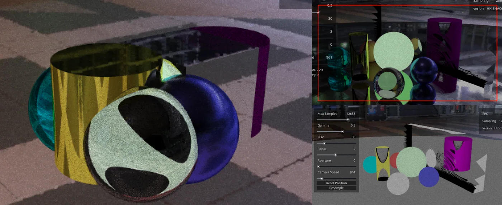

光线直接穿过了物体，没能跟物体表面相交，因此物体看起来裂开了
左图：物体没有进行缩放变换，正常求交
右图：物体进行了缩放变换，光线会在“窄”的一侧穿过物体
</Center>

<Callout title="思考">

是否有完备的解决方案，使得能够可靠地在非均匀缩放后的空间中与 SDF 物体求交？笔者认为是有的，但是这里写不下（其实我也还没找到解决方案哭了）

</Callout>

### 物体场

接着，创建一个 `Object.field` 场，用于存储所有的物体。这里我在地图中多加了一个盒子，它在球体后面，被球挡住了，需要移动摄像机才能看到。

```python
objects_num = 2 # 地图中物体的数量
objects = Object.field(shape=objects_num)

objects[0] = Object(type=SHAPE_SPHERE,
                    trs=Transform(vec3(0, 0, -1), vec3(0.5)),
                    mtl=Material(vec3(1, 0, 0)))

objects[1] = Object(type=SHAPE_BOX,
                    trs=Transform(vec3(0, 0, -2), vec3(0.2, 0.3, 0.5)),
                    mtl=Material(vec3(0, 1, 0)))
```

### 更改求交函数

最后，在光线步进求交阶段，光线每步进一次，就寻找距离这一点最近的物体，如果距离最近的物体表面接近于 0 ，就判定为光线与物体表面相交了，改进的 `raycast` 函数如下

```python
@ti.func
def raycast(ray) -> HitRecord:  # 光线步进求交
    record = HitRecord(ray.origin, TMIN, False) # 初始化光子碰撞记录
    for _ in range(MAX_RAYMARCH):   # 光线步进
        record.position = ray.at(record.distance)   # 计算光子所在位置
        record.obj = nearest_object(record.position)    # 计算光子与球体的有向距离
        dis = abs(record.obj.sd)    # 绝对值为无符号距离
        if dis < PRECISION: # 如果光子与球体的距离小于精度即为击中
            record.hit = True   # 设置击中状态
            break
        record.distance += dis  # 光子继续传播
        if record.distance > TMAX:  # 如果光子传播距离大于最大传播距离
            break
    return record   # 返回光子碰撞记录
```

### 寻找最近物体

那么如何寻找距离某点最近的物体呢？最简单粗暴和有效的方法是遍历所有的物体，计算所有物体的 SDF 值，然后返回 SDF 值最小的那个物体。这里我们使用了一个 `nearest_object` 函数，该函数的实现如下

<Callout title="思考">

读者可以思考一下，有没有更好的算法来寻找距离某点最近的物体，而不用遍历所有的物体呢？

</Callout>

```python
@ti.func
def nearest_object(p: vec3) -> Object:  # 求最近的物体
    o = Object(sd=MAP_SIZE) # 设置一个最大的 SDF 值，即地图边界
    for i in range(objects_num):
        oi = objects[i]
        oi.sd = signed_distance(oi, p)
        if abs(oi.sd) < abs(o.sd): o = oi
    return o
```

### 探索场景

到这一步，我们就可以运行程序，然后自由移动摄像机看看场景中的两个颜色不同的物体。

<Center>
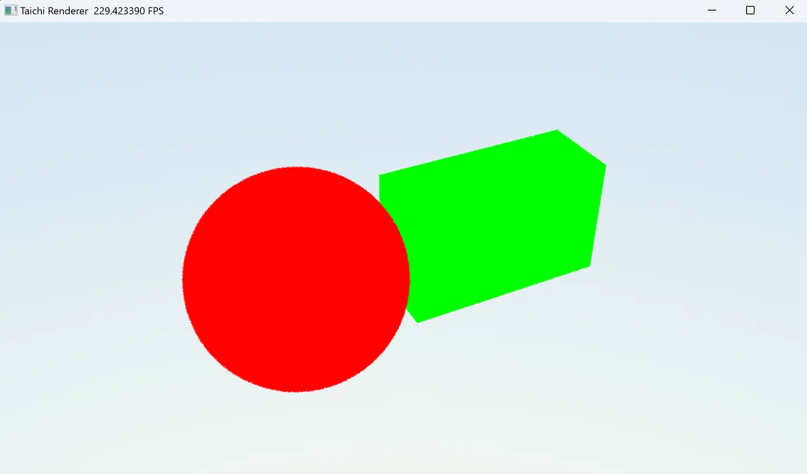

两个不同的物体，一个红色球和一个绿色的盒子
</Center>

只进行一次光线追踪，没有多次反弹的间接光和光强损耗，物体看起来很平，也没有影子。后面的章节会逐步补上。先继续测试法线

<Center>
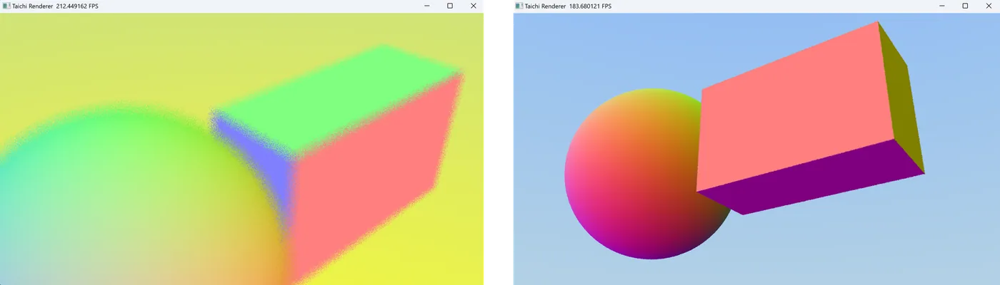

左：由于摄像机光圈和对焦距离的存在，产生了散景模糊
右：从另一个角度查看场景中的球和盒子
</Center>

摄像机可以进入物体内部吗？答案是肯定的。在前面物体求交阶段，我们对符号距离值做了绝对值处理，因此物体内部会被当作外部来处理，这样就可以进入物体内部了。

如果物体是空心的（物体只有薄薄的一层表面），那物体内部的法线是怎样的呢？如何判断某点是在物体内部还是外部？我们控制摄像机进入盒子看看

<Center>
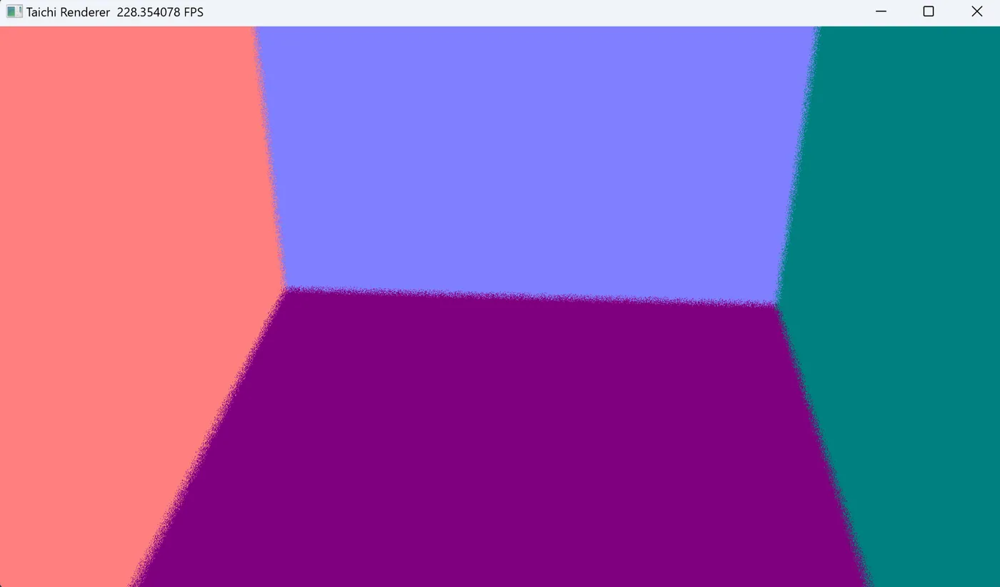

盒子内部，将梯度当作法线，内表面法线仍然是朝向物体外面的
</Center>

从上图可以看到，物体内表面的法线仍然是朝向物体外面的，回顾 [计算物体法线](#计算物体法线) 这一章节，这是因为 SDF 函数的梯度方向永远是朝着 SDF 值增大的方向，而 SDF 物体内部的 SDF 函数值是负的。因此，如果要判断某点是在物体内部还是外部，只需要判断 SDF 值的符号即可。

<Callout>

- 到这一步的完整代码在 GitHub
- https://github.com/HK-SHAO/RayTracingPBR/blob/taichi/taichi/RT01/08.py

</Callout>

## 内外表面法线

在处理透明的物体（例如玻璃、钻石、塑料等材质）时，物体内外有不同的折射率，光线会根据折射率之比改变方向。因此我们必须得知道光线正在进入物体内部，还是正在穿出物体。怎么做呢？如下图所示

<Center width={400}>
<Invert>


</Invert>

光线穿入物体和穿出物体
</Center>

还记得向量的点乘吗？无论内表面还是外表面，几何法线都朝物体外面。因此当入射方向 $\overrightarrow{\mathbf{ray}}$ 与法线点乘小于零时，光线正在从外表面穿入；大于零时，正在从内表面穿出。

$$
\overrightarrow{\mathbf{ray}}\cdot \vec{\mathbf{n}}_1 < 0
$$

$$
\overrightarrow{\mathbf{ray}}\cdot \vec{\mathbf{n}}_2 > 0
$$

## 遮蔽与间接光

在这一章，我们将继续靠近真正的路径追踪。当光线在场景的一个区域内不停的漫反射而难以逃出此区域击向光源（例如，靠近的两物体或狭缝处。在我们当前的场景，天空是我们唯一的光源），光强就会不停的损耗，因此这块区域看起来更暗（我将其称作遮蔽效应）。

此外，当光线被一个物体表面过滤（相当于染色）后，再击到另外一个物体，就会在另外一个物体表面染上间接光颜色。通过路径追踪，我们可以用更接近物理世界规则的方式渲染场景，并拥有全局光照[^wikigi] (Global illumination, GI) 。

[^wikigi]: Global illumination. https://en.wikipedia.org/wiki/Global_illumination

### 路径追踪

正如前面所说，光线追踪的核心算法很简单，就是光线与物体求交，然后与物体表面材质交互，即光线颜色、强度和方向改变，然后进行下一步追踪，直到光线到达光源。

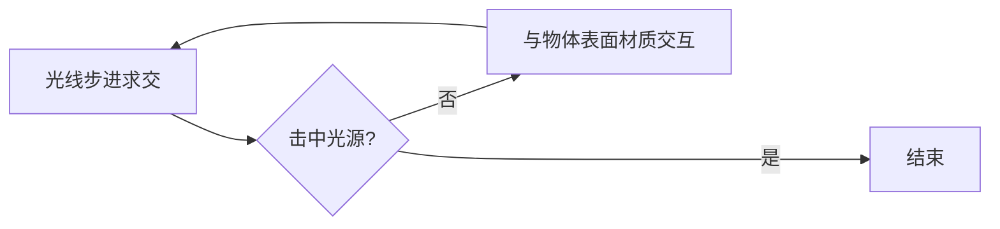
```mermaid
graph LR
    A[光线步进求交] --> B{击中光源?};
    B -->|否| C[与物体表面材质交互];
    C --> A;
    B ---->|是| E[结束];
```

### 俄罗斯轮盘赌

即使限制了最大的追踪次数，但是光线仍然有可能在两个表面不停来回反弹，这会使得单帧内的计算量陡然上升，帧数下降。为了提升帧率，将蒙特卡洛采样的计算量更均匀的分摊到每一帧，我们可以使用俄罗斯轮盘赌[^wikiroulette] (Russian roulette, RR) 算法。

[^wikiroulette]: Russian roulette. https://en.wikipedia.org/wiki/Russian_roulette

俄罗斯轮盘赌算法的核心是，在光线每一次反弹时，以一个概率决定光线是否继续传播。这个概率可以是一个固定的概率，但是一种比较好的做法是，将每次反弹看作独立事件，让停止光线继续传播的概率随着反弹次数增加而上升。

```python
@ti.func
def raytrace(ray, time: float) -> Ray:
    for i in range(MAX_RAYTRACE):
        record = raycast(ray)   # 光线步进求交

        # 俄罗斯轮盘赌概率，防止光线过分的反复反射
        light_quality = 1 / 50
        inv_pdf = exp(float(i) * light_quality)
        roulette_prob = 1.0 - (1.0 / inv_pdf)

        visible = length(ray.color.rgb*ray.color.a)
        # 如果光已经衰减到不可分辨程度，或者光线毙掉就不继续了
        if visible < 0.001 or ti.random() < roulette_prob:
            break

        if not record.hit:
            ray.color.rgb *= sky_color(ray, time)  # 获取天空颜色
            break
        ...

        ray.color *= inv_pdf # 能量守恒

    return ray
```

### 漫反射与切线空间

实现最基本的材质：漫反射。表面粗糙的石头就是漫反射，光线在物体表面随机反射，没有明显的镜面方向。思路是半球采样：在物体表面某点，以法线为 z 轴，在表面外的单位半球上随机取一点作为出射光方向。

<Center>
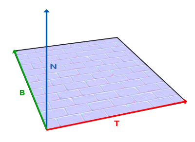

切线空间与法线贴图[^lnm]
</Center>

[^lnm]: Normal Mapping. https://learnopengl.com/Advanced-Lighting/Normal-Mapping

### 半球采样与TBN矩阵

半球采样的第一步是建立物体表面切线空间坐标系，我们需要一个旋转矩阵将切线空间的法线方向映射到世界空间，这个矩阵就是 TBN 矩阵。在切线空间中，法线 $\vec{\mathbf N}$ 指向 Z 轴正方向，另外有与之两两正交的两个向量 $\vec{\mathbf T}$ 和 $\vec{\mathbf B}$。 Jeppe Revall Frisvad 的一篇论文[^obasis]介绍了一种快速求解这两个向量的方法，如下

[^obasis]: Building an Orthonormal Basis from a 3D Unit Vector Without Normalization. https://doi.org/10.1080/2165347X.2012.689606

```python
@ti.func
def TBN(N: vec3) -> mat3:   # 用世界坐标下的法线计算 TBN 矩阵
    T = vec3(0)
    B = vec3(0)

    if N.z < -0.99999:
        T = vec3(0, -1, 0)
        B = vec3(-1, 0, 0)
    else:
        a = 1.0 / (1.0 + N.z)
        b = -N.x*N.y*a

        T = vec3(1.0 - N.x*N.x*a, b, -N.x)
        B = vec3(b, 1.0 - N.y*N.y*a, -N.y)

    return mat3(T, B, N)
```

<Center width={300}>
<Invert>


</Invert>

在上半球内的点
</Center>

把单位圆盘上的均匀采样抬到半球上（Malley 方法），得到的是余弦加权半球采样，不是球面面积均匀采样。这正是朗伯漫反射想要的：法线方向附近更密。Z 轴取 $X \in [0,1]$ 的平方根，$\theta \in [0,2\pi]$

$$
\begin{aligned}
z &= \sqrt{X} \\
\overrightarrow{\mathbf{xy}} &= \sqrt{1-z^2} \cdot (\cos(\theta), \sin(\theta))\\
\vec{\mathbf{p}}&=(\overrightarrow{\mathbf{xy}}, z)
\end{aligned}
$$

在下面的代码中，我们使用了 taichi 的 `@` 运算符来进行矩阵乘法运算

```python
@ti.func
def hemispheric_sampling(n: vec3) -> vec3:  # 以 n 为法线进行半球采样
    ra = ti.random() * 2 * pi
    rb = ti.random()

    rz = sqrt(rb)
    v = vec2(cos(ra), sin(ra))
    rxy = sqrt(1.0 - rb) * v

    return TBN(n) @ vec3(rxy, rz)   # 用 TBN 矩阵将切线空间方向转换到世界空间
```

<Callout tone="warm">

在这篇文章，我们并不采取直接将半球采样的方向作为出射光方向的办法，而是用半球采样随机扰动法线，然后再反射光线。这可以很好的模拟凹凸不平的微表面，后面的余弦重要性采样也建立在同一套半球采样上
- 如果光线反射到了物体内部怎么办？我们暂时处理方案是直接结束掉这条光线

</Callout>

```python
@ti.func
def raytrace(ray, time: float) -> Ray:
    for _ in range(MAX_RAYTRACE):
        record = raycast(ray)   # 光线步进求交

        if not record.hit:
            ray.color.rgb *= sky_color(ray, time)  # 获取天空颜色
            break

        visible = length(ray.color.rgb*ray.color.a)
        if visible < 0.001:  # 如果光已经衰减到不可分辨程度了就不继续了
            break

        # 这里的法线会始终指向物体外面
        normal = calc_normal(record.obj, record.position) # 计算法线
        # ray.color.rgb = 0.5 + 0.5 * normal  # 设置为法线颜色

        N = hemispheric_sampling(normal)    # 半球采样
        ray.direction = reflect(ray.direction, N)  # 反射光线
        ray.origin = record.position    # 设置光线起点
        ray.color.rgb *= record.obj.mtl.albedo   # 设置为材质颜色
        ray.color.a *= 0.5  # 让强度衰减一些
        if dot(normal, ray.direction) < 0: # 如果光线反射到了物体内部，也直接跳出循环
            break

    return ray
```

这个方法能表现完全粗糙的表面，但画面噪点很多，放大还能看到边缘锯齿。下一章介绍简单的降噪和抗锯齿。

<Center>
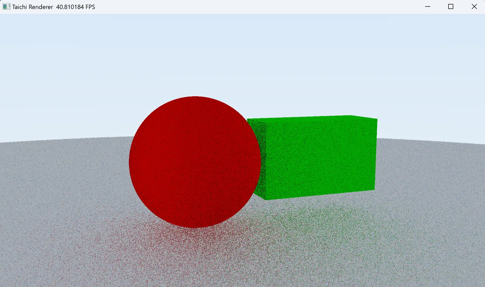

漫反射材质光线追踪效果（有大量噪点）
</Center>

<Callout>

- 到这一步的完整代码在 GitHub
- https://github.com/HK-SHAO/RayTracingPBR/blob/taichi/taichi/RT01/09.py

</Callout>

## 基础降噪与抗锯齿

### 基础降噪

降噪的思路：光线追踪是蒙特卡洛过程，在迭代中积累多帧结果，积累到一定程度噪点就看不见了。用 $\mathbf{C}_i$ 与 $\mathbf{C}_{i-1}$ 表示当前帧和上一帧像素颜色，$\mathbf{S}_i$ 表示这帧采样到的颜色，$n$ 表示当前采样次数，像素颜色按下面的公式更新

$$
\mathbf{C}_i = \mathrm{mix}\left(\mathbf{C}_{i-1}, \mathbf{S}_i, \frac{1}{n}\right)
$$

在实现上，我们需要引入 `denoise_frame` 来控制采样次数

```python
color = ray.color.rgb * ray.color.a # 混合颜色与光强

last_color = image_pixels[i, j] # 获取上一帧的颜色
out_color = mix(last_color, color, 1.0 / denoise_frame) # 混合当前帧和上一帧的颜色

image_pixels[i, j] = out_color  # 设置像素颜色
```

当按下空格键时，重新开始积累降噪帧，否则让 `denoise_frame` 自增

```python
while window.running:
    camera.track_user_inputs(window, movement_speed=0.03, hold_key=ti.ui.LMB)
    delta_time = time.time() - start_time   # 计算时间差
    if window.is_pressed(' '):
        denoise_frame = 0
    denoise_frame += 1
    ...
```

### 超采样抗锯齿

锯齿的产生是因为我们的像素是离散的，但是只要像素密度足够高，我们就难以察觉出锯齿。因此超采样抗锯齿的思路是在一个像素中虚拟出更多像素，然后对这些像素进行平均。在光线追踪中，我们可以在一个像素中对 uv 进行抖动，来模拟对像素内大量虚拟像素的采样。

在蒙特卡洛过程使用超采样抗锯齿的办法很简单，在 taichi 中只需要一行代码就可以实现

```python
SCREEN_PIXEL_SIZE = 1.0 / vec2(image_resolution)
uv = vec2(i, j) * SCREEN_PIXEL_SIZE # 计算像素坐标
uv += vec2(ti.random(), ti.random()) * SCREEN_PIXEL_SIZE    # 超采样
```

累积之后画面干净了很多，边缘的过渡也平滑了

<Center>
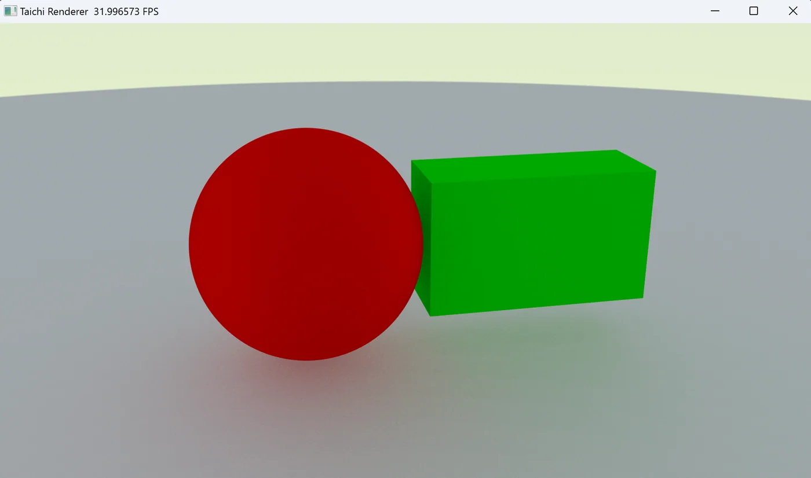

累积帧降噪和抗锯齿，地面看出自然的阴影和间接光染色
</Center>

<Callout>

- 到这一步的完整代码在 GitHub
- https://github.com/HK-SHAO/RayTracingPBR/blob/taichi/taichi/RT01/10.py

</Callout>

## 物体的旋转

换个口味，实现一个简单但有用的小功能：物体的旋转。位移和缩放在前面的章节已经完成。

### 旋转矩阵

三维空间下的旋转矩阵是一个 $3\times3$ 的矩阵，按列向量约定，它的每一列都是一个单位向量，这三列构成正交基。用旋转矩阵左乘列向量，就能把向量旋到另一个方向。

$$
\begin{bmatrix}
x' \\
y' \\
z'
\end{bmatrix}=\begin{bmatrix}
 \cdot & \cdot & \cdot\\
 \cdot & \cdot & \cdot\\
  \cdot& \cdot &\cdot
\end{bmatrix}
\begin{bmatrix}
x \\
y \\
z
\end{bmatrix}
$$

### 欧拉角

由于人们操控旋转矩阵或者四元数中的数值来表示旋转并不直观，因此我们使用欧拉角来表示旋转。欧拉角是一个三维向量，它的每个分量分别表示绕 X、Y、Z 轴的旋转角度。右手系、列向量约定下，绕三个轴的旋转矩阵分别为

$$
\mathcal{R}_{x}\left(\theta_{x}\right)=\left[\begin{array}{ccc}
1 & 0 & 0 \\
0 & \cos \theta_{x} & -\sin \theta_{x} \\
0 & \sin \theta_{x} & \cos \theta_{x}
\end{array}\right]
$$

$$
\mathcal{R}_{y}\left(\theta_{y}\right)=\left[\begin{array}{ccc}
\cos \theta_{y} & 0 & \sin \theta_{y} \\
0 & 1 & 0 \\
-\sin \theta_{y} & 0 & \cos \theta_{y}
\end{array}\right]
$$

$$
\mathcal{R}_{z}\left(\theta_{z}\right)=\left[\begin{array}{ccc}
\cos \theta_{z} & -\sin \theta_{z} & 0 \\
\sin \theta_{z} & \cos \theta_{z} & 0 \\
0 & 0 & 1
\end{array}\right]
$$

矩阵乘法有先后区别。列向量按 XYZ 外旋（先 $R_x$ 再 $R_y$ 再 $R_z$）合起来是

$$
\mathcal{M}(\theta_x, \theta_y, \theta_z)=\mathcal{R}_{z}(\theta_z)\, \mathcal{R}_{y}(\theta_y)\, \mathcal{R}_{x}(\theta_x)
$$

Taichi 里 `mat3(vec3, vec3, vec3)` 按列填入，与上面的矩阵一致：

```python
@ti.func
def rotate(a: vec3) -> mat3: # 欧拉角到旋转矩阵
    s = sin(a)
    c = cos(a)
    return  mat3(   vec3( c.z,  s.z,    0),
                    vec3(-s.z,  c.z,    0),
                    vec3(   0,    0,    1)) @\
            mat3(   vec3( c.y,    0, -s.y),
                    vec3(   0,    1,    0),
                    vec3( s.y,    0,  c.y)) @\
            mat3(   vec3(   1,    0,    0),
                    vec3(   0,  c.x,  s.x),
                    vec3(   0, -s.x,  c.x)  )
```

### 旋转物体

在 taichi 结构体类中添加一个旋转向量（如果要更改物体的旋转，别忘了在物体场中修改物体的旋转）

```python
@ti.dataclass
class Transform:
    position: vec3
    rotation: vec3
    scale: vec3
```

对物体进行旋转，只需要将 `pos - position` 左乘旋转矩阵即可

```python
@ti.func
def signed_distance(obj, pos: vec3) -> float:   # 对物体求 SDF 距离
    position = obj.trs.position # 位置空间变换（下一步再实现旋转变换）
    scale = obj.trs.scale   # 用缩放控制物体大小

    p = rotate(obj.trs.rotation) @ (pos - position)
    ...
```

## PBR 材质渲染

<Callout tone="warm">

WIP: 本章节还需要补充大量细节

</Callout>

<Callout>

关于 PBR 渲染从理论到实现，可以查看这本在线书：https://www.pbr-book.org/

</Callout>

PBR (Physically Based Rendering) ，即基于物理的渲染，它的渲染效果更加接近现实世界。满足 PBR 渲染的条件被认为是

- 基于微表面模型 (Microfacet Model[^microfacet])
- 能量守恒——出射光线的能量永远不能超过入射光线的能量（除自发光或者光源外）
- 使用基于物理的 BRDF[^lopgl]

[^lopgl]: Learn OpenGL PBR Theory. https://learnopengl.com/PBR/Theory

[^microfacet]: Microfacet Models. https://www.pbr-book.org/3ed-2018/Reflection_Models/Microfacet_Models

对于我们的光线追踪程序来说，PBR 仍然要解决的是光如何与物体表面发生作用的问题，即光 `ray.direction` 和 `ray.color` 如何改变的问题。

我们将要实现的 PBR 模型是基于双向散射分布函数 (Bidirectional Scattering Distribution Function, BSDF) 的，它包含了反射 (BRDF) 和透射 (BTDF) 两部分。此外我们还允许材质的自发光属性，让这个光照模型类似于 Blender 的原理化 BSDF (Principled BSDF) 渲染。

taichi 中的 PBR 材质类如下

```python
@ti.dataclass
class Material:
    albedo: vec3        # 材质颜色
    roughness: float    # 材质粗糙度
    metallic: float     # 材质金属度
    transmission: float # 材质透明度
    ior: float          # 材质折射率
    emission: vec4      # 材质自发光
    normal: vec3        # 切线空间法线
```

然后写一个 `PBR` taichi 函数，对已有的属性做预处理

```python
@ti.func
def PBR(ray, record, normal: vec3) -> Ray:
    roughness = record.obj.mtl.roughness        # 获取粗糙度
    metallic = record.obj.mtl.metallic          # 获取金属度
    transmission = record.obj.mtl.transmission  # 获取透明度
    ior = record.obj.mtl.ior                    # 获取折射率

    I = ray.direction   # 入射方向（指向表面）
    V = -ray.direction  # 观察方向
    # 将材质的切线空间法线转换到世界空间：TBN 以几何法线为 z 轴
    N = TBN(normal) @ record.obj.mtl.normal

    NoV = dot(N, V)
    ...
```

<Callout tone="warm">

笔者实现的 BSDF 注重简洁且有效率，以及“看起来正确”，不能保证百分百物理正确。如果你发现了这个模型可以优化的点，可以在评论区告诉大家

</Callout>

### 余弦重要性采样

在这里，我们的余弦重要性采样 (Cosine weighted sampling) 结合了微表面模型的法线分布函数，用一个随粗糙度变大的参数去拉宽法线分布。代码里这个参数写成了 `pow5(roughness)`，是为了好调，并不是教科书上的 $\alpha=\mathrm{roughness}^2$。

与半球采样类似，只需要改变法线 Z 轴分布即可重要性采样，其中的 TBN 矩阵仍然是将切线空间法线旋转到世界坐标，代码如下

```python
@ti.func
def hemispheric_sampling_roughness(n: vec3, roughness: float) -> vec3:
    # 用粗糙度采样沿向量 n 半球采样
    ra = ti.random() * 2 * pi
    rb = ti.random()

    shiny = pow5(roughness) # 这里用 roughness^5 近似 α²，越大高光越散

    rz = sqrt((1.0 - rb) / (1.0 + (shiny - 1.0)*rb))    # 用粗糙度改变 Z 轴分布
    v = vec2(cos(ra), sin(ra))
    rxy = sqrt(abs(1 - rz*rz)) * v

    return TBN(n) @ vec3(rxy, rz)
```

其中快速计算 5 次方的 `pow5` 函数如下，它使用了快速幂 (Binary Exponentiation) 算法[^qin]

[^qin]: Binary Exponentiation. https://oi-wiki.org/math/binary-exponentiation/

```python
@ti.func
def pow5(x: float): # 快速计算 x 的 5 次方
    t = x*x
    t *= t
    return t*x
```

### 菲涅尔方程

菲涅尔现象是自然环境中很常见的光学现象，例如从更倾斜的角观察水面或者玻璃、光滑大理石会看到倒影，这是因为视角的不同会影响我们看到的反射的光的量。而菲涅尔方程描述了光线中被反射的部分与被折射的部分的占比，这个比率会随着我们观察的角度不同而改变。

<Center>
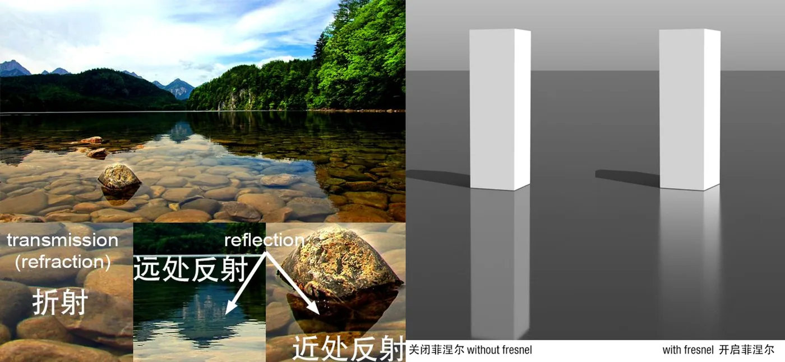

菲涅尔反射
图片来自 https://zhuanlan.zhihu.com/p/357190332
</Center>

菲涅尔方程是一个复杂的方程式，但是我们可以用 Fresnel-Schlick 近似法快速求得近似解，其中 $\cos\theta$ 取法线与视线夹角余弦的绝对值（落在 $[0,1]$ 里）。$F_0$ 是正入射时的基础反射率，介质相对折射率 $\eta=n_1/n_2$ 时

$$
F_0=\left(\frac{\eta-1}{\eta+1}\right)^2
$$

Schlick 近似是

$$
F_{Schlick}(\cos\theta, F_0) =
    F_0 + (1 - F_0) ( 1 - \cos\theta)^5
$$

```python
@ti.func
def fresnel_schlick(cosine: float, F0: float) -> float:   # 计算菲涅尔近似值
    return F0 + (1 - F0) * pow5(abs(1 - cosine))

@ti.func
def fresnel_schlick_roughness(cosine: float, F0: float, roughness: float) -> float:  # 计算粗糙度下的菲涅尔近似值
    return F0 + (max(1 - roughness, F0) - F0) * pow5(abs(1 - cosine))
```

### BRDF

通过粗糙度和 Fresnel-Schlick 近似法计算出一个反射率，并让金属度影响完全漫反射与混合粗糙度的半球采样。

```python
F = fresnel_schlick_roughness(NoV, 0.04, roughness)
if ti.random() < F + metallic:  # 反射部分
    N = hemispheric_sampling_roughness(N, roughness)
    ray.direction = reflect(I, N)   # 镜面反射
else:   # 漫反射部分
    ray.direction = hemispheric_sampling(N)  # 半球采样
```

### BTDF

我们要先用之前章节的方法（[内外表面法线](#内外表面法线)）判断光线是正在穿入物体还是穿出物体，然后来获取正确的法线方向和折射率比值 `eta` 。其中， `sign` 函数用来获取数值的符号，公式如下

$$
\mathrm{sign}(x) = \begin{cases}
    +1 & x > 0 \\
    0 & x = 0 \\
    -1 & x < 0
\end{cases}
$$

当光线穿出物体时，`outer` 小于 0 ，取相反数更改法线方向 `N` ，取倒数更改折射率比值 `eta` 。为什么用这种方式而不用 `if` 语句来更改呢？这是因为并行计算擅长大规模整齐的数学计算，而分支语句很容易影响并行计算的效率。

```python
if ti.random() < transmission:  # 折射部分
    # BTDF
    eta = ENV_IOR / ior # 折射率之比
    outer = sign(NoV)   # 大于零就是穿入物体，小于零是穿出物体
    eta = pow(eta, outer)   # 更改折射率之比
    N  *= outer   # 如果是穿出物体表面，就更改法线方向

    NoI = -NoV
    k = 1.0 - eta * eta * (1.0 - NoI * NoI) # 这个值如果小于 0 就说明全反射了

    F0 = (eta - 1) / (eta + 1)  # 基础反射率
    F0 *= F0
    F = fresnel_schlick(abs(NoV), F0)
    N = hemispheric_sampling_roughness(N, roughness)    # 根据粗糙度抖动法线方向

    # k < 0 为全反射
    if ti.random() < F + metallic and outer > 0 or k < 0:
        ray.direction = reflect(I, N)   # 反射
    else:
        # ray.direction = refract(I, N, eta)    # 折射
        ray.direction = eta * I - (eta * NoI + sqrt(k)) * N
else:
    ... # BRDF
```

### BSDF

双向散射分布函数 (BSDF, Bidirectional Scattering Distribution Function) ，包含反射部分 (BRDF) 和透射部分 (BTDF) ，可以将两个函数结合到一起。最后经过一些优化，得到一个完整的 `ray_surface_interaction` 函数。

```python
@ti.func
def ray_surface_interaction(ray: Ray, object: SDFObject) -> Ray:
    # 表面材质信息
    albedo       = object.material.albedo
    roughness    = object.material.roughness
    metallic     = object.material.metallic
    transmission = object.material.transmission
    ior          = object.material.ior

    # 计算法线
    normal  = calc_normal(object, ray.origin)
    outer   = dot(ray.direction, normal) < 0.0
    normal *= 1.0 if outer else -1.0

    # 计算下个采样方向，包括半球采样和根据粗糙度的重要性采样
    alpha = roughness * roughness
    hemispheric_sample = hemispheric_sampling(normal)
    roughness_sample = normalize(mix(normal, hemispheric_sample, alpha))

    N = roughness_sample
    I = ray.direction
    NoI = dot(N, I)

    # 计算折射比、菲涅尔近似值
    eta = ENV_IOR / ior if outer else ior / ENV_IOR
    k = 1.0 - eta * eta * (1.0 - NoI * NoI)
    F0 = (eta - 1.0) / (eta + 1.0)
    F = fresnel_schlick(abs(NoI), F0*F0)

    if sample_float() < F + metallic or k < 0.0:
        # 反射部分：菲涅尔反射、金属反射、全反射
        ray.direction = I - 2.0 * NoI * N
        outer = dot(ray.direction, normal) < 0.0
        ray.direction *= (-1.0 if outer else 1.0)
    elif sample_float() < transmission:
        # 折射部分：斯涅尔折射
        ray.direction = eta * I - (sqrt(k) + eta * NoI) * N
    else:
        # 漫反射部分：直接使用半球采样方向
        ray.direction = hemispheric_sample

    # 混合光照
    ray.color *= albedo

    # 偏移光的原点，防止光线穿过物体
    outer = dot(ray.direction, normal) < 0.0
    ray.origin += normal * MIN_DIS * (-1.0 if outer else 1.0)

    return ray
```

### 自发光

我们将自发光物体视为一个光源，它的光照强度由自发光颜色和自发光强度决定，因此 `emission` 是一个四维向量， `rgb` 代表颜色， `a` 代表光强。当光线与自发光物体相交时，我们改变光线颜色，并结束路径追踪。

```python
# 应用 PBR 材质
ray = light_and_surface_interaction(ray, record)

# 处理自发光
intensity = brightness(ray.color)
ray.color  *= record.object.material.emission
visible   = brightness(ray.color)

if intensity < visible or visible < VISIBILITY: break
```

<Center>
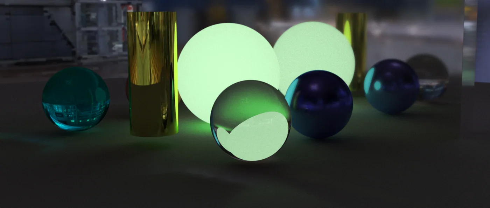

玻璃球和自发光带来的简单焦散
</Center>

## IBL 基于图像照明

基于图像的照明是将图片作为环境光源，这样可以大幅度提高光线追踪程序的真实感。之前的章节，我们一直使用一个简单的函数映射天空，接下来，我们将使用 taichi 读取像下面一样的一张图片作为天空光源。

<Center>
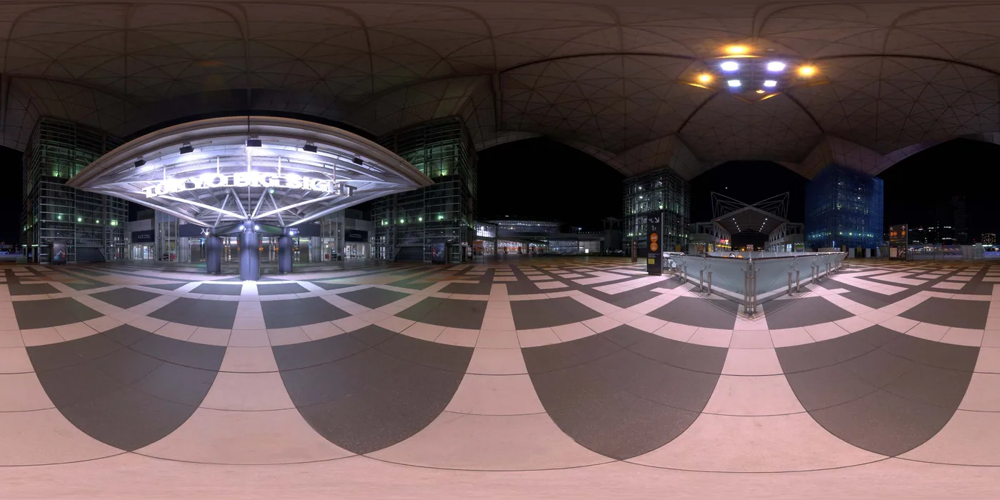

东京国际展览中心的 IBL 图片[^sibl]
</Center>

[^sibl]: sIBL Archive. http://www.hdrlabs.com/sibl/archive.html

### 读取图片

第一步当然是读取图片啦。使用 taichi 的 `ti.tools.imread` 函数读取图片[^tiimr]为 numpy 数组，然后将其转换为 `vec3.field` 。下面按 8bit 图 `/255` 归一化；如果读的是线性 HDR，就不要再除 255。`texture` 用归一化 uv 取像素。

[^tiimr]: taichi.tools.image. https://docs.taichi-lang.org/api/taichi/tools/image/

```python
@ti.data_oriented
class Image:
    def __init__(self, path: str):
        img = ti.tools.imread(path).astype('float32')
        self.img = vec3.field(shape=img.shape[:2])
        self.img.from_numpy(img / 255)

    @ti.func
    def texture(self, uv: vec2) -> vec3:
        x = int(uv.x * self.img.shape[0])
        y = int(uv.y * self.img.shape[1])
        return self.img[x, y]
```

### 采样球面贴图

接下来，我们需要将 HDRi 图片映射到单位球面上，然后就可以直接使用光线的方向作为方向向量来采样天空贴图。`pow(..., camera_gamma)` 是把 8bit 贴图近似变回线性亮度，后面色调映射才有意义。

```python
@ti.func
def sample_spherical_map(v: vec3) -> vec2:
    uv = vec2(atan2(v.z, v.x), asin(v.y))
    uv *= vec2(0.5 / pi, 1 / pi)
    uv += 0.5
    return uv

@ti.func
def sky_color(ray) -> vec3:
    uv = sample_spherical_map(ray.direction)
    color = sky_image.texture(uv) * 1.8
    color = pow(color, vec3(camera_gamma))
    return color
```

## 色调映射

为什么要色调映射？

大多数显示器能够显示的色彩范围是 $[0,1]$ ，当 RGB 的某个分量大于 1 时，会被直接截断为 1 ，这带来的后果是大量高光信息丢失。自然世界中的光强取值是 $[0,+\infty)$ ，为了能够让更广的动态范围被显示设备显示，需要一条曲线映射原本的光强，在保证阴影和高光细节的同时，呈现更真实的色彩。

|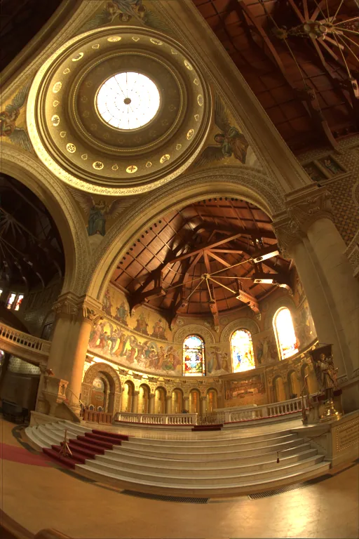|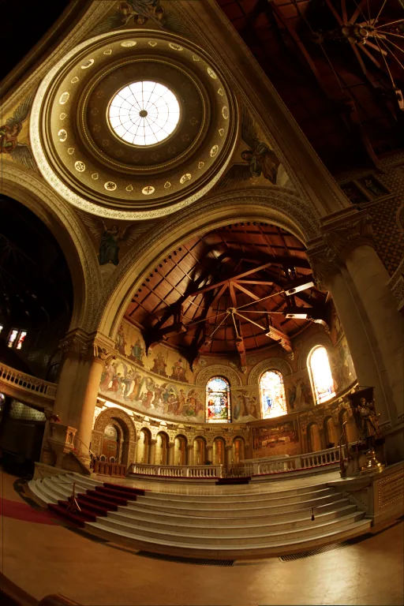|
|:-:|:-:|
|直接截断颜色|ACES 色调映射|

Matt Taylor 的这篇文章[^tomp]很好的总结了各种色调映射算法，我将其中的 ACES (Academy Color Encoding System) 算法实现如下

[^tomp]: Tone Mapping. https://64.github.io/tonemapping/

```python
ACESInputMat = mat3(
    0.59719, 0.35458, 0.04823,
    0.07600, 0.90834, 0.01566,
    0.02840, 0.13383, 0.83777
)

ACESOutputMat = mat3(
     1.60475, -0.53108, -0.07367,
    -0.10208,  1.10813, -0.00605,
    -0.00327, -0.07276,  1.07602
)

@ti.func
def RRTAndODTFit(v: vec3) -> vec3:
    a = v * (v + 0.0245786) - 0.000090537
    b = v * (0.983729 * v + 0.4329510) + 0.238081
    return a / b

@ti.func
def ACESFitted(color: vec3) -> vec3:
    color = ACESInputMat @ color
    color = RRTAndODTFit(color)
    color = ACESOutputMat @ color
    return clamp(color, 0.0, 1.0)
```

### 曝光与 gamma 矫正

显示器输出和人眼对亮度的响应都不是线性的，因此色调映射通常还要配上 gamma 编码。ACES 拟合曲线一般在线性空间里做；下面先做一次 gamma 再送进 ACES，是为了把暗部抬亮一些，属于观感上的选择。

```python
color *= camera_exposure # 调整曝光
color  = pow(color, vec3(1.0 / camera_gamma)) # gamma 矫正
color  = ACESFitted(color) # ACES 色调映射
```

## AI 降噪

针对路径追踪的 AI 降噪是一项很重要的研究，这项研究 Nvidia, Intel, AMD 等企业都在研究，其中目前最新的一篇 (2023 年 1 月 11 日) 是 AMD 的。

<Callout>

Nvidia 的论文 [Neural Denoising with Layer Embeddings](https://research.nvidia.com/publication/2020-06_neural-denoising-layer-embeddings) 提出了一种基于神经网络的蒙特卡罗路径追踪图像进行去噪的新方法。

Intel 的论文 [Temporally Stable Real-Time Joint Neural Denoising and Supersampling](https://www.intel.com/content/www/us/en/developer/articles/technical/temporally-stable-denoising-and-supersampling.html) 提出了一种效果不错的光追降噪方法，这是一种混合了传统和 AI 的降噪方案。

AMD 的论文 [Weighted À-Trous Linear Regression (WALR) for Real-Time Diffuse Indirect Lighting Denoising](https://gpuopen.com/download/publications/GPUOpen2022_WALR.pdf) 提出了一种基于回归的新方法，对具有少量光线或像素的路径追踪全局光照的图像降噪。

</Callout>
